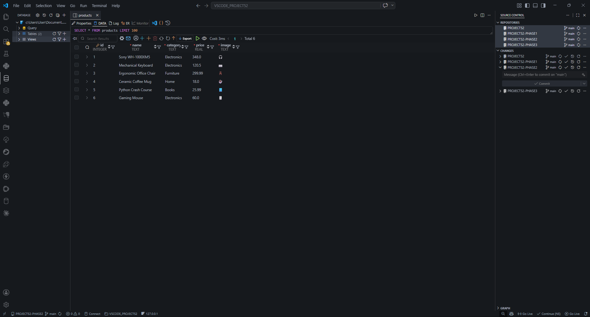
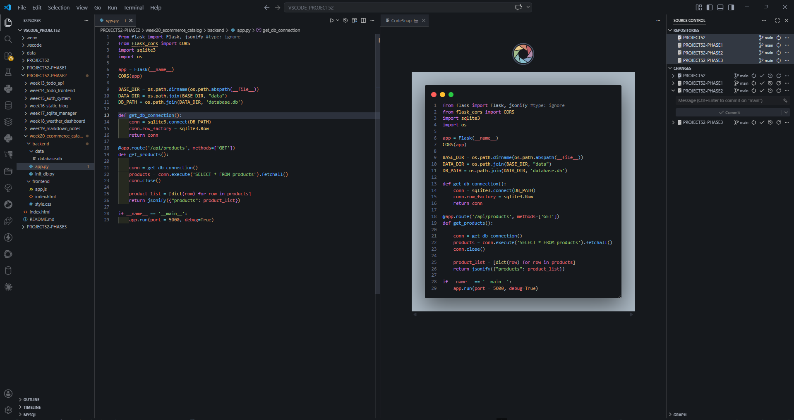
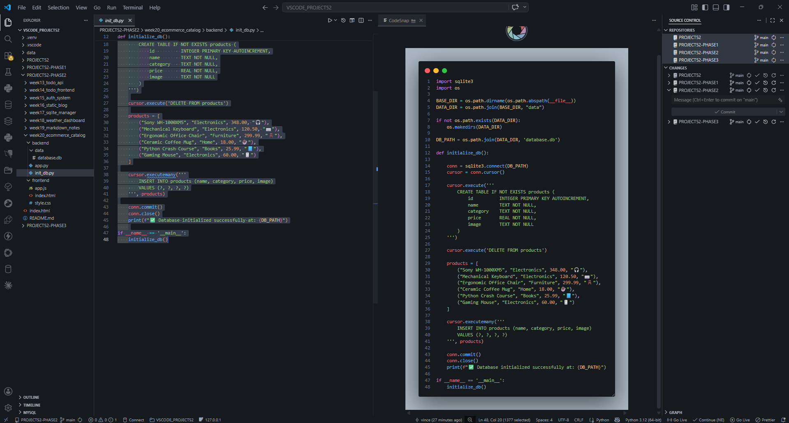

# DEV LOG: WEEK 20, DAY 3

## 1. Executive Summary
Day 3 focused on eliminating hardcoded backend state by integrating a persistent SQLite database. The objective was to replace the in-memory Python dictionary with a real database table while maintaining the exact same JSON API contract with the frontend.

## 2. Dynamic Directory Routing
* Encountered a file-system issue where `sqlite3.connect()` generated the `.db` file in the terminal's Current Working Directory rather than the intended `backend/data/` folder.
* **The Fix:** Engineered a dynamic pathing solution using Python's `os` module:
  `BASE_DIR = os.path.dirname(os.path.abspath(__file__))`
  `DATA_DIR = os.path.join(BASE_DIR, "data")`
* This guarantees that the database is always created in the correct location relative to the script, regardless of where the terminal is executed from.

## 3. Database Initialization (`init_db.py`)
* Authored a standalone seed script to handle database generation.
* Utilized `CREATE TABLE IF NOT EXISTS` to structure the `products` table with strict data typing (`INTEGER`, `TEXT`, `REAL`).
* Used `cursor.executemany()` to efficiently seed the database with the initial product catalog.

## 4. Flask API Update (`app.py`)
* Refactored the `get_products` route to open a SQLite connection.
* Utilized `conn.row_factory = sqlite3.Row` to cast the returned SQL tuples into dictionary-like objects.
* Executed a `SELECT * FROM products` query, serialized the row data into standard Python dictionaries, and passed them directly to the `jsonify()` response handler.
* **Result:** The frontend successfully consumed the new database data without requiring a single modification to the client-side JavaScript.

