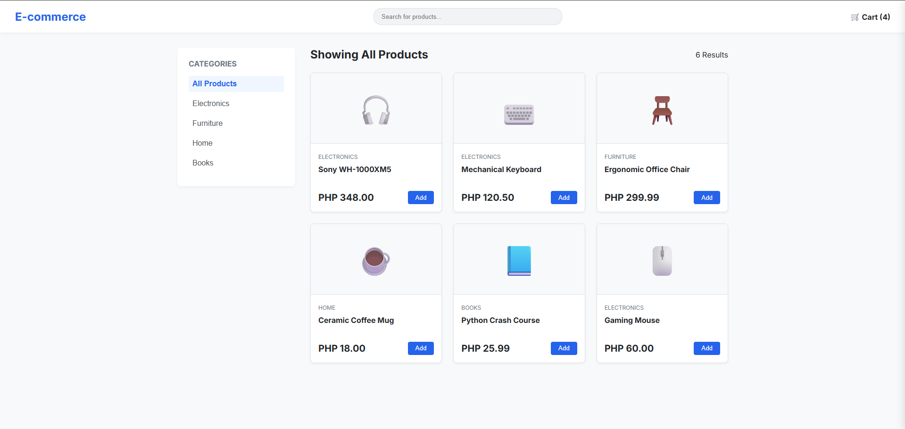
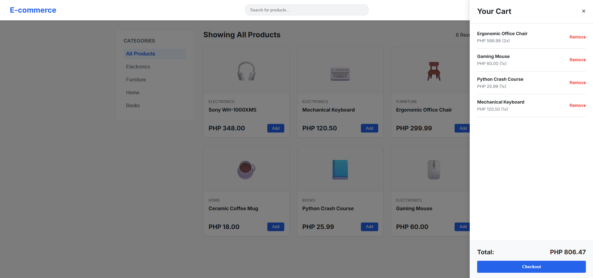
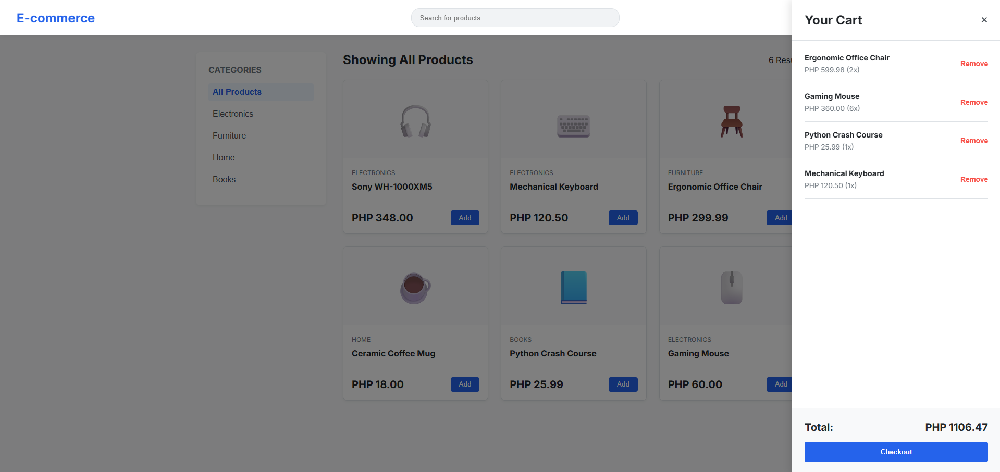

# DEV LOG: WEEK 20, DAY 4

## 1. Executive Summary
Day 4 was dedicated to building the application's core transactional feature: the Shopping Cart. We implemented a decoupled UI slide-out panel, engineered a robust state-management system to track selected items, and resolved dynamic rendering issues using JavaScript Event Delegation.

## 2. UI Architecture (The Slide-Out Cart)
* Engineered an off-screen cart panel using CSS absolute positioning (`right: -400px`).
* Utilized CSS transitions and a `.active` utility class to smoothly translate the cart into the viewport.
* Implemented a semi-transparent `cart-overlay` that blocks interaction with the background page while the cart is active, enhancing user focus.

## 3. JavaScript Event Delegation
* **The Problem:** The "Add to Cart" buttons are generated asynchronously after the `fetch()` call. Standard `addEventListener` attachments fail because the buttons do not exist in the DOM when the script first executes.
* **The Solution:** Employed Event Delegation by attaching a single `click` listener to the parent `#product-grid`. 
* Used `e.target.classList.contains('add-to-cart-btn')` to intercept clicks and extract the `data-id` attribute to identify which product was selected.

## 4. Advanced State Management (Quantity Tracking)
* Refactored the `cart` array logic from a simple `push()` pipeline to a conditional grouping engine.
* Utilized `Array.prototype.find()` to check if an added product already exists in the cart.
* If it exists, the engine mutates the object state (`existingItem.quantity += 1`) instead of duplicating the DOM element.
* Localized the currency formatting to PHP, dynamically calculating line-item totals (`price * quantity`) and reducing the array to render the final cart total.

