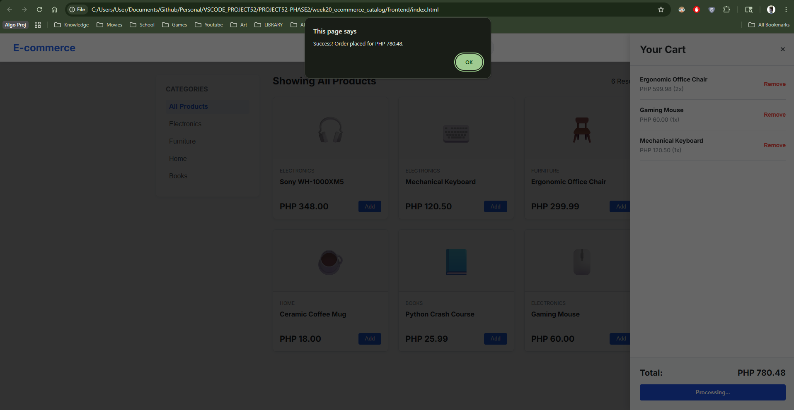

# DEV LOG: WEEK 20, DAY 5

## 1. Executive Summary

Day 5 finalized the E-Commerce application by engineering a complete Full-Stack Checkout Pipeline. We successfully bridged the gap between client-side state (the shopping cart) and server-side persistence (SQLite) by implementing a secure `POST` request architecture.

## 2. Backend Database Expansion (`init_db.py`)

- Scaled the SQLite database architecture by introducing a new relational concept: the `orders` table.
- **Schema Design:** \* `id`: Auto-incrementing Primary Key.
  - `total_amount`: Stored as a `REAL` (float) to handle currency.
  - `total_items`: Stored as an `INTEGER`.
  - `purchase_date`: Utilized `TIMESTAMP DEFAULT CURRENT_TIMESTAMP` to automatically log the exact server-time of the transaction without requiring frontend input.

## 3. Backend API Route (`POST /api/checkout`)

- Authored a new Flask endpoint specifically designated for data insertion.
- Utilized `request.get_json()` to securely parse the incoming payload from the client.
- **Database Execution:** Opened a SQLite connection and executed an `INSERT INTO orders` parameterized query, securely committing the `total_price` and `total_items` to the hard drive.
- **HTTP Standards:** Returned a `201 Created` status code alongside a JSON success message to inform the frontend that the transaction was securely logged.

## 4. Frontend Transaction Engine

- Engineered an asynchronous checkout function utilizing the `Fetch API` to transmit the local JavaScript `cart` state to the Python server.
- **Payload Serialization:** Converted the local variables into a JSON string using `JSON.stringify({ cart: cart, total_price: totalPrice })`.
- **UX/UI Polish:** \* Implemented a Guard Clause (`if cart.length === 0`) to prevent null-transactions.
  - Added visual state-management by temporarily disabling the checkout button and changing its text to "Processing..." to prevent double-clicks.
  - Upon a successful HTTP `200/201` response, the engine automatically clears the local array (`cart = []`), updates the UI, closes the sidebar, and fires a success notification.

## 5. Week 20 Retrospective

This week represented a massive leap in architectural complexity. I moved beyond reading static text files and successfully implemented a multi-table SQLite Database, dynamic DOM rendering via CSS Grid, complex Client-Side State Management (cart grouping/math), and a bi-directional REST API (handling both `GET` and `POST` methods).

