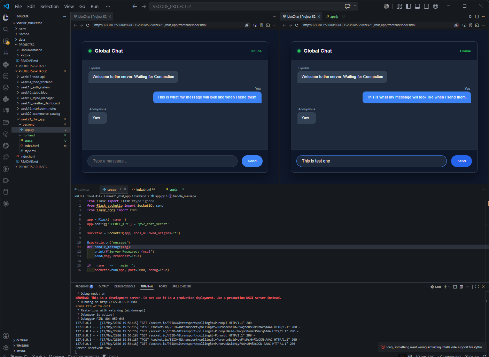
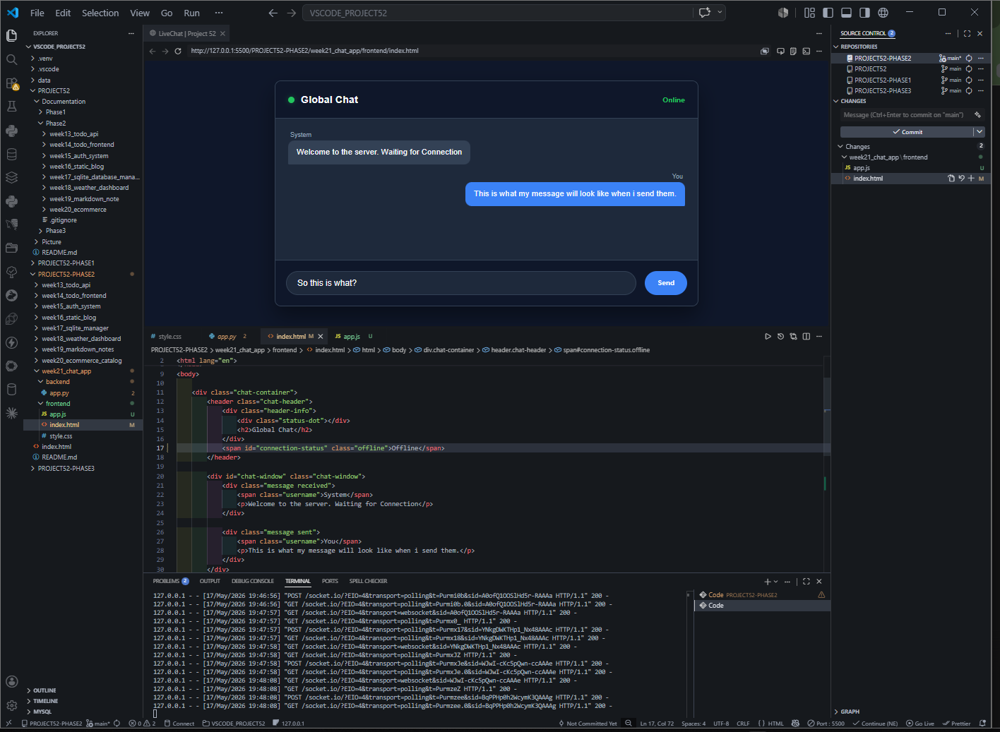
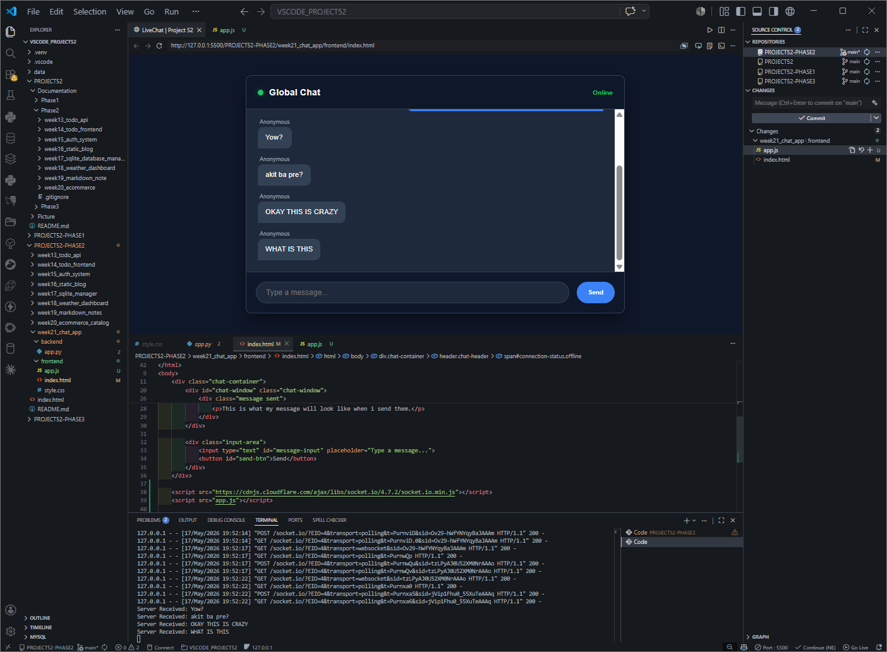
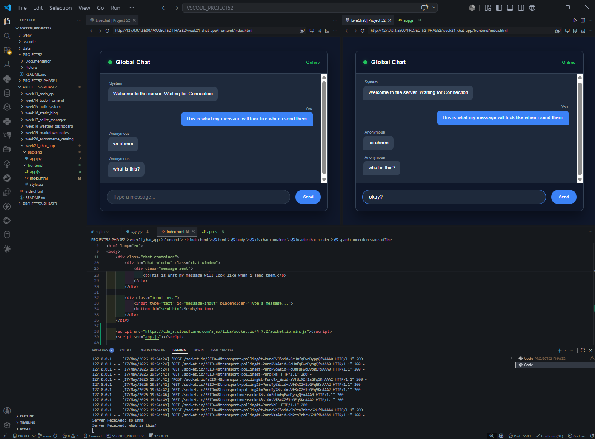

# DEV LOG: WEEK 21, DAY 1

## 1. Executive Summary

Initiated Week 21 by transitioning from standard REST API architecture (stateless HTTP requests) to an Event-Driven, Real-Time architecture using WebSockets. The objective was to establish a persistent, bidirectional communication tunnel between a Vanilla JS frontend and a Python server.

## 2. Backend Architecture (`Flask-SocketIO`)

- Replaced the standard Flask development server runner (`app.run`) with the asynchronous `socketio.run`.
- **Event Listeners:** Implemented `@socketio.on('message')` to actively listen for incoming data streams over the WebSocket connection, bypassing standard HTTP routing.
- **Broadcasting:** Utilized the `send(msg, broadcast=True)` method to instantly echo received payloads to all connected clients simultaneously.

## 3. Frontend Implementation (`Socket.IO Client`)

- Sourced the `socket.io.min.js` client library via the Cloudflare CDN to minimize local asset bloat and optimize load times.
- **Connection Lifecycle:** \* Initialized the tunnel using `const socket = io('http://127.0.0.1:5000')`.
  - Bound event listeners to the `connect` and `disconnect` lifecycle events to drive dynamic UI state changes (toggling the "Online" status indicator).
- **Transmission & Reception:**
  - Bound the UI input fields (Send button and 'Enter' keypress) to `socket.send()`.
  - Created an asynchronous listener `socket.on('message', ...)` to capture server broadcasts, dynamically construct DOM elements (`div.message.received`), and append them to the chat window in real-time.

