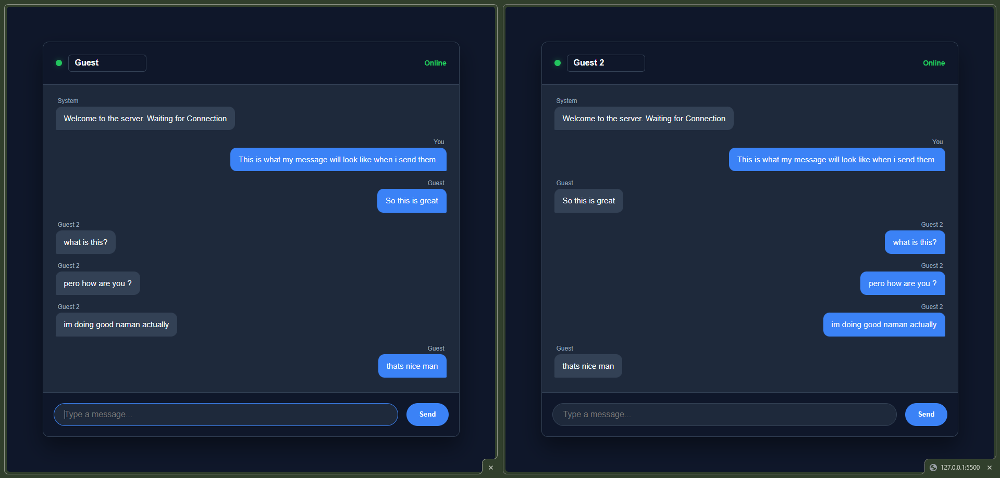
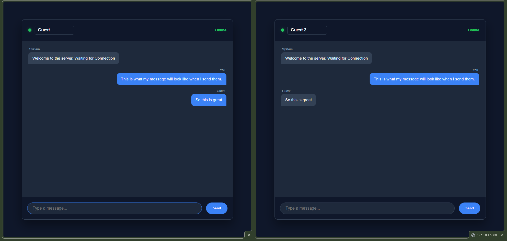

# DEV LOG: WEEK 21, DAY 2

## 1. Executive Summary
Day 2 focused on resolving the "Echo Problem" inherent to basic WebSocket broadcasts. We upgraded the data transmission pipeline from raw strings to structured JSON objects, allowing the client-side JavaScript to identify the author of incoming messages and route them to the correct UI components.

## 2. Backend Upgrades (Custom Events)
* Deprecated the generic `message` event in favor of a custom `@socketio.on('chat_message')` listener.
* Refactored the Python server to receive, parse, and broadcast Python Dictionaries (JSON objects) containing both `username` and `message` key-value pairs, rather than raw text strings.

## 3. Frontend Upgrades (The Sorting Engine)
* Implemented a dynamic UI input (`#username-input`) to capture local user identity state.
* Upgraded the `socket.emit()` function to package the user's name and message into a structured JSON payload before pushing it through the tunnel.
* **Client-Side Routing Logic:**
  * Created an asynchronous listener for the incoming `chat_message` broadcast.
  * Engineered a strict equality check (`data.username === myCurrentName`) to determine authorship.
  * Dynamically applied CSS classes (`.sent` vs `.received`) based on the boolean result, effectively separating local user messages from global server traffic.

