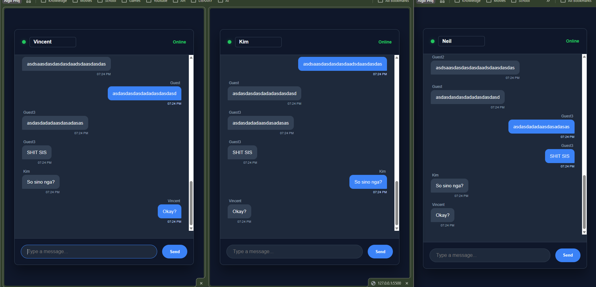
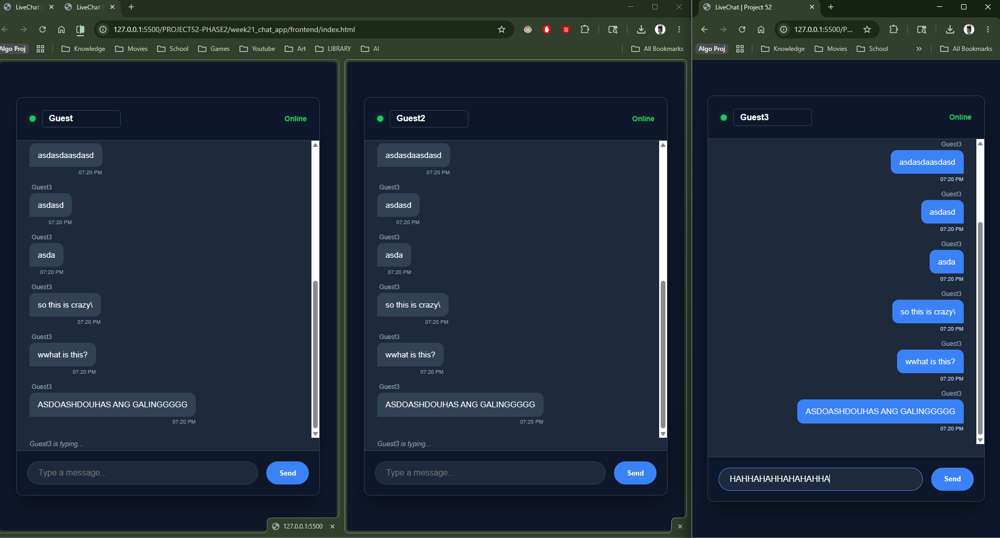
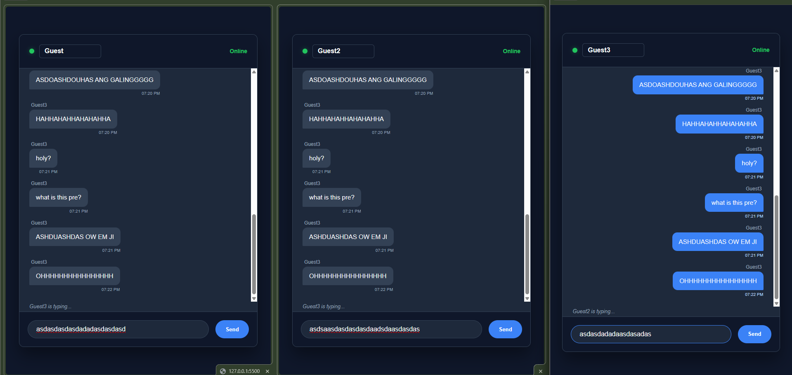

# 💬 DEV LOG: WEEK 21, DAY 3 (PRESENCE & QoL)

## 1. Executive Summary
Day 3 focused on Quality of Life (QoL) improvements and Real-Time Presence. We upgraded the JSON payload to include localized timestamps and engineered a secondary WebSocket event to broadcast active typing status, significantly enhancing the "live" feel of the application.

## 2. Temporal State (Timestamps)
* Upgraded the `sendMessage()` function to capture the client's exact local time before transmission.
* Utilized the JavaScript `Date()` object and `.toLocaleTimeString()` to format the time into a clean `HH:MM AM/PM` string.
* Injected the `timestamp` key into the JSON payload, allowing the receiving clients to render the exact time the message was originally dispatched.

## 3. The Presence Engine (Typing Indicator)
* **Client-Side Trigger:** Bound an `input` event listener to the chat textbox. Any keystroke immediately emits a custom `typing` event containing the user's current identity state.
* **Server-Side Routing:** Engineered the Python backend to intercept the `typing` event and broadcast it using `emit('typing', data, broadcast=True, include_self=False)`. The `include_self=False` parameter prevents the typing indicator from echoing back to the user who is actually typing.
* **Client-Side Rendering:** * Intercepted the broadcasted `typing` event to dynamically update the DOM (`#typing-indicator`).
  * Implemented an asynchronous `setTimeout` function to automatically clear the typing indicator after 2 seconds of inactivity, resetting the timer (`clearTimeout`) upon subsequent keystrokes to prevent flickering.

