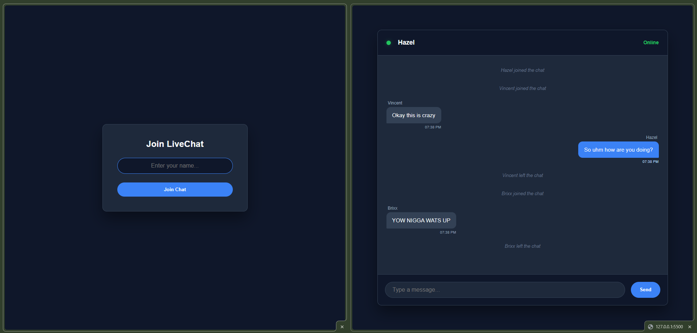
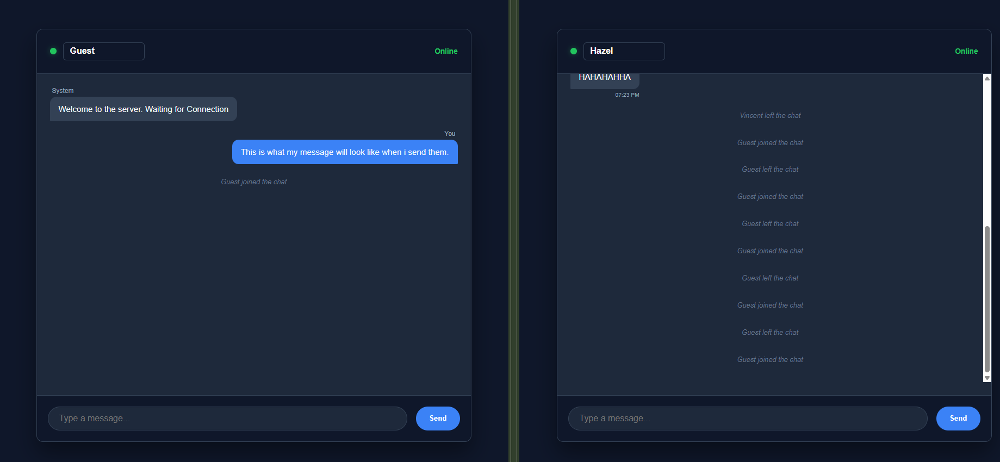
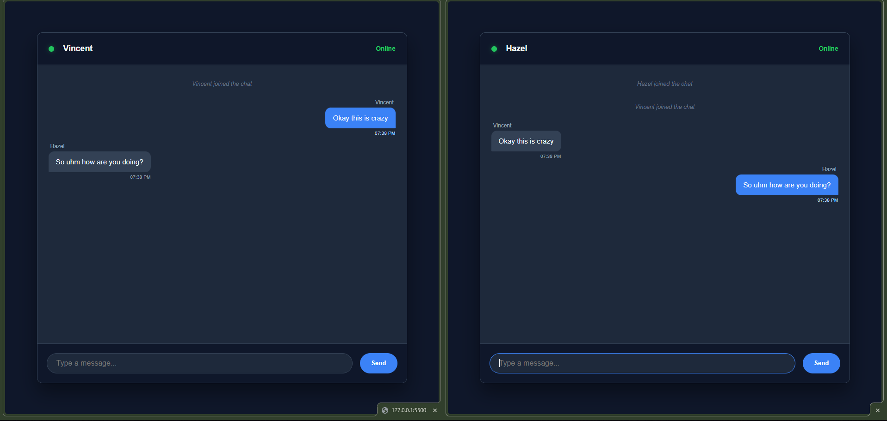

# 💬 DEV LOG: WEEK 21, DAY 4 (SESSION MEMORY & AUTHENTICATION)

## 0. Context and Problem Statement (The "Why")
Before implementing session tracking, the chat application suffered from architectural vulnerabilities: Anonymous Connection Spoofing and State Desynchronization. Without a verified identity layer, any client could establish a WebSocket connection (a "ghost" connection) and broadcast messages without being tied to a user account. The core objective of Day 4 was to enforce a strict authentication handshake that must precede the establishment of the real-time communication channel.

## 1. Server-Side Memory (`app.py`) - Deep Dive
* **The `active_users` Dictionary:** The in-memory Python dictionary serves as the single source of truth for the session state. It maps a unique, ephemeral identifier (the WebSocket Session ID, or `request.sid`) to a persistent user attribute (the validated username).
  * *Data Structure:* `{ request.sid: username }`
  * *Efficiency:* This structure allows for **O(1) lookup time complexity** when checking if a specific session is active.
* **Lifecycle Event Handling:** * `@socketio.on('user_join')`: Acts as the gatekeeper, mapping the `request.sid` to the username and broadcasting the "joined" system announcement.
  * `@socketio.on('disconnect')`: Critical for cleanup. When a client disconnects, this hook removes the corresponding entry from `active_users` to prevent memory leaks and broadcasts a localized "left the chat" system announcement.

## 2. Client-Side Gateway (UX/UI Architecture)
* **Conditional Rendering Rationale:** Using the CSS `.hidden` utility class is an enforcement mechanism. By hiding the main chat interface and disabling the WebSocket initialization script (`io()`) until identity confirmation, we prevent:
  * *Race Conditions:* The client cannot attempt to establish a real-time connection before its state variables are set.
  * *Anonymous Broadcasts:* It physically prevents users from accessing the underlying Socket.IO tunnel until they have passed the initial UI gate.

## 3. Architectural Considerations and Future Scope
While the current implementation successfully solves anonymous connections, scaling this system for production requires addressing several bottlenecks:

* **Persistence and Scalability (The Single Point of Failure):**
  * *Limitation:* Using an in-memory Python dictionary means that if the application server restarts, all session data is lost. 
  * *Improvement:* The `active_users` store must be migrated to a dedicated, highly available key-value store like **Redis**. Redis handles the rapid read/write operations necessary for session tracking while ensuring data persistence across server restarts.

* **Security Enhancements (JWTs):**
  * *Improvement:* Instead of relying on simple string passing, the system should adopt **JSON Web Tokens (JWTs)**. The client would hit a REST API endpoint (`/api/login`) to receive a cryptographic token, which is then passed into the WebSocket handshake for secure identity validation.

* **Advanced State Management:**
  * *Improvement:* For larger applications, consider using a dedicated Message Queue (e.g., RabbitMQ or Kafka) for broadcasting announcements. This allows multiple microservices to subscribe to message events without creating tight coupling dependencies.

