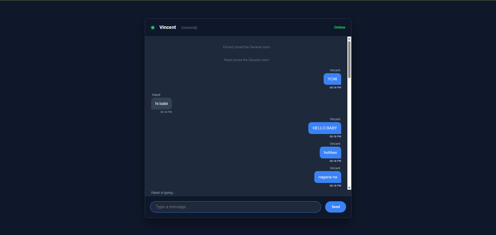

# 💬 DEV LOG: WEEK 21, DAY 5

## 1. Executive Summary

Day 5 finalized the Week 21 architecture by addressing two critical enterprise requirements: Data Partitioning (Channels) and Public Accessibility (Deployment). The application was upgraded from a single global broadcast model to an isolated room-based architecture, and subsequently exposed to the public internet using secure tunneling protocols.

## 2. Data Partitioning (`Socket.IO Rooms`)

To prevent the "global megaphone" effect, traffic needed to be segmented into isolated channels.

- **Server-Side (`join_room` / `leave_room`):** \* Imported native Room management functions from `flask_socketio`.
  - Restructured the `active_users` state dictionary to track complex objects rather than simple strings: `active_users[request.sid] = {'username': username, 'room': room}`.
  - Scoped all outbound `emit` functions using the `to=room` parameter, ensuring payloads are strictly delivered only to clients explicitly subscribed to that channel.
- **Client-Side Payload Upgrades:** \* Upgraded the Gateway UI to include a `<select>` DOM element for channel routing.
  - Injected the selected `room` state into every outgoing JSON payload (`chat_message`, `typing`, `user_join`), providing the backend router with the necessary context to sort the traffic.

## 3. Public Deployment & Secure Tunneling

Bypassed traditional (and insecure) router-level port forwarding by utilizing Secure Tunnels to expose the local development environment.

- **Backend Tunneling:** Leveraged VS Code's native Port Forwarding infrastructure to expose `localhost:5000`. This generated a secure, public `devtunnels.ms` URL that bridges internet traffic directly to the local Python instance.
- **Frontend Connectivity:** Updated the client-side Socket.IO initialization string (`const socket = io(...)`) to target the public tunnel instead of `127.0.0.1`.
- **Distribution:** Because the frontend consists of static assets containing a hardcoded link to a public backend, the UI can be distributed via ZIP file or hosted via a secondary tunnel (Port 5500), allowing global users to immediately access the local server.

