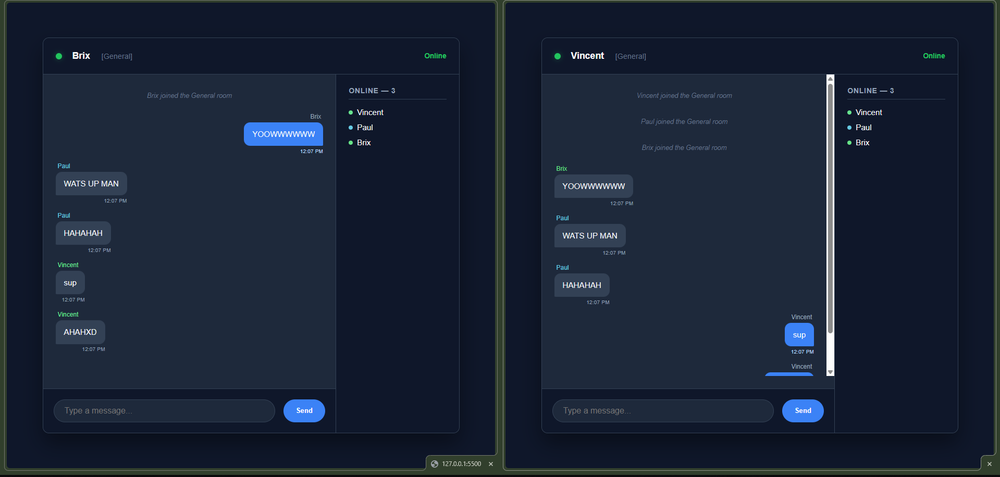
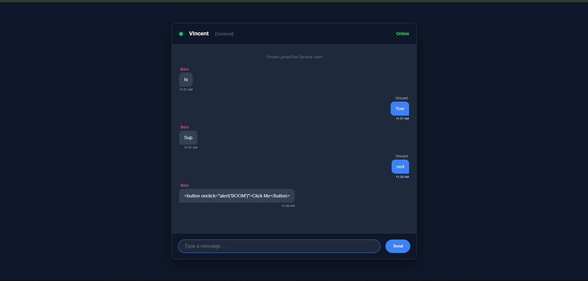

# 💬 DEV LOG: WEEK 21, DAY 6

## 1. Executive Summary

Following the XSS security patch, the application required a real-time "Who's Online" sidebar to improve user presence and visibility. This was achieved by implementing a Publisher/Subscriber (Pub/Sub) pattern where the Python backend acts as the authoritative state manager and pushes roster updates to the connected client interfaces.

## 2. Backend State Aggregation (`app.py`)

- Engineered a `get_room_roster(room)` helper function to iterate through the `active_users` dictionary and aggregate an array of usernames currently authenticated within a specific channel.
- **Lifecycle Hooks:** Upgraded the `@socketio.on('user_join')` and `handle_disconnect()` events to trigger the roster aggregation and broadcast a new `room_roster` event strictly to the affected channel.

## 3. Frontend Architecture (UI & Logic)

- **CSS Flexbox Layout:** Refactored the core UI into a `.chat-body` flex container, establishing a responsive 75/25 horizontal split between the main chat window (`flex: 3`) and the new right-hand sidebar (`flex: 1`).
- **DOM Rendering (`app.js`):** \* Implemented an asynchronous listener for the `room_roster` payload.
  - To prevent UI duplication, the rendering logic completely clears the `.innerHTML` of the roster list before dynamically rebuilding the `<li>` nodes using the fresh server array.
  - Reused the `getColorForUsername()` hashing algorithm to dynamically generate matching status indicators (colored dots) for each user in the sidebar.
  - Maintained strict XSS security protocols by exclusively utilizing `document.createElement()` and `.textContent` for rendering the roster names.

