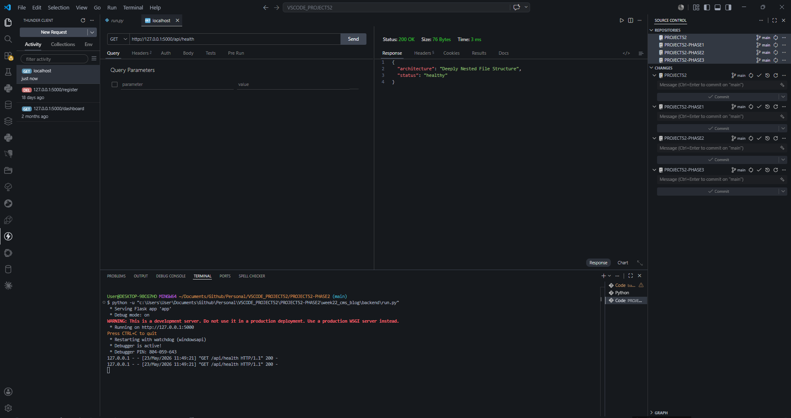
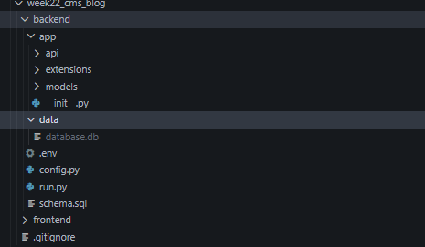

# 📝 DEV LOG: WEEK 22, DAY 1

## 1. Executive Summary

Day 1 focused exclusively on the Data Layer and Backend Architecture. The application was deliberately transitioned from a basic monolithic structure into a deeply modular **Flask Application Factory Pattern**. This ensures the codebase is highly scalable, secure, and prepared for blueprint-based API routing.

## 2. Directory Structure & Data Segregation

- **The `app/` Package:** Isolated all core source code (`__init__.py`, `/extensions`, `/models`) into a dedicated Python package.
- **The `data/` Directory:** Implemented strict separation of concerns by dynamically generating a `data/` folder at the root level to house the `database.db` file. This ensures dynamic server data is completely decoupled from version-controlled source code.
- **Initialization Logic:** Upgraded the `init_db()` function to utilize `os.makedirs(exist_ok=True)`, ensuring the database directory is automatically scaffolded during the first boot.

## 3. Environment Security & Version Control

- **Secret Management (`.env`):** Removed hardcoded secrets from the codebase. Implemented `python-dotenv` within `config.py` to securely load sensitive variables (e.g., `SECRET_KEY`) from a local `.env` file into the application's environment variables.
- **Source Control Hygiene (`.gitignore`):** Configured strict Git rules to prevent the accidental commit of Python bytecode caches (`__pycache__`), virtual environments (`venv/`), database files (`*.db`), and environment variables (`.env`).

## 4. The Application Factory (`create_app`)

- Replaced the global `app` instance with a `create_app()` factory function.
- Successfully mapped the application context teardown (`app.teardown_appcontext`) to securely close the database connection after every incoming API request, preventing memory leaks and database locking issues.

