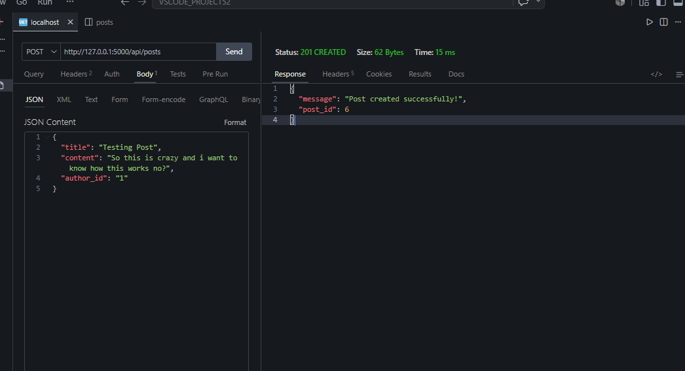
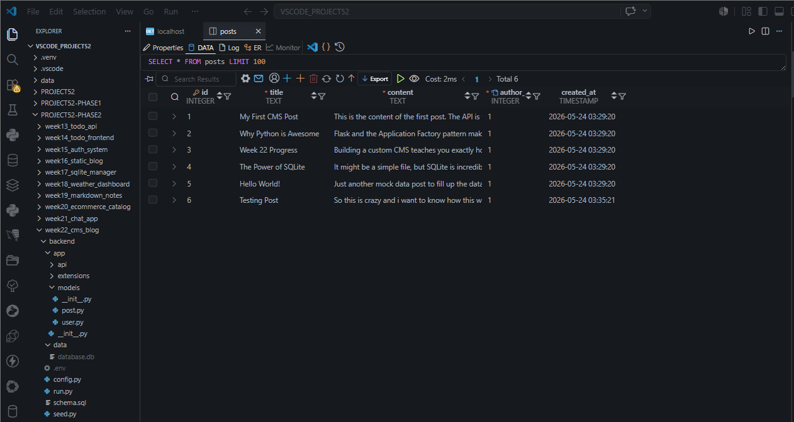
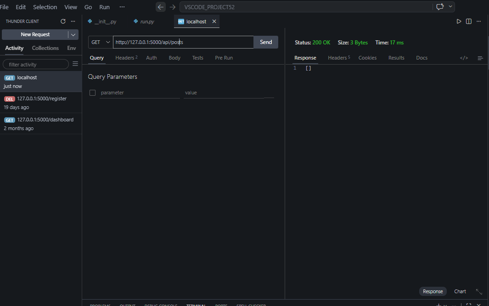

# 📝 DEV LOG: WEEK 22, DAY 2

## 1. Executive Summary

Day 2 focused on establishing the data pipeline between the SQLite database and the internet. The objective was to implement a clean Data Access Layer (DAL) using Python classes, and expose that layer via RESTful API endpoints utilizing Flask Blueprints. End-to-end Create and Read (CR) operations were successfully tested.

## 2. The Data Access Layer (Models)

Abstracted all raw SQL queries out of the API routes and into dedicated Model classes:

- **`User` Model:** Implemented `get_by_username` and `get_by_id` static methods to handle future authentication flows securely.
- **`Post` Model:** Built the foundation for CRUD operations. Implemented `get_all()` to retrieve the content feed, and `create()` to safely execute `INSERT` statements using parameterized queries to prevent SQL injection.

## 3. RESTful API Routing (Blueprints)

Registered the `/api/posts` Blueprint to handle HTTP requests:

- **`GET /api/posts/`**: Successfully retrieves all rows from the database, formats the SQLite tuples into standard Python dictionaries, and returns a sanitized JSON array (`HTTP 200 OK`).
- **`POST /api/posts/`**: Implemented payload ingestion via `request.get_json()`. Added essential backend validation to ensure required fields (title, content, author_id) are present before passing the data to the Model layer. Returns a success confirmation with the new resource ID (`HTTP 201 Created`).

## 4. Database Seeding

Engineered a custom `seed.py` automation script. This script connects directly to the `data/database.db` file, bypasses the web server entirely, and utilizes `cursor.executemany()` to bulk-insert mock articles. This provides the necessary volume of data required to build and test the frontend UI in subsequent days.

