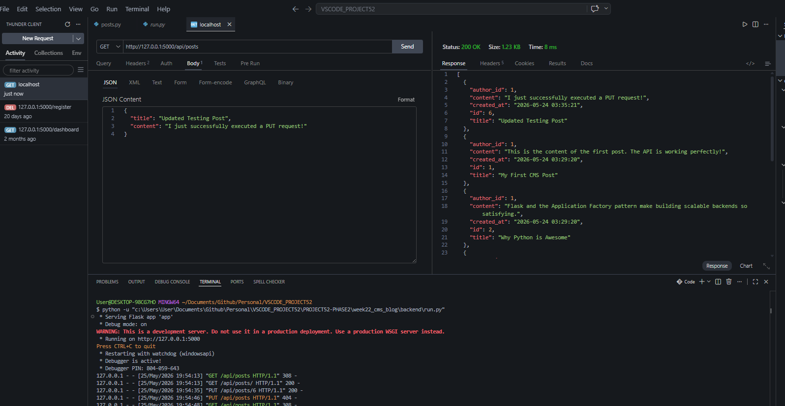
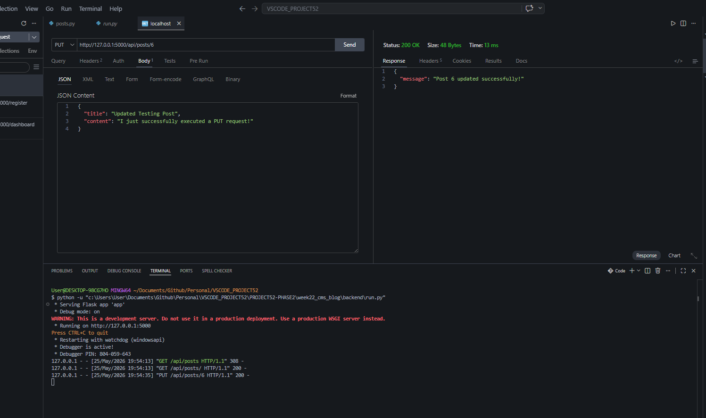

# 📝 DEV LOG: WEEK 22, DAY 3 

## 1. Executive Summary
Day 3 achieved full feature-completion for the backend Data Access Layer and REST API. The objective was to implement the remaining `UPDATE` and `DELETE` operations for the blog posts, finalizing the C.R.U.D. architecture. A comprehensive code review confirmed the system is secure, modular, and enterprise-ready.

## 2. Advanced Model Logic
Expanded the `Post` class within `/models/post.py`:
* **`get_by_id()`**: Implemented to retrieve a single row, providing a mechanism for the API to verify resource existence prior to modification.
* **`update()` & `delete()`**: Implemented strict parameterized SQL queries (`?`) to ensure complete protection against SQL injection vulnerabilities during write operations.

## 3. API Route Finalization
Upgraded the `/api/posts` Blueprint to support mutative HTTP methods:
* **`PUT /<int:post_id>`**: Engineered to intercept dynamic URL variables. The route validates incoming JSON payloads, verifies the target post exists, and returns a `404` if absent, before delegating the update to the Model.
* **`DELETE /<int:post_id>`**: Implemented a secure destruction route. Verifies resource existence before triggering the SQL `DELETE` command, returning a `200 OK` success confirmation.

## 4. Architectural Verification
The backend directory structure successfully isolates environment secrets (`.env`), database instances (`/data`), third-party connections (`/extensions`), SQL logic (`/models`), and web routing (`/api`). The Python backend is officially closed and ready for frontend integration.

