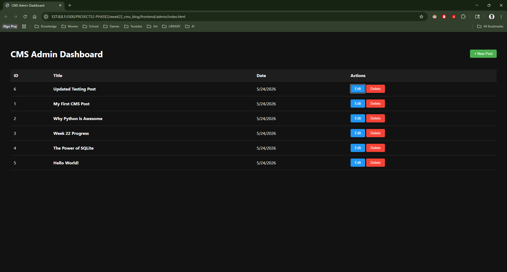

# DEV LOG: WEEK 22, DAY 4

## 1. Executive Summary

Day 4 marked the transition from backend architecture to frontend integration. The primary objective was to establish secure communication between the Flask API and the Vanilla JS frontend, and to dynamically render database records into an Admin UI. Strict adherence to Separation of Concerns (SoC) was maintained throughout the frontend refactor.

## 2. Cross-Origin Resource Sharing (CORS)

- **The Problem:** Browser security protocols natively block frontend applications (e.g., running on port 5500) from querying external APIs (e.g., port 5000) without explicit permission.
- **The Solution:** Integrated the `flask-cors` library into the Python Application Factory (`__init__.py`). By wrapping the Flask instance with `CORS(app)`, the backend was successfully configured to accept cross-origin HTTP requests, unblocking the UI data pipeline.

## 3. Frontend Architecture (Modular JS)

Engineered a centralized API Client (`/src/api/client.js`) to decouple network requests from UI logic.

- Implemented an asynchronous `getPosts()` method using the native `fetch()` API.
- Centralized the `BASE_URL`, ensuring that future environment shifts (from `127.0.0.1` to a production domain) require only a single variable update rather than sweeping codebase refactors.

## 4. UI Implementation & Separation of Concerns

- **Structure (`admin/index.html`):** Built a semantic HTML table layout to serve as the data container for the CMS dashboard.
- **Presentation (`admin/css/admin.css`):** Extracted all styling logic from the HTML file into a dedicated stylesheet, maintaining an enterprise-grade, clean component structure.
- **Behavior (`src/pages/admin.js`):** Engineered the DOM manipulation logic. Utilized an asynchronous `DOMContentLoaded` event listener to trigger the data fetch, iterate through the JSON payload, and dynamically construct `<tr>` nodes using `document.createElement()` and template literals for seamless injection into the UI.

