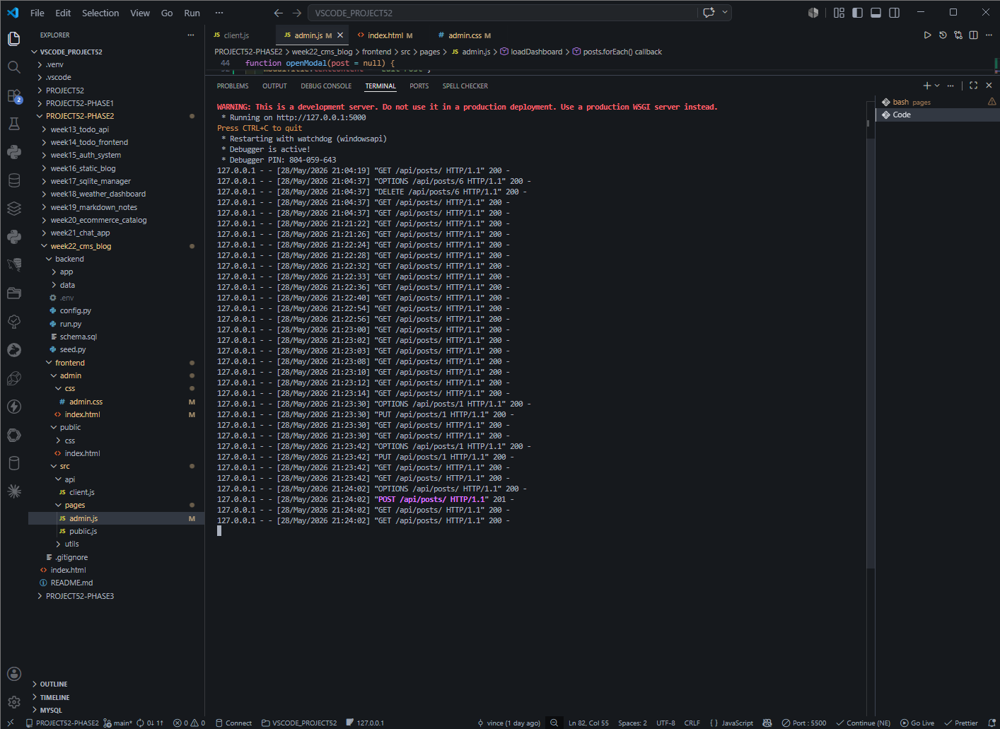
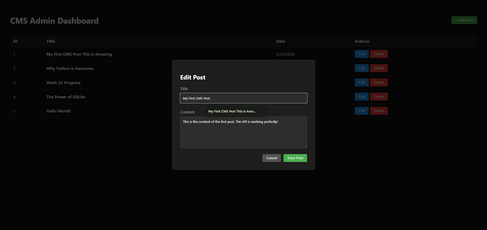
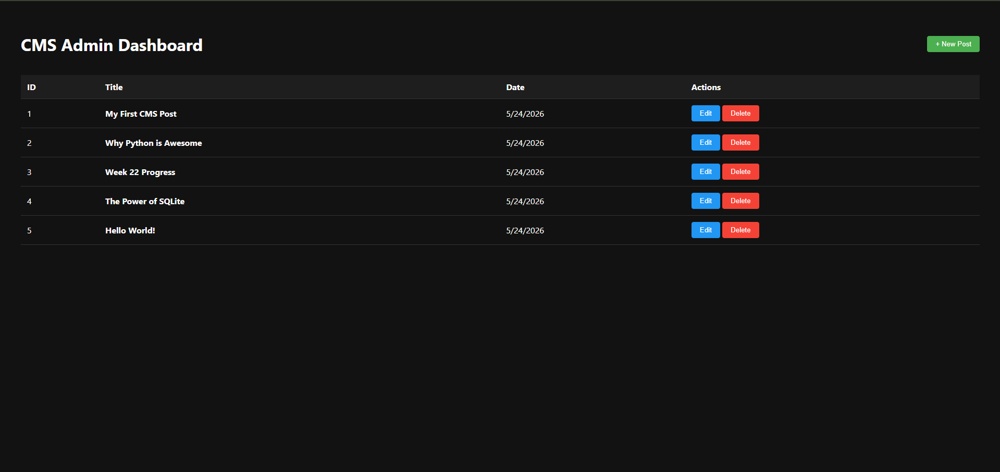
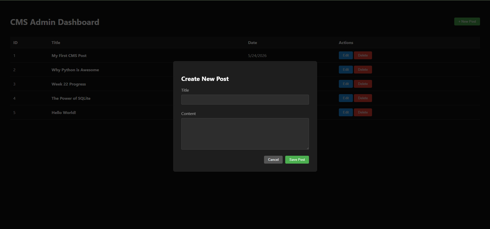
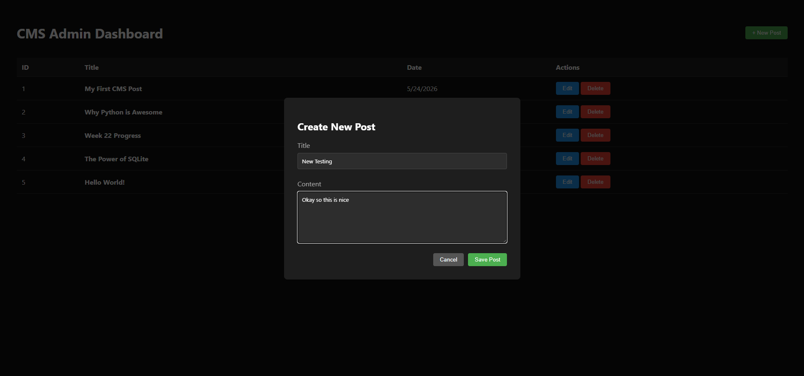
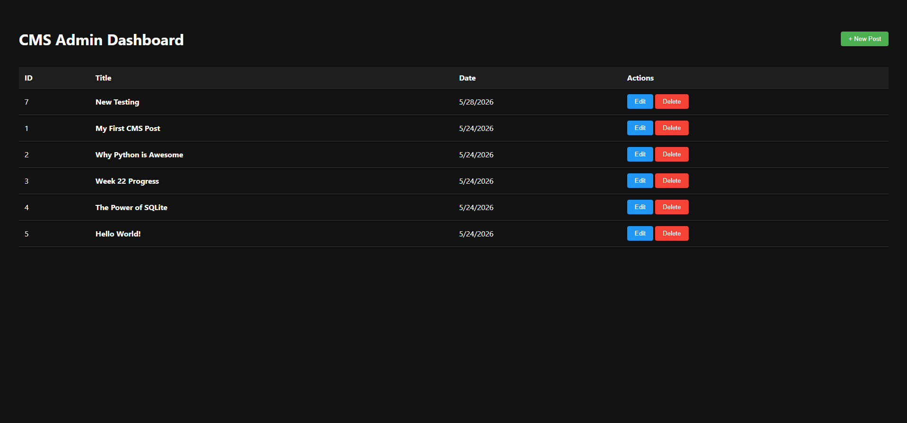

# 📝 DEV LOG: WEEK 22, DAY 5 

## 1. Executive Summary
Day 5 marked the completion of the Week 22 CMS project. The objective was to finalize the interactive C.R.U.D. pipeline by connecting the frontend UI to the `POST`, `PUT`, and `DELETE` API endpoints. This was achieved by engineering a reusable UI Modal component and implementing basic state management to track editing contexts.

## 2. API Client Expansion
Expanded the central `apiClient` (`/src/api/client.js`) to support mutative operations:
* Implemented `createPost()` utilizing the `POST` method and `JSON.stringify()` payloads.
* Implemented `updatePost()` utilizing the `PUT` method.
* Implemented `deletePost()` utilizing the `DELETE` method.
All network requests return boolean success flags to drive UI state updates.

## 3. UI Architecture: The Reusable Modal
Instead of building separate HTML pages for "Create" and "Edit", a single hidden Modal component was injected into the DOM.
* **State Management:** Utilized a `currentEditId` variable to track the active context. If `null`, the form operates in POST (Create) mode. If populated, it operates in PUT (Edit) mode.
* **Data Injection:** When the "Edit" button is triggered, the existing database row object is passed directly into the modal logic, automatically pre-filling the `<input>` and `<textarea>` fields.

## 4. Asynchronous DOM Refresh
Implemented a seamless user experience by chaining API requests with DOM updates. Upon a successful `POST`, `PUT`, or `DELETE` response, the UI automatically triggers the `loadDashboard()` function, silently fetching the latest database state and rebuilding the HTML table without requiring a full page reload.

