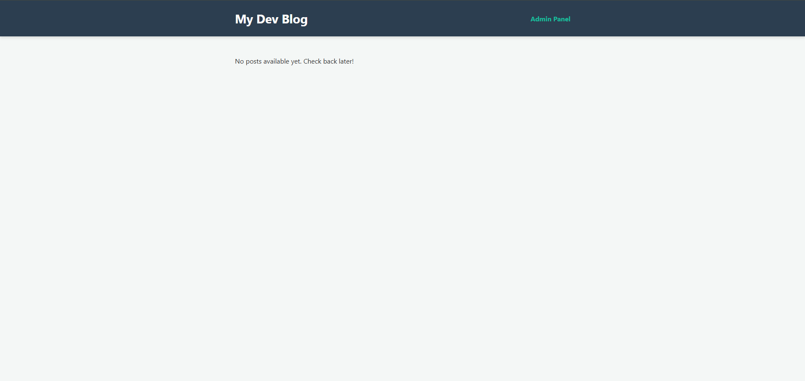
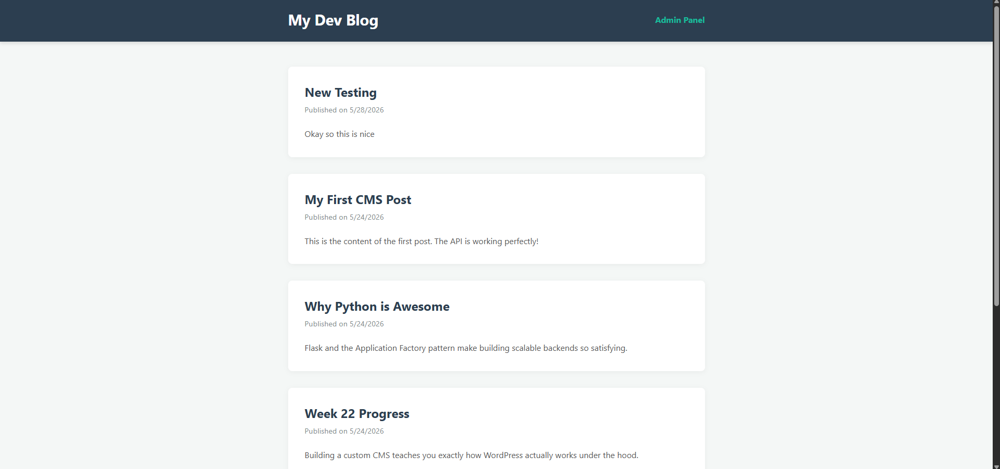

# 📝 DEV LOG: WEEK 22, DAY 6

## 1. Executive Summary
Day 6 focused on establishing the public-facing blog interface. The architecture was restructured to ensure strict Separation of Concerns, successfully isolating the Admin Panel (`/admin`) from the Reader View (`/public`). The UI is now successfully consuming the REST API to render a dynamic content feed, moving the project into its finalization phase.

## 2. Architectural Structure
* Implemented a dedicated `/public` directory to house the reader-facing HTML and CSS, maintaining parity with the `/admin` directory structure.
* Adjusted relative file paths across the application to ensure CSS stylesheets and modular JS scripts link correctly across the newly nested directory tree.

## 3. Client-Side Rendering (CSR)
* Reused the central `apiClient` (`/src/api/client.js`) to fetch the database payload, successfully demonstrating the efficiency of modular JavaScript and decoupled architecture.
* Engineered a dynamic DOM injection loop in `public.js` that iterates through the JSON payload and constructs standard `<article>` nodes.
* Implemented foundational edge-case handling to display a clean fallback message ("No posts available yet") when the database returns an empty array, preventing UI breakage.

## 4. Phase Status & Pending Finalization
The core Full-Stack loop (SQLite -> Flask API -> Vanilla JS) is fully operational. The application is now primed for the finalization phase, which will include UI/UX polish, advanced styling, and overall codebase optimization before being officially declared complete.

