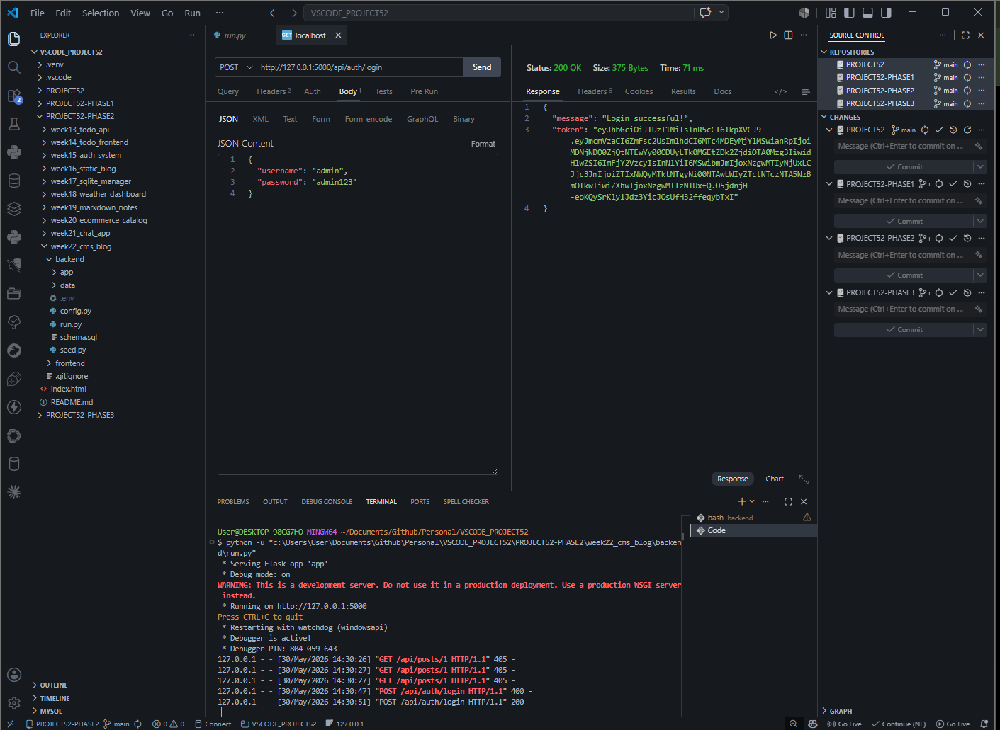
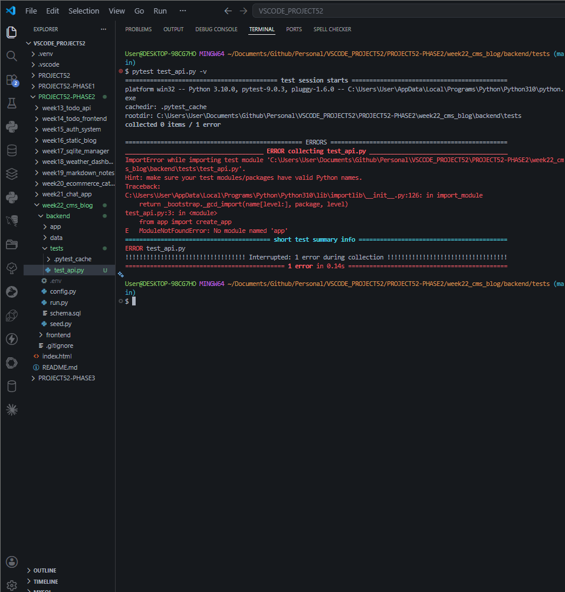
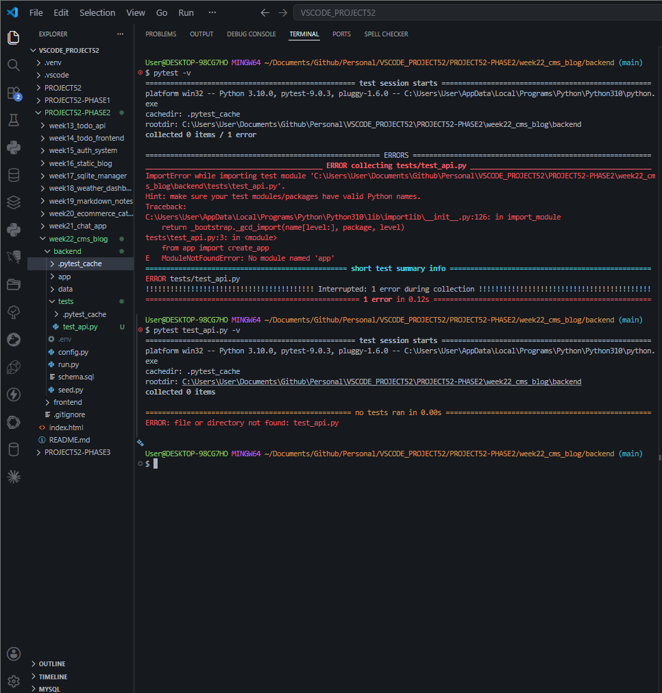
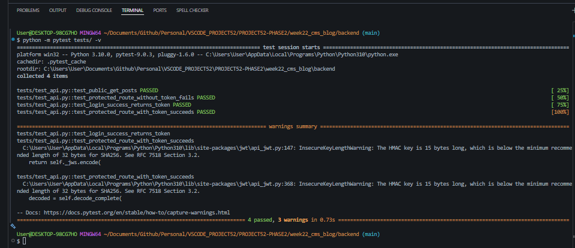
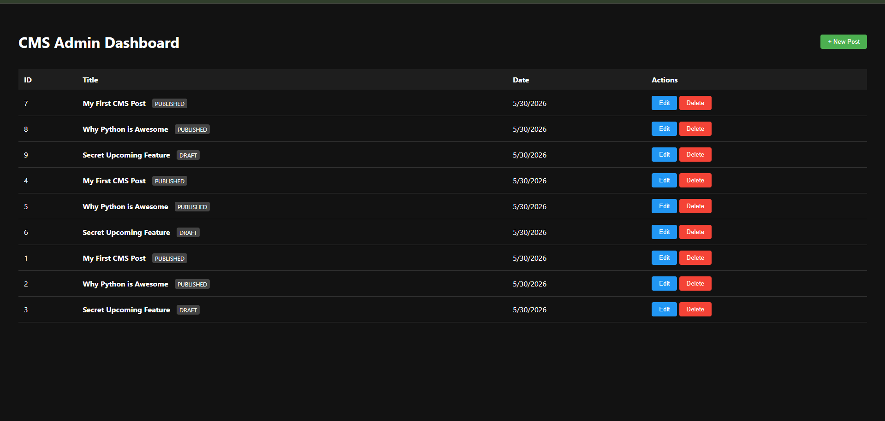
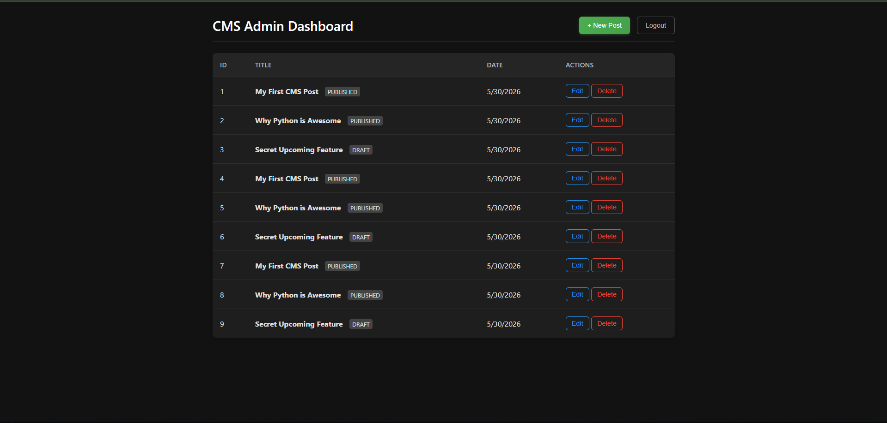
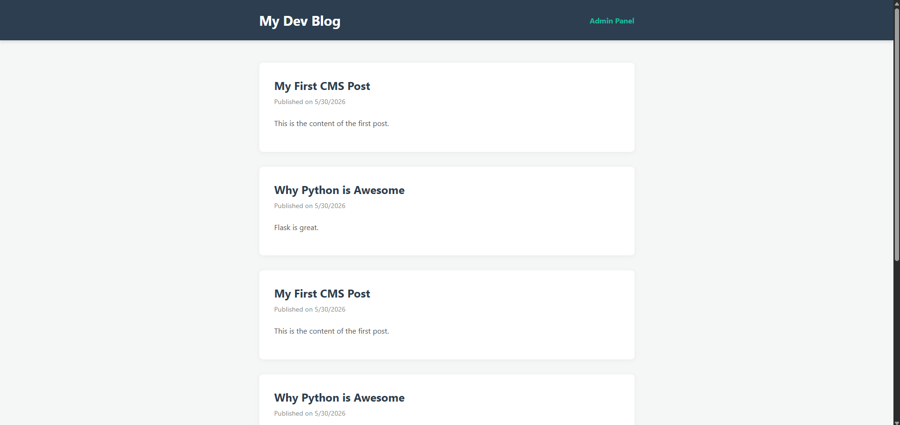
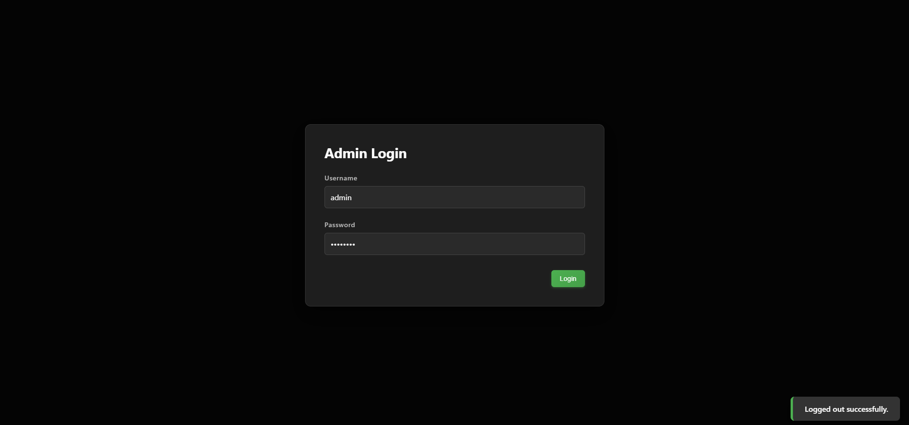

# DEV LOG: WEEK 22 FINALIZATION 

## 1. Executive Summary
The final phase of the Week 22 CMS project focused on elevating the application from a functional prototype to a production-ready system. Core engineering efforts were directed toward securing the REST API with JSON Web Tokens (JWT), preventing Cross-Site Scripting (XSS) attacks, implementing a "Draft vs. Published" data workflow, and heavily modularizing the frontend presentation layer.

## 2. Security Architecture
* **Database Encryption:** Implemented `werkzeug.security` to hash administrator passwords using SHA-256 before storage in the SQLite `users` table, preventing plain-text credential leaks.
* **API Lockdown (JWT):** Upgraded the Flask Application Factory to utilize `flask-jwt-extended`. The `POST`, `PUT`, and `DELETE` endpoints are now secured behind `@jwt_required()` decorators.
* **Client-Side Auth Flow:** Engineered a `utils/auth.js` module to handle login network requests, securely store the resulting JWT in the browser's `localStorage`, and dynamically inject the `Authorization: Bearer <token>` header into all mutative API calls.
* **XSS Prevention:** Integrated `DOMPurify` on the public frontend. All database strings pass through `DOMPurify.sanitize(marked.parse())` before DOM injection, neutralizing malicious script execution.

## 3. Data & State Management
* **Schema Migration:** Altered the `schema.sql` to include a `status` column (defaulting to 'draft') within the `posts` table.
* **Deterministic Sorting:** Refactored the `Post.get_all()` SQLite query to `ORDER BY id DESC` to resolve non-deterministic sorting issues caused by identical timestamp injections.
* **Content Workflow:** The public blog UI was updated to strictly fetch `?status=published` records, successfully hiding drafts from unauthorized readers.

## 4. UI/UX Optimization
* **CSS Modularization:** Extracted monolithic stylesheets into deeply decoupled modules (`admin.css`, `modal.css`, `toast.css`) to improve maintainability and adherence to Separation of Concerns.
* **Toast Notifications:** Replaced blocking browser `alert()` calls with a custom, keyframe-animated Toast Notification system for non-intrusive user feedback during database operations.
* **Authentication UI:** Replaced basic JS prompts with a dedicated, styled Login Modal that acts as a secure gateway to the Admin Dashboard.

