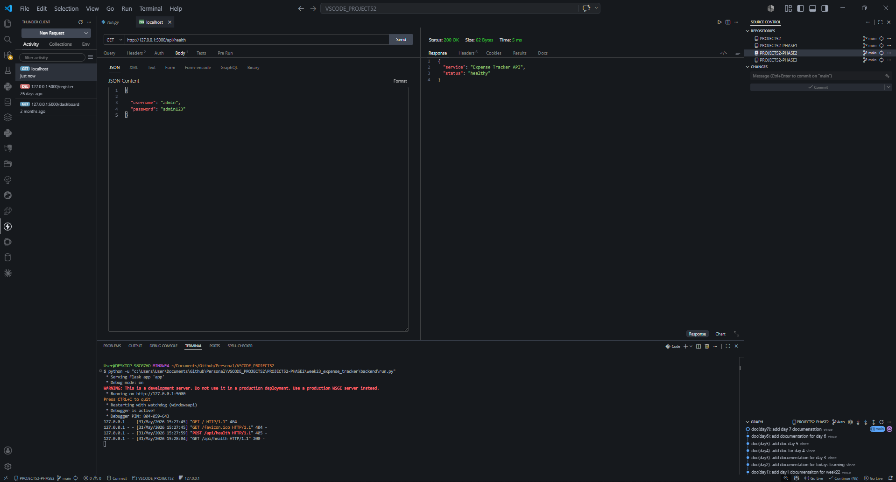
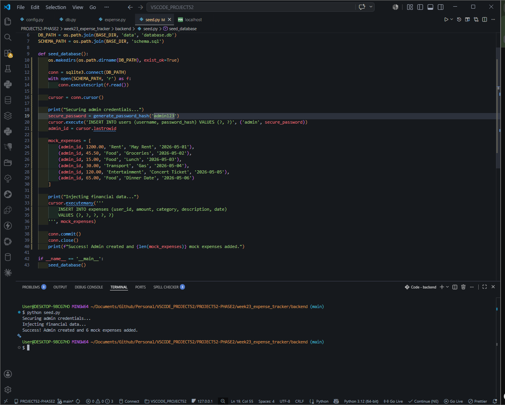
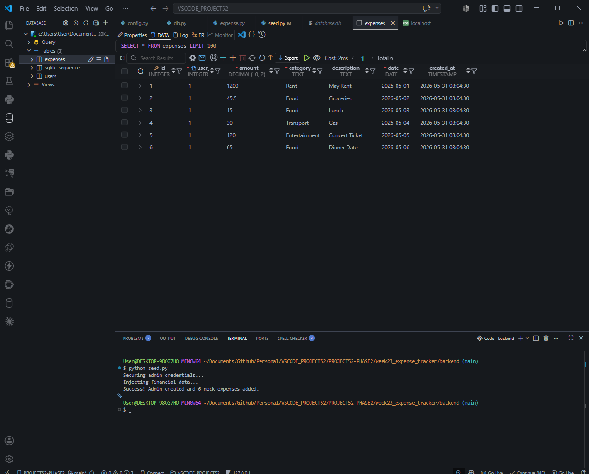

# 📝 DEV LOG: WEEK 23 - DAY 2 (THE DATA ENGINE)

## 1. Executive Summary
With the structural blueprint laid down, Day 2 was dedicated entirely to the data engine. The core engineering challenge of an Expense Tracker is generating category summaries for frontend data visualization (Chart.js). Instead of relying on Python to perform math across thousands of records, I engineered the backend to push the heavy mathematical lifting directly to the SQLite database layer.

## 2. SQL Aggregation (Pushing Compute to the DB)
If an application pulls 5,000 raw expense rows into Python memory and uses a `for` loop to calculate the totals, the server will experience massive RAM spikes and extreme latency. 

* **The Optimized Solution:** I wrote the `get_aggregated_by_category` method inside the `Expense` model using native SQL functions: `GROUP BY category` combined with `SUM(amount)`.
* **The Result:** The database engine, which is written in highly optimized C code, does the math instantly and returns a tiny payload of maybe 5 or 6 rows (e.g., `[{"category": "Food", "total": 450.50}, ...]`). The Flask API simply passes this pre-calculated data forward.

## 3. Database Connection Lifecycles
Improper database connections are the #1 cause of server crashes in backend development. 
* **Row Factories:** I configured `g.db.row_factory = sqlite3.Row` inside `utils/db.py`. This forces SQLite to return database rows as accessible Python dictionaries (e.g., `row['amount']`) rather than archaic, unreadable tuples (e.g., `row[2]`).
* **Teardown Context:** I wired Flask's `@app.teardown_appcontext` to my `close_db` utility. This guarantees that even if the Python code crashes or throws a massive 500 Server Error, the database connection will be safely closed, preventing "Database is locked" errors on subsequent requests.

## 4. Seeding Reproducible State
Frontend development is impossible without reliable backend data. I built a robust `seed.py` script to generate `database.db` from scratch.
* **Security & Payload:** The script securely hashes admin credentials using `werkzeug.security` and injects a deterministic mock dataset of categorized expenses. I now have a perfect, reproducible data state to begin writing API routes and frontend fetch pipelines on Day 3.

