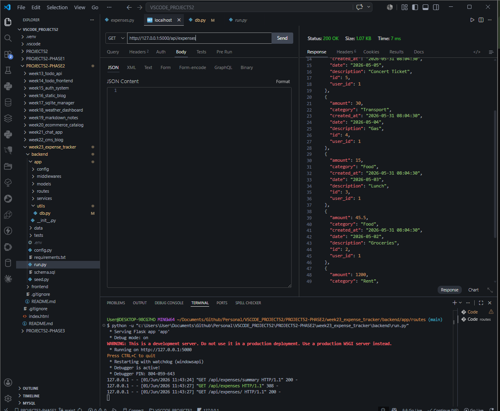
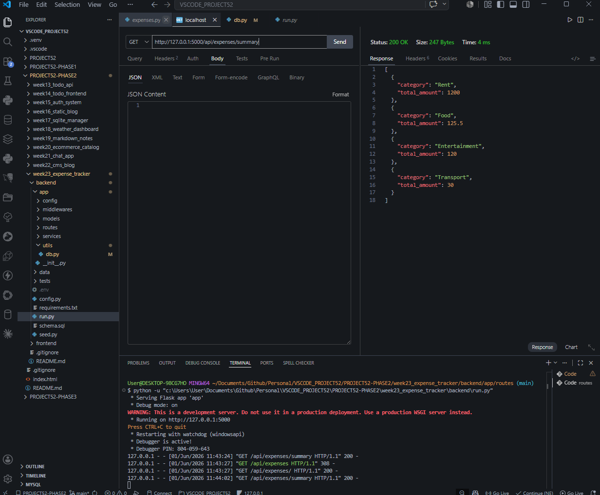
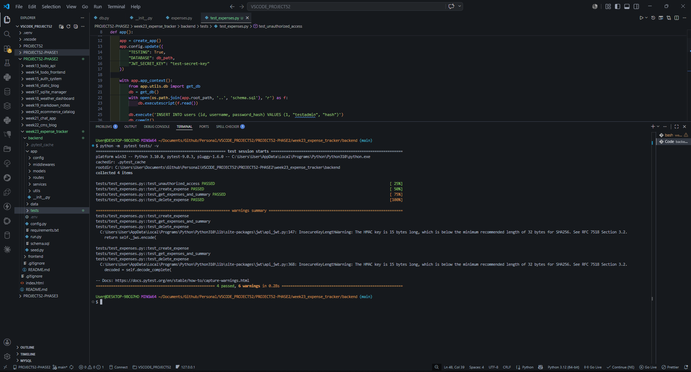

# DEV LOG: WEEK 23 - DAY 3 

## 1. Executive Summary
Day 3 focused on exposing the SQL aggregation engine via RESTful APIs. However, rather than stopping at a Minimum Viable Product (MVP), I executed a "Pro Max" upgrade to ensure the backend meets enterprise security standards. This involved implementing JWT authentication across all endpoints, adding a secure deletion workflow, and proving the architecture's stability via an automated test suite.

## 2. API Endpoint Architecture (Full CRUD)
I established a comprehensive suite of endpoints to support the frontend application:
* **`GET /api/expenses/`**: Retrieves the raw, un-aggregated list of transactions.
* **`GET /api/expenses/summary`**: Triggers the `get_aggregated_by_category` SQL method, returning pre-calculated financial totals.
* **`POST /api/expenses/`**: The mutative endpoint for logging new financial entries with strict payload validation.
* **`DELETE /api/expenses/<id>`**: A targeted endpoint allowing users to correct financial mistakes by deleting erroneous entries.

## 3. JWT Security & Data Isolation
Financial data is highly sensitive. Leaving endpoints unsecured or relying on hardcoded User IDs is a critical vulnerability.
* **Identity Extraction:** Every route is now protected by `@jwt_required()`. The backend dynamically extracts the `user_id` from the secure token (`get_jwt_identity()`) rather than trusting frontend payloads.
* **Safe Deletion:** The SQLite `delete` query was engineered to require *both* the `expense_id` and the `user_id` (`DELETE FROM expenses WHERE id = ? AND user_id = ?`). This physically prevents a malicious user from passing an arbitrary ID and deleting someone else's financial records.

## 4. Test-Driven Validation & Strict Typing
Engineered a comprehensive `pytest` suite utilizing `tempfile` to create isolated database instances, ensuring tests do not corrupt real financial data.
* **The 422 Strict Typing Bug:** During testing, `flask-jwt-extended` threw `422 UNPROCESSABLE ENTITY` errors. The root cause was passing an integer (`identity=1`) into the token generator instead of a string (`identity="1"`).
* **Resolution:** Corrected the JWT fixture signature to strictly use string-based identities. The test suite now passes at 100%, mathematically validating that unauthorized access is blocked, creation works, deletion is secure, and SQL aggregation math is perfectly accurate.

