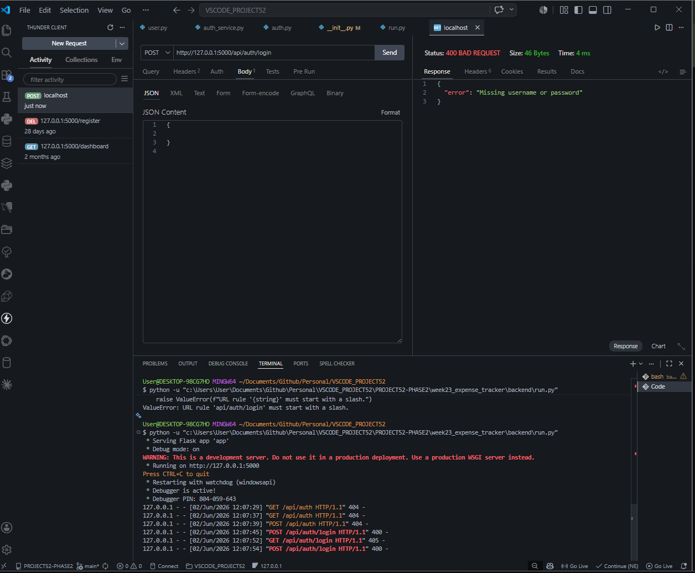
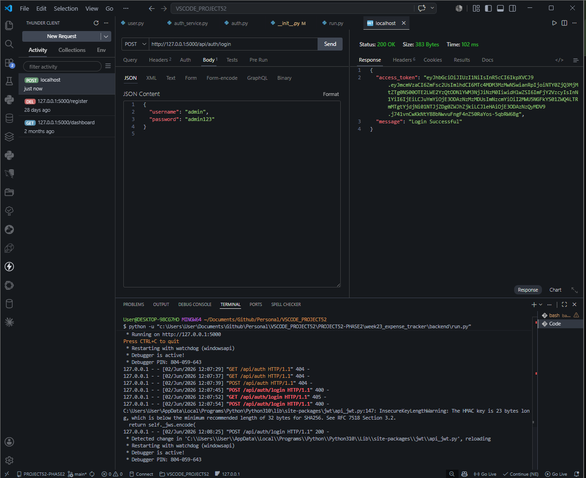
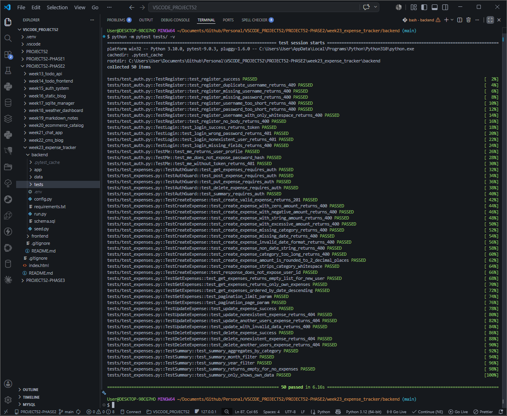
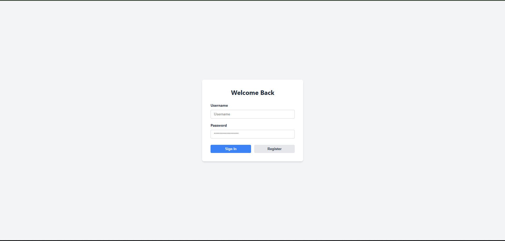
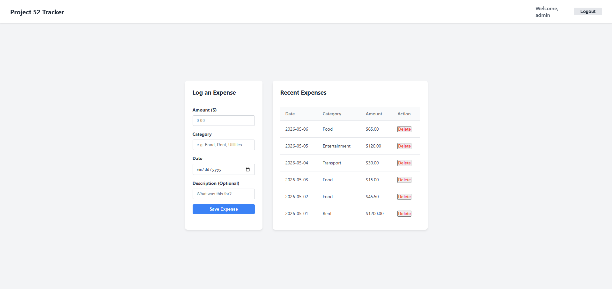

# DEV LOG: WEEK 23 - DAY 4

## 1. Executive Summary

Day 4 was originally slated for frontend integration, but a strict code audit revealed architectural gaps in the backend (missing registration, data leaks, weak validation). I executed a "Backend Hardening" phase to elevate the API to production standards before building the frontend's Singleton API Client and the Authentication UI.

## 2. Backend Hardening (Enterprise Patch)

Before allowing the frontend to connect, I patched several critical vulnerabilities and quality-of-life issues:

- **The Missing Front Door:** Engineered the `POST /api/auth/register` endpoint and added strict password/username rules (min lengths, whitespace stripping).
- **Data Leak Prevention:** Replaced `SELECT *` in the expense fetching logic with explicit column selections to prevent leaking the internal `user_id` to the client.
- **Pagination & Performance:** Implemented `?page=1&limit=50` logic on the GET routes to prevent massive payload crashes.
- **Strict Validation:** Upgraded the `validate_expense_data` helper to safely parse `0` amounts, reject negative numbers, round floating points to 2 decimal places, and strictly enforce `YYYY-MM-DD` date formatting.
- **State Verification:** Added a `GET /api/auth/me` route so the client can securely identify who is currently logged in.

## 3. Frontend Architecture (The Singleton Client)

To prevent "spaghetti code" (scattering `fetch()` calls and token headers across every UI component), I built a centralized API wrapper.

- **`client.js`**: A Singleton fetch wrapper that automatically intercepts outgoing requests to inject the JWT token from `localStorage`, and intercepts incoming responses to force a logout if it detects a `401 Unauthorized` status.
- **Service Modules:** Built `auth.js` and `expenses.js` to map directly to the backend endpoints, abstracting all network logic away from the UI.

## 4. UI Implementation (Separation of Concerns)

Built the Login/Registration portal and the Dashboard scaffolding.

- **Strict Separation:** Eschewed inline utility classes (like Tailwind) in favor of strict separation of concerns: `HTML` for structure, `CSS` for design, and `JS` for logic.
- **State-Aware Routing:** The login script instantly redirects to `/index.html` upon successful authentication, and the dashboard script kicks the user back to `/login.html` if no token is found.

