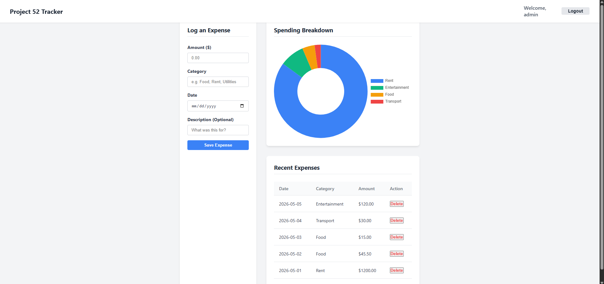
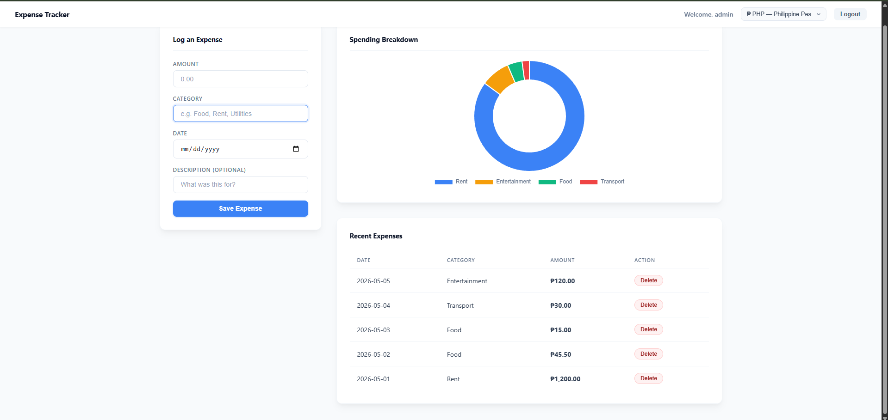
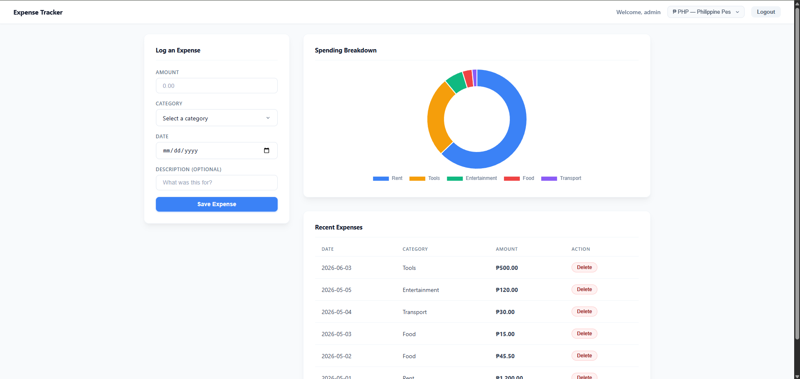

# 📝 DEV LOG: WEEK 23 - DAY 5 

## 1. Goal of the Day
Today,Now that the backend is fully secure (requiring logins and checking for bad data), the main goal today was to clean up the messy frontend code, add the Chart.js visualizer, and make the app load faster. 

## 2. Cleaning Up the Login & Register Pages
Having all your code in one giant file quickly turns into a messy "spaghetti" trap. We fixed this by separating things into their own spaces.

* **Two Separate Pages:** Instead of cramming Login and Register into one HTML file, we split them into `login.html` and `register.html`.
* **Two Separate Scripts:** We also split the JavaScript. `login.js` only worries about logging in, and `register.js` only worries about registering. This makes the code much easier to read and prevents bugs where buttons accidentally trigger the wrong action.
* **Smooth User Experience:** When a user registers, instead of instantly teleporting them away, the app shows a green "Success!" message for exactly 2 seconds, and *then* gently sends them to the login page.

## 3. Fixing the CSS and App Layout
We did a massive cleanup of the visual design so the app looks premium and clean.

* **No More Messy HTML:** We removed all the inline styles (like `
`) from our HTML files. All the design rules now live properly in `style.css`.
* **Fixed the Layout Bug:** The code we used to perfectly center the Login card was accidentally crushing the Dashboard layout. We fixed this by moving that centering trick into a specific `.login-wrapper` class so it only affects the login page.
* **CSS Grid Dashboard:** We changed the Dashboard layout so the "Log an Expense" form is always a comfortable, fixed width on the left (350px), while the chart and table automatically stretch to fill the rest of the screen on the right.

## 4. Building the Chart & Smart Categories
We turned the raw numbers into a visual breakdown so users can actually see where their money is going.

* **Adding Chart.js:** We added a Doughnut chart. We also added a crucial fix: every time the chart updates, the code *deletes* the old chart before drawing the new one. If we didn't do this, the old charts would stay hidden in the background, slowing down the computer and causing visual glitches when you hover your mouse over them.
* **Smart Dropdown Menu:** Instead of making the user type out their category every time, we changed it to a dropdown. We wrote a script that looks at the user's past data, finds any custom categories they made (like "Gaming"), and automatically adds them to the dropdown list for next time.

## 5. Making the App Faster and Safer
We added some final touches to make the app feel instant and prevent user errors.

* **Multiple Currencies:** We built a feature that formats numbers into proper money (defaulting to the Philippine Peso, ₱). It saves your choice in the browser (`localStorage`), so if you refresh the page, it remembers what currency you like.
* **Loading Twice as Fast:** Before, the app would download the table data, wait for it to finish, and *then* download the chart data. We changed the code to download both at the exact same time (`Promise.all`). This makes the dashboard load much faster.
* **Preventing Double-Clicks:** We made it so the moment you click "Save Expense," the button turns grey and says "Saving...". This physically stops users from double-clicking the button and accidentally saving the same expense twice in the database.

