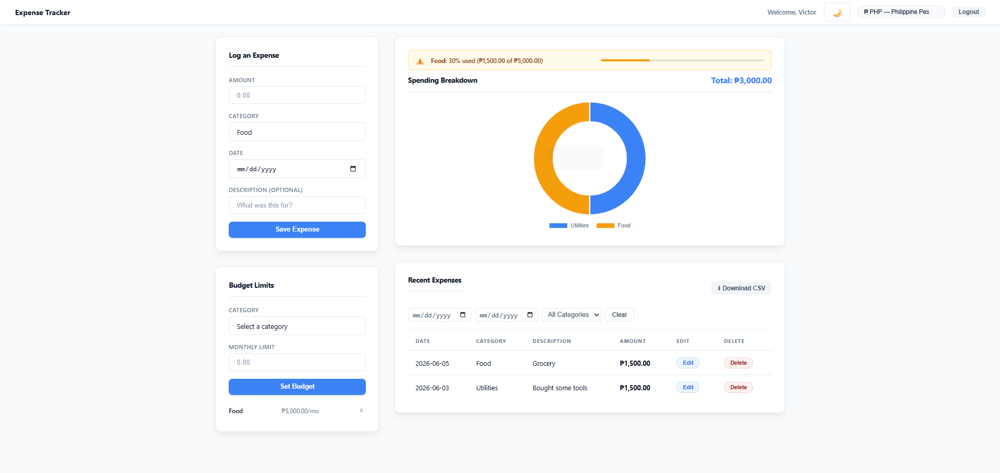
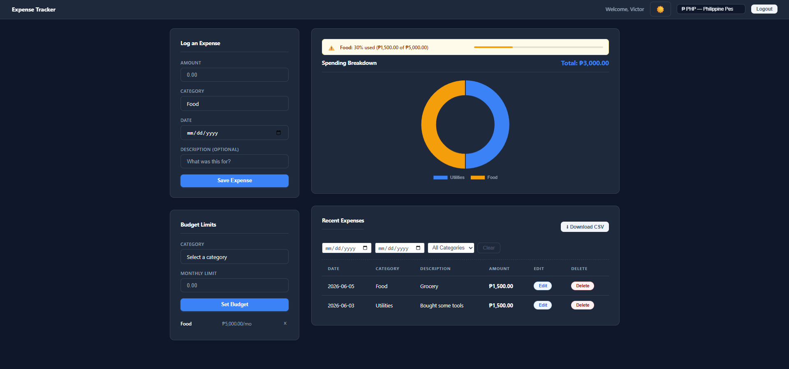

# DEV LOG: WEEK 23 - DAY 7

## 1. Goal of the Day
Day 7 is about polish and presentation. The core application—complete with a secure backend, real-time filtering, data visualization, and export capabilities—is fully operational. Today's objective was to add a final "Premium" UI touch and write the official repository documentation so the project is ready for the portfolio.

## 2. Implementing Dark Mode Architecture
Instead of writing duplicate CSS for every element, we engineered a scalable theming system using CSS Variables.

* **CSS Variables (Custom Properties):** We defined a global `:root` palette for Light Mode (default) and a specific `[data-theme="dark"]` palette. 
* **Global Implementation:** We updated the base structural classes (`body`, `.card`, `.expense-table`) to dynamically reference these variables (e.g., `var(--bg-main)`). This ensures buttery-smooth color transitions without requiring massive CSS overrides.
* **Persistent State Management:** We built a `ThemeManager` utility in JavaScript. When the user clicks the 🌙/☀️ toggle in the navbar, the script updates the DOM and saves their preference to `localStorage`. If the user refreshes or returns later, the app remembers their exact theme choice.
## 3. The Ultimate README.md
Code is only as good as its documentation. We completely rewrote the GitHub `README.md` to reflect the senior-level architecture of the project.

* **Highlighting the Stack:** Explicitly listed Python, Flask, SQLite, Vanilla JS, and Chart.js.
* **Explaining the "Why":** Documented *why* the code is good—mentioning the MVC pattern, the Single Responsibility Principle used to decouple the frontend auth files, and the `Promise.all()` optimizations used for data fetching.
* **Onboarding:** Provided clear, step-by-step local installation instructions so any recruiter or developer can clone the repo, spin up the virtual environment, seed the database, and run the app effortlessly.

## 4. Week 23 Sign-off
This marks the official completion of Week 23. Over the last 7 days, this project evolved from a basic idea into an enterprise-grade dashboard. 

**Final Feature Checklist:**
- [x] Secure REST API with JWT Authentication (Flask).
- [x] Hardened SQLite Database with strict data validation.
- [x] Decoupled Frontend Architecture (Vanilla JS + MVC).
- [x] Real-time Data Visualization (Chart.js with canvas memory management).
- [x] Power-User Tools (Real-time Date/Category Filtering & CSV Exporting).
- [x] Global Localization (Native Currency Formatting).
- [x] Premium Minimalist UI with persistent Dark Mode.

