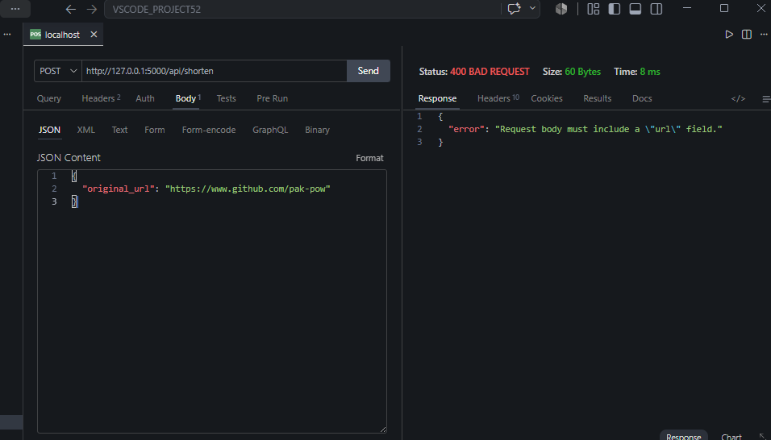
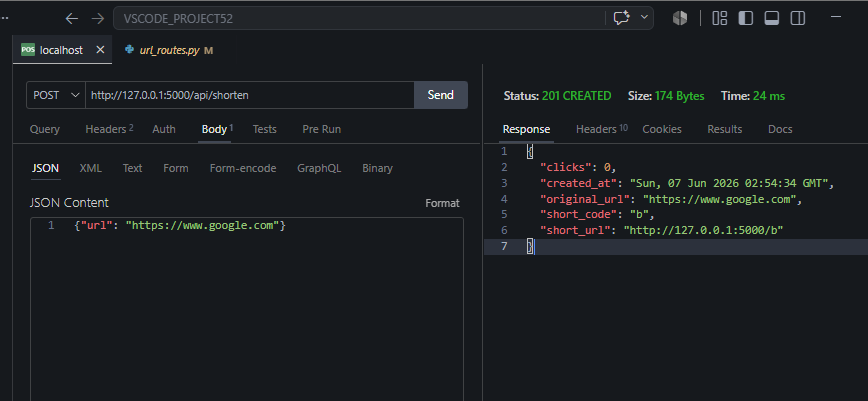
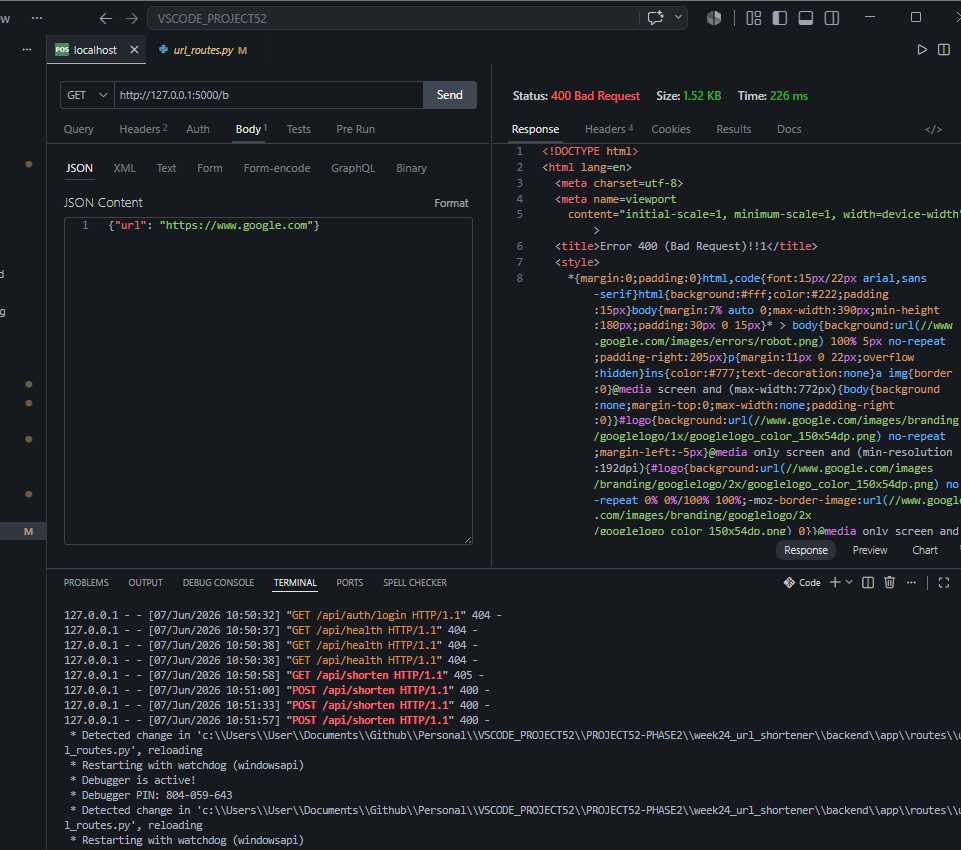
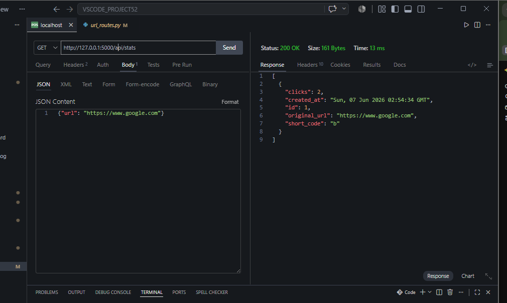

# DEV LOG: WEEK 24 - DAY 2

## 1. Goal of the Day
The objective for Day 2 was to mathematically prove the Base62 engine and logically verify the Service layer using Test-Driven Development (TDD). Once the automated tests passed, the goal expanded to booting the Flask server and executing live HTTP network tests to prove the end-to-end MVC pipeline.

---

## 2. Automated Testing & Conftest Architecture
Instead of testing against our real database, we engineered a secure testing environment.
* **The Toolbox (`conftest.py`):** Configured a `pytest` fixture that intercepts database connections and redirects them to an ephemeral, in-memory SQLite database (`:memory:`).
* **Mathematical Proofs:** Wrote symmetry tests for `app/utils/base62.py` proving that any integer converted to a Base62 string decodes perfectly back to the original integer.
* **Service Logic Verification:** Validated that `url_service.py` correctly rejects malformed URLs, correctly routes valid ones, and perfectly deduplicates requests (returning an existing short code instead of creating duplicate database rows).

---

## 3. Bug Squashing: The Import Cache State Leak
During testing, we encountered a classic backend bug where tests began failing because clicks were mysteriously persisting between test runs (e.g., expecting 2 clicks but finding 4).
* **The Cause:** The `url_model.py` file used `from app.utils.db import get_db`. In Python, this creates a *hard copy* of the function in memory at boot time. By the time `conftest.py` tried to hijack the database connection for testing, the model was already permanently linked to the real `database.db` file.
* **The Fix:** Refactored the import to reference the module itself (`from app.utils import db as db_utils`) and invoked it dynamically (`db_utils.get_db()`). This ensured the model always checked the current, live state of the connection, perfectly isolating the test database.

---

## 4. Live Network Integration (Thunder Client)
With the tests glowing green, we booted the Flask server and executed manual integration tests over a local network connection, proving the API contract.
* **POST `/api/shorten`:** Successfully accepted a JSON payload (`{"url": "https://..."}`), created the database entry, and returned a `201 Created` status with the generated Base62 short code. Verified the 400 Bad Request guard clause works when the wrong JSON key is sent.
* **GET `/<short_code>`:** Simulated a browser request. The server successfully intercepted the short code, retrieved the original URL, and returned a `301 Moved Permanently` redirect.
* **GET `/api/stats`:** Verified that the analytics engine successfully tracks the `clicks` counter, incrementing exactly by 1 each time the redirect endpoint is triggered.

