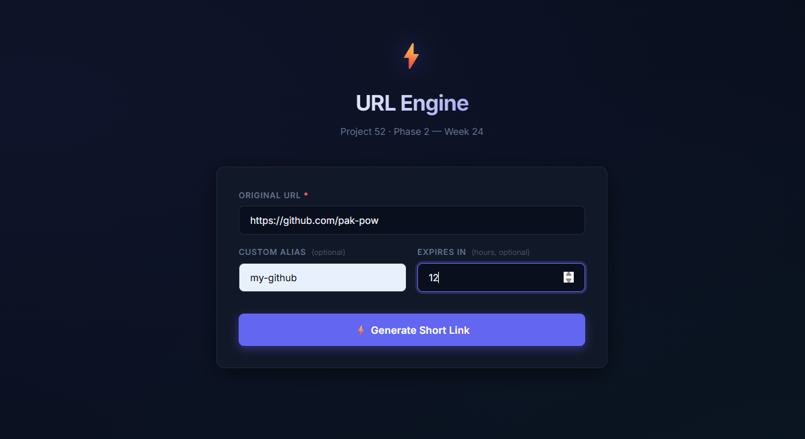

# DEV LOG: WEEK 24 - DAY 6

## 1. Goal of the Day
The objective was to construct a modular, scalable client-side interface to interact with the Python backend. During integration, a deep-dive security and logic audit was executed across the stack, requiring real-time patching of edge-case bugs, SQLite parsing limitations, and local developer tooling friction.

---

## 2. Frontend Architecture & UX Polish
* **Modular CSS & Semantic HTML:** Scaffolded a strict directory structure (`src/assets`, `src/components`). Stripped all inline styles in favor of utility classes to strictly separate structure from presentation.
* **The JavaScript Engine (`main.js`):** Implemented an async/await wrapper connecting the DOM to the `url_api.js` endpoints. Fixed a payload construction bug where an empty "Expires In" input sent `{ expires_in_hours: NaN }` resulting in a 400 Bad Request.
* **The Result Modal & SVGs:** Upgraded the UI from basic text injection to an animated spring-bounce modal with a blurred backdrop. Purged all text-based emojis and replaced them with crisp, inline SVG icons (e.g., animated loading spinners, clipboard toggle states) for a production-grade aesthetic.
* **Clickable Error Banners:** Enhanced the `409 Conflict` response. If an alias is taken by a different destination, the error message dynamically renders a clickable, secure link to the conflicting URL.

---

## 3. Backend Hardening & Database Debugging
* **The SQLite Timestamp Crash (`ValueError`):** Diagnosed a "black hole" 500 error masking as a 400. Python's default SQLite parser (`sqlite3.PARSE_DECLTYPES`) was failing to split ISO-8601 timestamps containing a "T" separator. Removed `detect_types` to allow standard string handling via `datetime.fromisoformat()`.
* **Database Auto-Migration:** Implemented `_migrate_db()` to automatically reconcile schema drifts. This specifically resolved crash loops caused by stale `.db` files enforcing a legacy `NOT NULL` constraint on the `short_code` column during the new Base62 creation flow.
* **Advanced Alias Logic:** * *Graceful Deduplication:* Submitting an exact matching Original URL + Custom Alias now safely returns the existing record instead of throwing a collision error.
  * *Alias Reclamation:* The engine actively purges expired custom aliases, releasing them back into the pool.

---

## 4. Developer Experience (DX) & Tooling
* **Live Server Write-Loop:** Resolved an aggressive page-refresh loop where VS Code's Live Server interpreted backend database writes (`database.db`) as frontend code changes. Added `.vscode/settings.json` to explicitly ignore `.db`, `.db-wal`, and `__pycache__` files.
* **CSP Tuning:** Removed overly strict Content-Security-Policy meta tags that were blocking local hot-reload scripts and external stylesheets.

