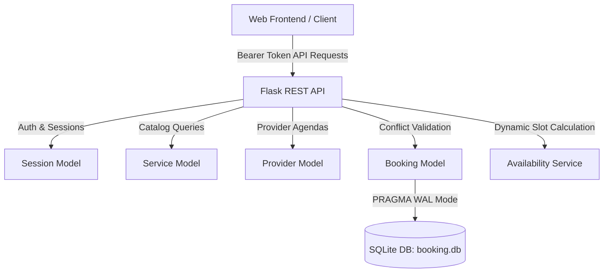

# 📝 DEV LOG: WEEK 31 - DAY 1

**Core Objective:** Scaffold `week31_booking_system` and establish a production-grade backend architecture handling appointment scheduling, provider agendas, dynamic time-slot calculation, and double-booking conflict protection, with an individual git commit for every file.

---

## 1. The Initiative 

Week 31 shifts from social media feeds to commercial appointment and resource booking software (similar to Calendly or OpenTable). Day 1 laid down the core data foundation: a relational SQLite database operating in WAL mode, Flask application factory, Bearer token authentication, user and provider models, and an availability engine that dynamically calculates open time slots.

---

## 2. Database Schema & Data Models

The database structure in `backend/data/schema.sql` enforces data integrity with foreign key cascades, strict column check constraints, and indexed lookups:

- **`users`**: Client, provider, and admin accounts (`username`, `display_name`, `email`, `role`, `password_hash`).
- **`sessions`**: Bearer token session storage (`token`, `user_id`, `created_at`).
- **`services`**: Service catalog items (`title`, `description`, `duration_minutes`, `price`, `category`).
- **`providers`**: Staff/specialists linked 1:1 with users (`user_id`, `title`, `bio`).
- **`provider_services`**: M:N mapping linking qualified providers to specific catalog services.
- **`provider_availability`**: Weekly working hours schedules (`provider_id`, `day_of_week` 0-6, `start_time`, `end_time`).
- **`bookings`**: Appointment records (`user_id`, `provider_id`, `service_id`, `booking_date`, `start_time`, `end_time`, `status`, `notes`).

---

## 3. The Availability (`availability_service.py`)

The availability engine dynamically computes open vs. booked time slots for any requested provider, service, and date:

$$\text{Slot Interval} = \text{service.duration\_minutes}$$
$$\text{Grid Increment} = 30 \text{ minutes}$$

1. Inspects `provider_availability` for the requested day of week (0=Mon ... 6=Sun).
2. Queries active `confirmed` appointments for the provider on that `booking_date`.
3. Iterates from working start time to working end time in 30-minute increments.
4. Marks slots as `available: false` if any interval overlap occurs with existing booking spans `[b_start, b_end)`.

---

## 4. REST API Route Specifications

- `GET /api/health` — Health check endpoint (`status: ok`).
- `POST /api/auth/register` — User registration & automatic session token generation.
- `POST /api/auth/login` — Authentication & session issuance.
- `GET /api/auth/me` — Fetch current user profile (requires Bearer token).
- `POST /api/auth/logout` — Invalidate session token.
- `GET /api/services` — List service catalog (filterable by `category`).
- `GET /api/services/<id>` — Get service details and qualified providers.
- `GET /api/providers` — List all specialists and providers.
- `GET /api/providers/<id>/availability` — Query open time slots (`?service_id=X&date=YYYY-MM-DD`).
- `POST /api/bookings` — Book a new appointment (validates no overlapping conflict).
- `GET /api/bookings/my-bookings` — List authenticated user's appointments.
- `DELETE /api/bookings/<id>` — Cancel an existing appointment.

---
