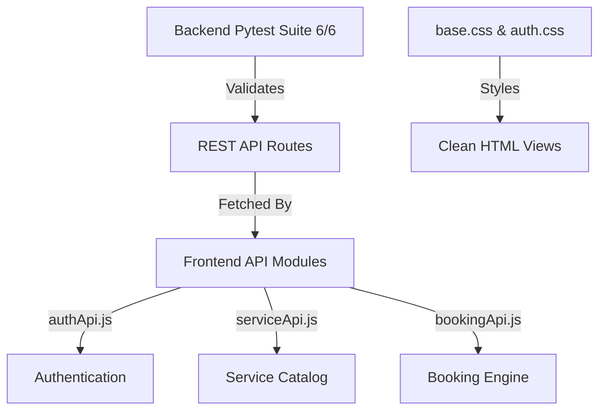

# 📝 DEV LOG: WEEK 31 - DAY 2

**Core Objective:** Expand the backend Pytest suite to 6 comprehensive tests covering double-booking conflicts and cancellations, build the frontend CSS design system (`base.css` and `auth.css`), build modular API wrappers, and extract all inline styles and scripts into standalone JS/CSS modules with individual git commits.

---

## 1. The Initiative & Context
Day 2 focused on testing rigor and front-end architectural cleanups. On the backend, we expanded the test suite to validate catalog queries, dynamic availability calculations, double-booking rejection (`409 Conflict`), and appointment cancellations. On the frontend, we scaffolded modular API clients, built a Slate & Indigo CSS token design system with dark/light mode persistence, and refactored HTML templates to ensure zero inline styles or scripts.

---

## 2. Expanded Pytest Suite (`backend/tests/test_booking_routes.py`)

The test suite was expanded to 6 comprehensive test cases running on an isolated temporary SQLite database fixture:

1. `test_health_check` — Verifies `/api/health` returns `200 OK` and service metadata.
2. `test_user_registration_and_login` — Tests user account creation and Bearer token issuance.
3. `test_list_services_and_details` — Tests `/api/services` catalog queries and single service detail lookups.
4. `test_check_provider_availability` — Verifies open time slots on working days.
5. `test_booking_creation_and_double_booking_conflict` — Tests appointment creation and verifies that overlapping double-booking attempts are rejected with `409 Conflict`.
6. `test_list_my_bookings_and_cancellation` — Tests listing user appointments and cancelling an existing appointment (`DELETE /api/bookings/<id>`).

---

## 3. Frontend Architecture & Modular Extracted Assets

All inline styling and page scripts were extracted into standalone, reusable modules:

- **`src/assets/base.css`**: CSS variables for Slate/Indigo dark theme and Light mode overrides, responsive container layouts, hero banner, category pill filters, card components, skeleton loaders, and toast alerts.
- **`src/assets/auth.css`**: Dedicated stylesheet for centered authentication cards (`.auth-card`), input groups (`.form-input`), and label styling.
- **`src/utils/helpers.js`**: Utility functions for XSS string escaping (`escapeHtml`), USD currency formatting (`formatCurrency`), date formatting (`formatDate`), and dynamic toast notifications.
- **`src/utils/theme.js`**: LocalStorage theme persistence (`booking_theme`) and toggle logic.
- **`src/utils/authCheck.js`**: Bearer token and user session storage helpers.
- **`src/api/authApi.js`**, **`serviceApi.js`**, **`bookingApi.js`**: Modular Fetch API clients handling request headers and JSON responses.
- **`src/components/navbar.js`**: Dynamic navigation header with active link highlighting, user greeting, and theme toggle button.
- **`src/pages/indexPage.js`**, **`loginPage.js`**, **`registerPage.js`**: Standalone page controller scripts.

---
