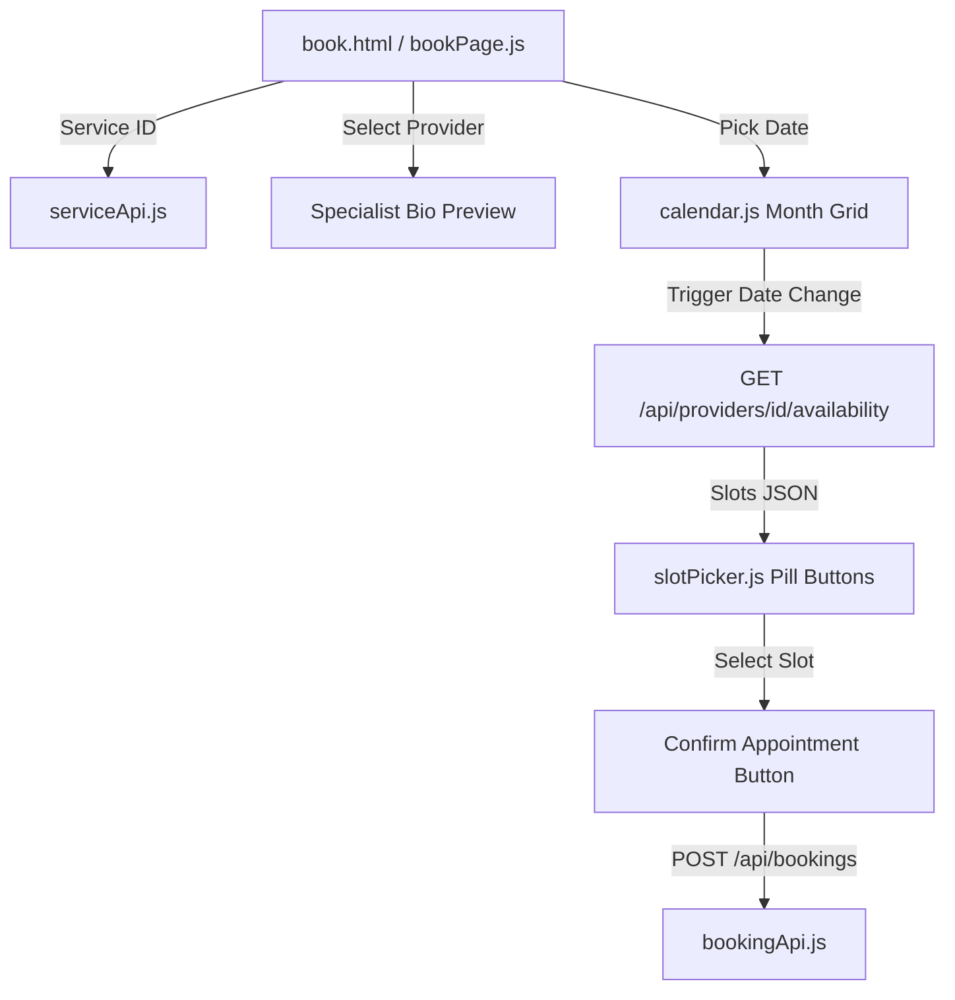

# 📝 DEV LOG: WEEK 31 - DAY 3
**Core Objective:** Build the interactive month-view calendar widget, dynamic time slot picker component, appointment checkout page, and polish typography, visual action badges, form controls, and back navigation with individual git commits for every file.

---

## 1. The Initiative & Context
Day 3 delivered the core interactive scheduling experience for Week 31. Clients can now view an interactive month calendar widget, navigate between months, pick an available working day (Mon–Fri), inspect real-time slot availability fetched from `/api/providers/<id>/availability`, view specialist bio cards, and confirm appointment reservations.

---

## 2. Interactive Components Built
- **`src/components/calendar.js`**: Custom month-view calendar component with month navigation (`❮` / `❯`), weekday headers, disabled states for past dates and weekends (Sat/Sun), and active selection highlight (`.selected`).
- **`src/components/slotPicker.js`**: Dynamic time slot picker pill buttons. Available slots are rendered with hover accents and click handlers; booked/unavailable slots are disabled with strike-through styling.
- **`src/pages/bookPage.js`**: Page controller coordinating service details, specialist dropdown, provider bio preview, calendar date selection, smooth scrolling to time slots, and appointment submission.
- **`public/book.html`**: Checkout wizard template featuring `← Back to Services` navigation, summary sidebar card, and calendar container.

---

## 3. UI/UX & Typography Polish
- **Global Form Controls (`base.css`)**: Extracted input styling (`.form-input`) to ensure form inputs inherit slate dark theme variables (`#1e293b`) instead of falling back to default browser white boxes.
- **Visual Action Badges (`calendar.css`)**: Added amber action badges (`📌 Select on calendar`, `⏰ Select time slot`) that transform into bold indigo highlight badges (`📅 Tue, Jul 28, 2026`, `⏰ 12:30 - 13:30`) upon selection.
- **Back Navigation**: Added a clean `← Back to Services` pill button allowing users to return to the catalog page (`index.html`) at any point.
- **Specialist Bio Card**: Added dynamic bio preview (`💡 Specializing in family medicine...`) beneath the provider dropdown.
- **Smooth Auto-Scroll**: Selecting a date automatically smooth-scrolls down to the time slot container.

---