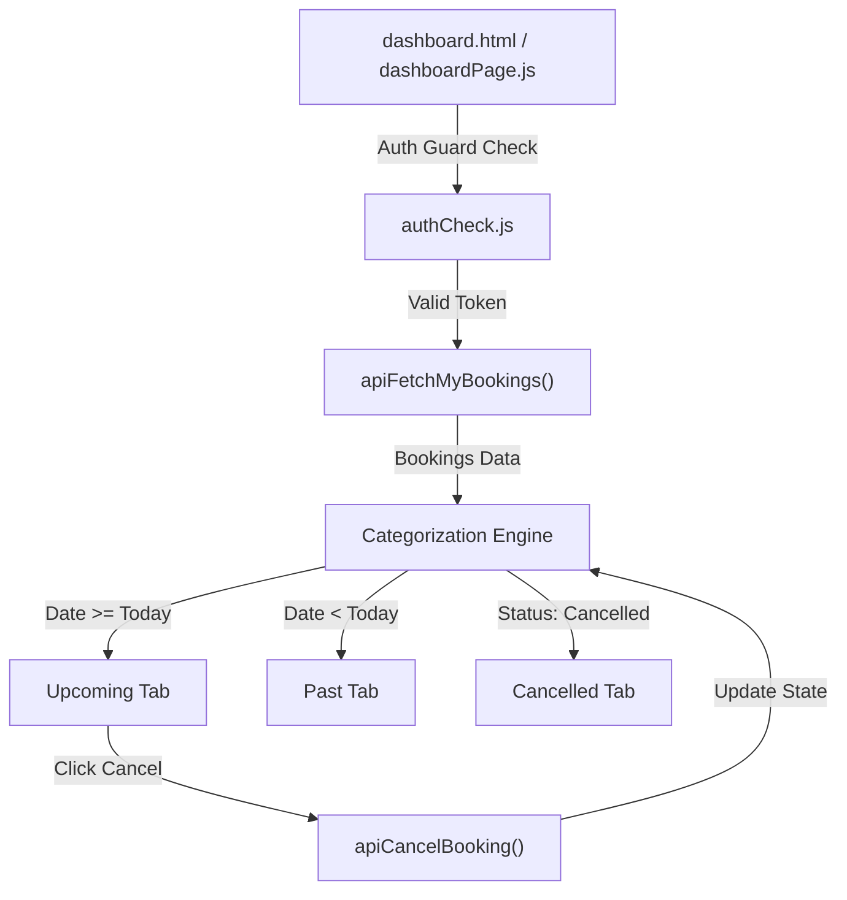

# 📝 DEV LOG: WEEK 31 - DAY 4
**Core Objective:** Build the user appointments dashboard view (`dashboard.html`), dashboard page controller (`dashboardPage.js`), 3-tab navigation system (`Upcoming`, `Past`, `Cancelled`), appointment cancellation engine (`apiCancelBooking`), and custom glassmorphism visual styling (`dashboard.css`) with individual git commits for every file.

---

## 1. The Initiative & Context
Day 4 introduced the complete personal appointments management experience for Week 31. Authenticated users can now access their personalized dashboard (`dashboard.html`), inspect summary metrics (Total, Upcoming, Past, Cancelled), switch between categorized status tabs, and cancel upcoming active appointments with real-time status updates and slot release.

---

## 2. Interactive Components & Views Built
- **`public/dashboard.html`**: User appointments dashboard layout featuring dynamic user welcome header (`#welcome-title`), live statistics summary cards, tab navigation bar, and grid container for appointment cards.
- **`src/assets/dashboard.css`**: Deep slate glassmorphism stylesheet (`rgba(15, 23, 42, 0.75)` with `backdrop-filter: blur(12px)`), skeleton loader animations, custom status badges (`.badge-confirmed`, `.badge-cancelled`, `.badge-past`), and dashed border opacity styling for cancelled items (`.card-cancelled`).
- **`src/pages/dashboardPage.js`**: Page controller containing auth guards (`isLoggedIn()`), client-side date comparison logic (`getCategorizedBookings()`), dynamic tab switching, metric counter updates, and interactive cancellation trigger.

---

## 3. Core Technical Mechanics & Refinements
- **Date-Based Categorization**: Compare reservation date string (`booking_date`) against today's date (`YYYY-MM-DD`). Active confirmed reservations on or after today belong to **Upcoming**; active confirmed reservations prior to today move automatically to **Past**.
- **Action Scoping & Cancellation Engine**: The "Cancel Appointment" action button is strictly rendered for **upcoming active bookings**, preventing invalid actions on past or already-cancelled items.
- **Real-Time UI Update**: Triggering `apiCancelBooking(bookingId)` sends a `POST /api/bookings/<id>/cancel` request to the backend. Upon resolution, the appointment's status updates to `cancelled`, statistics metrics refresh instantly, and the card moves to the Cancelled tab without requiring a page reload.
- **Auth Protection**: Direct URL navigation to `dashboard.html` without a valid Bearer token triggers a warning toast and auto-redirects to `login.html` within 600ms.

---
