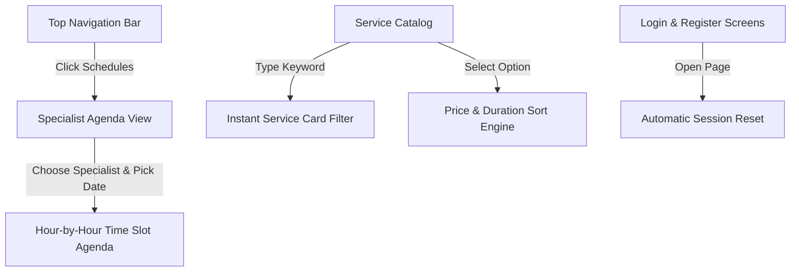

# 📝 DEV LOG: WEEK 31 - DAY 5

**Core Objective:** Design and build the specialist daily schedule agenda view, equip the service catalog with an instant keyword search bar and sorting dropdown, update navigation headers, and ensure user login screens automatically start with a fresh slate.

---

## 1. The Big Picture & User Experience Goal
On Day 5, our main goal was to give specialists and clients full visibility into daily working schedules while making the service catalog effortless to explore. 

Up until today, clients could book appointments and manage their own reservations. However, there was no centralized schedule view showing how a specialist's working day is laid out hour by hour. By building the **Specialist Schedule Agenda**, any user can now pick a specialist—such as Dr. Sarah Jones or Mike Vance—and select any date on the calendar to see every open working time slot alongside existing reservations.

Additionally, to ensure the service catalog scales cleanly, we added a real-time search bar that filters services instantly as you type, along with a sorting dropdown that organizes services by price or duration. Finally, we fixed a subtle session memory issue where old login data remained visible in the top navigation bar when visiting the login page.

---

## 2. Comprehensive Breakdown of What Was Built

### 📅 Specialist Daily Schedule Agenda (`provider.html` & `providerPage.js`)
- **Specialist Selection**: A dedicated dropdown menu allows users to switch between different specialists (such as primary care physicians, career coaches, dentists, and stylists).
- **Date Picker Controls**: An interactive date selector defaults to the current day and allows users to jump to any upcoming date.
- **Hour-by-Hour Timeline**: Displays all available working hours in 30-minute intervals. 
  - **Open Slots**: Rendered with subtle borders indicating the time is free for booking.
  - **Booked Slots**: Displayed as reserved appointments with a green checkmark badge so specialists can review their daily commitment load.
- **Off-Day Guidance**: If a specialist does not work on a selected date (such as weekends), a clear message explains that no appointments are scheduled for that day.

### 🔍 Instant Catalog Search & Multi-Criteria Sorting (`index.html` & `indexPage.js`)
- **Real-Time Keyword Search**: An input box located right above the service catalog filters cards dynamically as the user types. It matches titles, descriptions, and category names without requiring a page refresh.
- **Multi-Criteria Sorting**: A dropdown menu lets clients sort services by:
  - **Price: Low to High**: Displays budget-friendly services first.
  - **Price: High to Low**: Displays premium specialized consultations first.
  - **Duration: Shortest**: Displays quick 15-minute consultations at the top.
- **Friendly Empty State**: If a search query or filter returns zero matches, a helpful notice prompts the user to adjust their search term.

### 🔒 Session Clean Slate & Navigation Polish (`loginPage.js` & `registerPage.js`)
- **Automatic Session Reset**: Previously, if a user logged in during a test run and later returned to the login screen, the top bar would still show the old user's name due to saved browser memory. We updated the login and registration screens to automatically clear old session data on page load, guaranteeing a clean navbar state (`Services`, `Schedules`, `Login`, `Sign Up`).
- **Global Navigation Link**: Added a direct link to `Schedules` in the main top navigation bar across all pages.

---

## 3. Summary of Key User Improvements

- **Complete Visibility**: Clients and specialists can preview any specialist's daily availability before initiating a booking.
- **Effortless Discovery**: Finding specific services out of a large catalog takes less than a second using the new search bar.
- **Clean Authentication**: Users are never confused by leftover login names when attempting to sign in.
