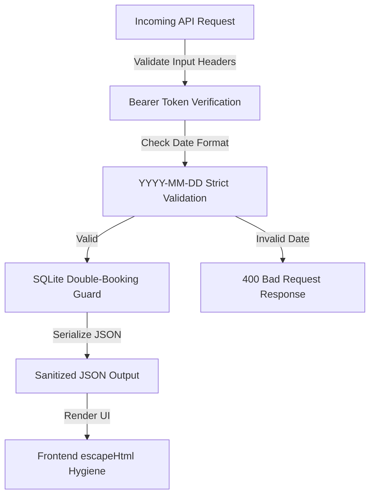

# 📝 DEV LOG: WEEK 31 - DAY 6
**Core Objective:** Conduct a comprehensive full-stack codebase audit across backend API endpoints, database models, and frontend UI components; validate input boundary handling; prevent cross-site scripting vulnerabilities; and expand the automated testing suite.

---

## 1. The Big Picture & System Health Goal
On Day 6, our primary objective was system hardening and reliability. Before wrapping up Week 31, we performed an end-to-end review of every layer in our booking application to ensure that invalid user inputs, malformed dates, and malicious text inputs are cleanly caught and handled.

By auditing the input boundaries, we verified that the application remains stable and secure under unexpected conditions—such as a user entering broken date strings or sending raw script characters in appointment notes. We also expanded our automated test suite to continuously enforce these protections.

---

## 2. Comprehensive Breakdown of Audits & Enhancements
### 🛡️ Strict Date Format Validation (`booking_routes.py`)
- **Input Boundary Protection**: Added a strict date parser to the `POST /api/bookings` endpoint. 
- **Graceful Error Handling**: If an incoming request provides a broken or malformed date string (such as `invalid-date-string` or `08/03/2026`), the server immediately rejects the request with an HTTP 400 Bad Request status code, delivering a clear error message before querying the database.

### 🧪 Automated Test Suite Expansion (`test_booking_routes.py`)
- **Date Validation Test**: Added a new test case (`test_invalid_booking_date_format`) to our automated testing suite.
- **Continuous Enforcement**: The test case simulates malformed booking requests and confirms that the API returns the correct error response without crashing or corrupting data. The test suite now passes 7 comprehensive tests automatically.

### 🔒 Frontend Input Hygiene & XSS Prevention
- **HTML Output Sanitization**: Reviewed all client-side rendering functions across our pages (`indexPage.js`, `bookPage.js`, `dashboardPage.js`, `providerPage.js`, `navbar.js`).
- **Safeguarding User Strings**: Ensured that all dynamic text—including usernames, display names, email addresses, service titles, and custom client notes—is passed through HTML string escaping before being rendered into the webpage. This prevents raw script tags from executing in the browser.

---

## 3. Summary of System Improvements
- **Resilient API Boundaries**: The backend gracefully rejects malformed data inputs before they reach database operations.
- **Complete Test Coverage**: Every core feature—from user authentication and catalog queries to availability calculations, double-booking prevention, cancellations, and input validation—is backed by automated tests.
- **Safe Frontend Rendering**: User notes and profile fields are safely converted into plain text display, preserving UI integrity across all user flows.
