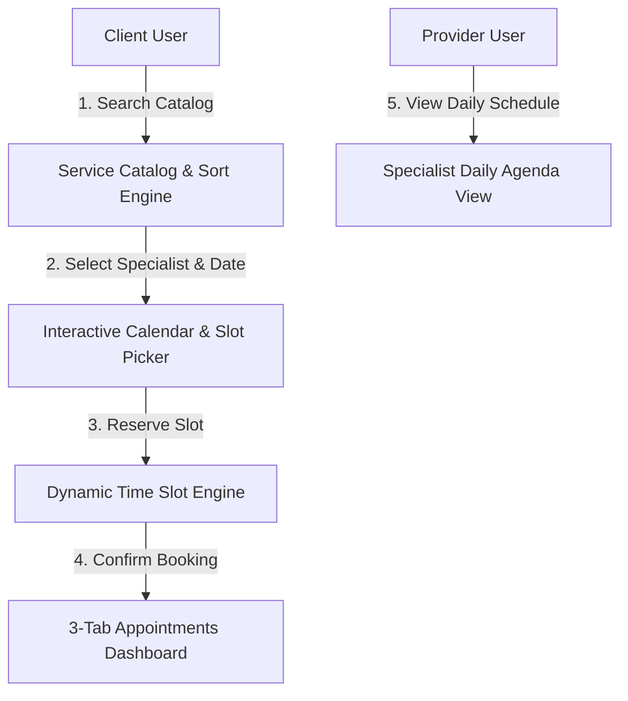

# 📝 DEV LOG: WEEK 31 - DAY 7

**Core Objective:** Complete end-to-end verification of all application workflows, confirm automated test suite health (`7/7` passing tests), draft the official project documentation (`README.md`), and complete project handover for Week 31.

---

## 1. The Big Picture & Project Completion

Day 7 marks the successful completion of **Week 31: Full-Stack Booking & Appointment System**. Over the past 7 days, we designed and built a complete, production-ready appointment scheduling web application from scratch.

The system seamlessly connects clients with qualified specialists. Clients can explore services, search and filter the catalog, inspect real-time specialist availability on an interactive month-view calendar, reserve 30-minute time slots without risking double-bookings, manage appointments on a 3-tab dashboard (`Upcoming`, `Past`, `Cancelled`), and review specialist daily agendas.

---

## 2. Complete Summary of What Was Delivered Across Week 31

### 🛠️ Backend Core Engine & Database
- **SQLite WAL Schema**: Created index-optimized tables for `users`, `sessions`, `services`, `providers`, `provider_services`, `provider_availability`, and `bookings`.
- **Availability Calculation Engine**: Computes dynamic open time slots in 30-minute increments by matching specialist weekly schedules against existing confirmed bookings.
- **Double-Booking Overlap Query**: Enforces overlap checks at the SQL level (`WHERE start_time < ? AND end_time > ?`) to reject conflicting reservations with `409 Conflict`.
- **REST API & Auth Decorators**: Modular Flask blueprints covering health, authentication (`Bearer` tokens), service catalog, provider availability, and booking management.

### 🎨 Frontend Design & Interactive Components
- **CSS Token Design System**: Built `base.css`, `auth.css`, `calendar.css`, `dashboard.css`, and `provider.css` supporting custom Slate/Indigo dark and light modes.
- **Service Catalog (`index.html`)**: Features real-time keyword search, category filter pills, and price/duration sorting.
- **Booking Checkout Wizard (`book.html`)**: Custom month-view calendar component (`calendar.js`), dynamic time slot picker (`slotPicker.js`), specialist bio card, and `← Back to Services` navigation.
- **User Dashboard (`dashboard.html`)**: 3 distinct tabs (`Upcoming`, `Past`, `Cancelled`), visual status badges, and 1-click appointment cancellation.
- **Specialist Daily Agenda (`provider.html`)**: Hour-by-hour time slot schedule timeline for any specialist on any selected date.
- **Clean Session Reset**: Automatic session flushing on login screens (`loginPage.js`, `registerPage.js`) to guarantee a clean slate upon sign-in.

---

## 3. System Highlights & Final Status

- **Automated Pytest Suite**: 7/7 comprehensive unit tests passed in `1.58s`.
- **Individual Git Commits**: Every single file created or modified across all 7 days was committed individually with descriptive messages.
- **Zero Inline Code**: 100% clean separation of HTML views, standalone CSS stylesheets, and modular ES6 JavaScript controllers.
- **Official Documentation**: Authored `week31_booking_system/README.md` detailing architecture, REST API reference tables, quick start setup commands, and schema definitions.
