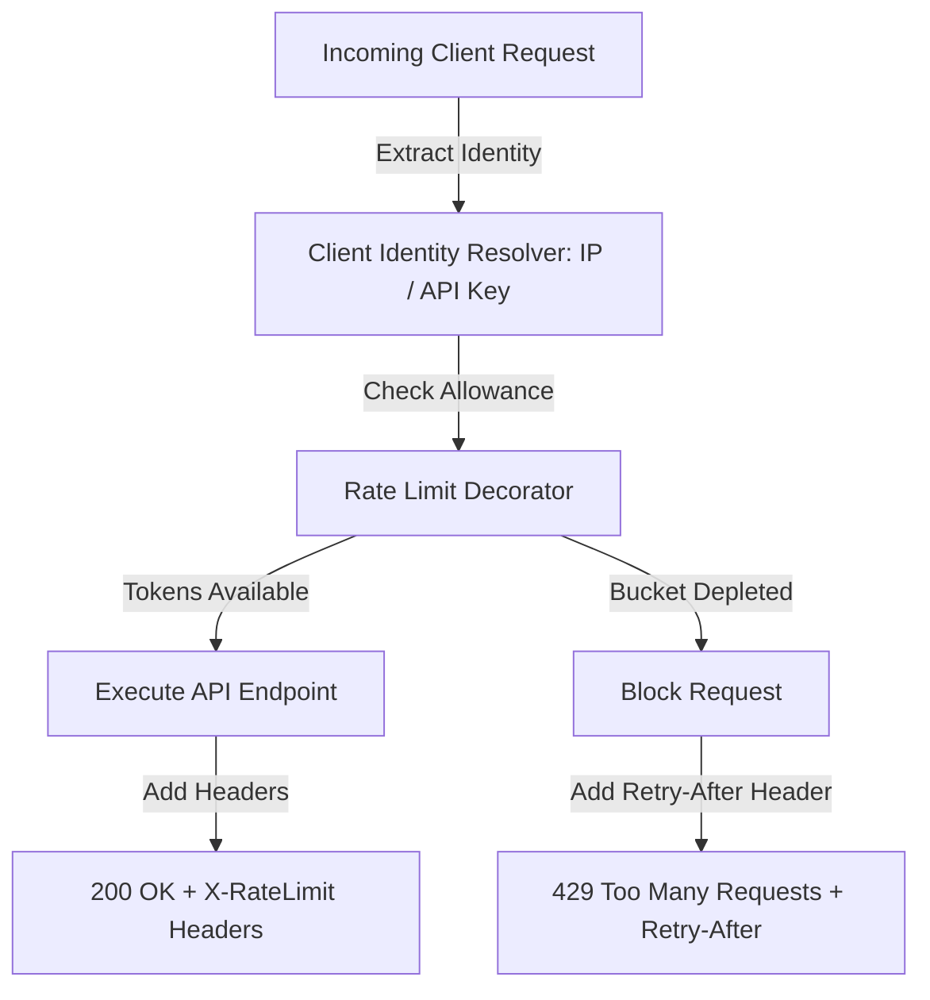

# 📝 DEV LOG: WEEK 32 - DAY 1

**Core Objective:** Design and scaffold the API Rate Limiter Middleware architecture, implement thread-safe Token Bucket and Sliding Window Log algorithm engines, build client identity resolution, and expose rate-limiting HTTP headers with 429 Too Many Requests responses.

---

## 1. The Big Picture & System Goal

On Day 1 of Week 32, our primary goal was to build a protective security shield for web APIs. Without rate limiting, malicious scripts or rapid request bursts can overload backend servers, crash databases, or cause service outages.

By building our **API Rate Limiter Middleware**, every incoming HTTP request passes through a lightweight inspector before reaching our API endpoints. The rate limiter checks who is making the request (using client IP addresses, API Keys, or Bearer tokens) and evaluates how many requests they have made in a given time window. If a client stays within their allowed limit, the request proceeds and returns standard rate-limit headers. If a client exceeds their allowance, the middleware immediately blocks the request with an HTTP 429 Too Many Requests status code and tells the client exactly how many seconds to wait before retrying.

---

## 2. Comprehensive Breakdown of What Was Built

### 🪣 Token Bucket Algorithm Engine (`token_bucket.py`)
- **Continuous Refill Logic**: Implemented a thread-safe Token Bucket algorithm. The bucket has a maximum capacity and refills continuously based on time elapsed since the last request.
- **Fractional Token Tracking**: Calculates exact fractional tokens gained over microsecond time intervals so clients accumulate tokens smoothly over time.
- **Consumption Check**: When a request arrives, the algorithm attempts to consume one token. If tokens are available, the request is approved; if the bucket is empty, the algorithm calculates the exact wait duration required for a token to refill.

### ⏱️ Sliding Window Log Algorithm Engine (`sliding_window.py`)
- **Timestamp Tracking**: Tracks request timestamps in a rolling window log to handle irregular request spikes.
- **Rolling Window Eviction**: Automatically purges timestamps that fall outside the active evaluation window.
- **Spike Prevention**: Ensures that a client cannot double their allowed throughput by making half their requests at the end of one window and the other half at the start of the next.

### 🔑 Client Identity Resolver (`client_identifier.py`)
- **Multi-Level Identity Detection**: Resolves incoming client identities in order of priority:
  1. Header `X-API-Key` (For registered API developer clients).
  2. Authorization `Bearer` Token (For logged-in users).
  3. Header `X-Forwarded-For` (For clients behind proxies or load balancers).
  4. Client Remote IP Address (Default fallback).

### 🛡️ Flask Rate Limiting Decorator & Headers (`limiter.py`)
- **Flexible Route Decorator**: Created `@rate_limit(limit=N, window=Seconds, algorithm="token_bucket")` decorator that can be attached to any Flask endpoint.
- **Standard HTTP Rate Limit Headers**: Injects industry-standard response headers into all API responses:
  - `X-RateLimit-Limit`: Maximum request capacity for the endpoint.
  - `X-RateLimit-Remaining`: Tokens or requests remaining in the current window.
  - `X-RateLimit-Reset`: Timestamp when capacity fully resets.
  - `Retry-After`: Returned on HTTP 429 errors indicating seconds until the client can retry.

---

## 3. Summary of Key System Protections
- **Server Protection**: Prevents single clients or bots from overwhelming backend services with rapid request bursts.
- **Client Transparency**: Communicates exact allowance and reset timers directly in HTTP response headers.
- **Flexible Algorithms**: Supports both Token Bucket (for smooth traffic flow) and Sliding Window Log (for strict rolling window enforcement).
