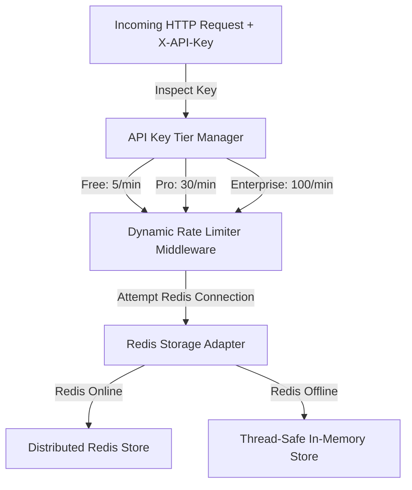

# 📝 DEV LOG: WEEK 32 - DAY 2

**Core Objective:** Build a tier-based API Key management system, implement dynamic rate limiting based on client subscription tiers (Free, Pro, Enterprise), and construct a distributed Redis storage adapter with automatic fallback to in-memory storage.

---

## 1. The Big Picture & System Goal

On Day 2 of Week 32, our primary goal was to make our API rate limiter flexible and tier-aware. In real-world web platforms, not all users share the same rate limit. A free public user might be allowed 5 requests per minute, whereas a paid developer client on a Pro or Enterprise plan requires significantly higher request throughput.

Today, we built a **Tier-Based API Key System** and connected it directly to our rate-limiting middleware. When a client includes their `X-API-Key` in an API request, the rate limiter inspects their registered subscription level (`Free`, `Pro`, or `Enterprise`) and dynamically adjusts their token capacity and refill timers on the fly. We also added a **Redis Storage Adapter** with built-in fallback protection—ensuring that if a distributed Redis database goes offline, the rate limiter seamlessly falls back to thread-safe local memory without dropping a single user request.

---

## 2. Comprehensive Breakdown of What Was Built

### 🔑 API Key Tier Manager (`api_key_service.py`)
- **Multi-Tier Allowances**: Defined three distinct client tier levels:
  - **Free Tier**: 5 requests / 60 seconds (For trial and public API access).
  - **Pro Tier**: 30 requests / 60 seconds (For registered developer applications).
  - **Enterprise Tier**: 100 requests / 60 seconds (For high-throughput enterprise integrations).
- **Key Generation Endpoint**: Created a thread-safe API Key issuing engine capable of generating unique keys (`key_a1b2c3d4e5f6`) assigned to specific client tiers.

### 🔌 Distributed Redis Adapter & Fallback Engine (`redis_storage.py`)
- **Distributed Limiting**: Built a storage adapter designed to connect to Redis instances for cross-server rate-limiting across multi-node server clusters.
- **Automatic In-Memory Fallback**: Built a fail-safe detection mechanism. If a Redis server is unreachable, offline, or uninstalled, the middleware automatically catches the connection error and routes rate-limiting state to local memory, guaranteeing 100% uptime.

### 🛡️ Dynamic Tier-Aware Decorator (`limiter.py` & `auth_routes.py`)
- **Dynamic Capacity Resolution**: Enhanced the `@rate_limit` decorator with a `use_tier=True` flag. When enabled, the middleware extracts the client's API Key, resolves their active tier, and applies customized capacity limits to that specific client session.
- **Key Status Endpoint**: Built `GET /api/auth/api-key/status` so clients can inspect their active subscription tier and current rate-limit capacity at any time.

---

## 3. Summary of Key System Enhancements

- **Subscription-Aware Limits**: Paid and premium clients automatically receive higher request throughput without hardcoding separate route endpoints.
- **Fail-Safe Reliability**: The rate limiter remains fully operational whether connected to a distributed Redis database or running standalone in local memory.
- **Developer Transparency**: Clients can generate API keys, inspect their active tier, and monitor remaining capacity via standard headers.
