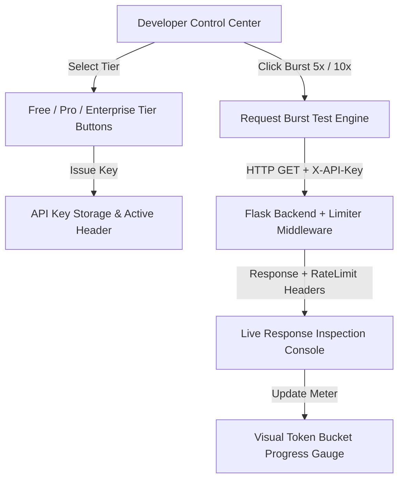

# 📝 DEV LOG: WEEK 32 - DAY 3

**Core Objective:** Build a modern, interactive web control center with real-time request burst testing controls, a visual Token Bucket capacity meter gauge, live HTTP response header inspection stream, and developer API key management.

---

## 1. The Big Picture & System Goal

On Day 3 of Week 32, our primary goal was to make our API rate limiter visible, tangible, and interactive. While algorithm logic and backend decorators run silently on the server, developers and system administrators need a visual dashboard to understand how rate limits behave under real traffic conditions.

Today, we built the **Rate Limiter Control Center & Live Burst Tester**. Through this web application, users can fire instant request bursts (1x, 5x, or 10x concurrent requests), switch between `Free`, `Pro`, and `Enterprise` API key tiers on the fly, observe their remaining token capacity on a smooth visual progress gauge, and inspect live HTTP status codes (`200 OK` vs `429 Too Many Requests`) alongside standard rate-limiting headers in an auto-updating response log table.

---

## 2. Comprehensive Breakdown of What Was Built

### ⚡ Interactive Control Center & Burst Tester (`index.html` & `indexPage.js`)
- **API Key & Tier Switcher**: Built interactive tier buttons allowing developers to switch between `Free` (5 req/min), `Pro` (30 req/min), and `Enterprise` (100 req/min) subscription tiers, generating new test API keys on the fly.
- **Request Burst Buttons**: Single-click controls to fire 1x, 5x, or 10x rapid concurrent requests to test how the Token Bucket algorithm responds to sudden traffic spikes.
- **Real-Time Token Capacity Gauge**: A visual progress bar that updates dynamically with every response. As tokens are consumed, the meter shrinks and turns from emerald green to warning amber/red when capacity drops below 20%.

### 📋 Live HTTP Response Inspection Stream (`indexPage.js` & `dashboard.css`)
- **Live Console Log Table**: Displays every outgoing request and incoming response in reverse chronological order.
- **Header Inspection**: Extracts and displays standard rate-limit headers directly from the response stream:
  - `Status Code`: Highlights green `200 OK` for approved requests vs ruby `429 Too Many Requests` for rate-limited requests.
  - `X-RateLimit-Remaining`: Shows available tokens remaining out of total capacity.
  - `Retry-After`: Displays the countdown timer in seconds indicating when the client is allowed to resume requests.

### 🔑 Developer Login & API Key Views (`login.html` & `register.html`)
- **Standalone Form Views**: Styled authentication and registration views created without inline CSS or script blocks.
- **Session Management**: Integrates with local browser storage to persist the active developer API key across page reloads.

---

## 3. Summary of Key User Experience Features

- **Visual Feedback**: Real-time visual feedback showing exactly when and why requests get blocked by rate limits.
- **Instant Burst Simulation**: Simulates heavy user traffic or bot attacks with a single button click.
- **Tier Flexibility**: Easily demonstrate how upgrading from a Free to Pro tier instantly increases API capacity limits.
