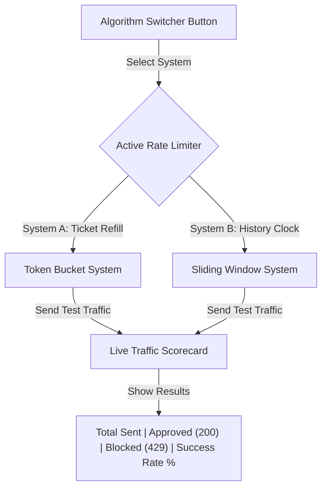

# 📝 DEV LOG: WEEK 32 - DAY 4

**Core Objective:** Build an easy-to-use switcher so developers can compare the two rate-limiting methods side-by-side, create a live traffic scorecard to count approved vs. blocked requests, and add a reset button to clear the dashboard.

---

## 1. The Big Picture & Simple Explanation

On Day 4 of Week 32, our main goal was to make it super easy to compare our two rate-limiting styles side-by-side without needing to restart the server or write any code.

Think of rate limiting like controlling entry to a popular venue:
1. **Token Bucket (Ticket Refill System)**: Gives you a bucket of entrance tickets. As long as you have tickets, you can enter immediately. Over time, new tickets are continuously added back to your bucket.
2. **Sliding Window (Recent History Check)**: Looks back at a rolling clock (like the last 60 seconds). It counts how many times you entered during that time window. If you've reached your limit, it asks you to wait until your oldest visit drops off the clock.

Today, we built a simple **Algorithm Switcher** button on our web dashboard so you can flip back and forth between these two systems with one click, send test traffic, and see how each system handles traffic spikes on a live **Traffic Scorecard**.

---

## 2. Simple Breakdown of What Was Built

### ⚙️ Easy Algorithm Switcher (`index.html` & `indexPage.js`)
- **One-Click Toggle**: Added `Token Bucket` and `Sliding Window` buttons right at the top of the dashboard. Clicking either button immediately switches which rate-limiting engine handles your test requests.
- **Automatic Test Routing**: Automatically routes your test requests to the matching backend route so you can test both styles instantly.

### 📊 Live Traffic Scorecard & Reset Button (`dashboard.css` & `indexPage.js`)
- **4 Live Metric Cards**: Displays four clear numbers at a glance:
  - **Total Requests Sent**: Counts how many total test requests you have launched.
  - **Approved (`200 OK`)**: Shows how many requests successfully passed through.
  - **Blocked (`429 Too Many Requests`)**: Shows how many requests were blocked because the limit was reached.
  - **Success Rate Percentage (`%`)**: Shows the overall percentage of requests that got through.
- **Clear Console Button**: Added a `Clear Console & Reset Stats` button so you can reset all counters back to zero and start fresh whenever you want.

### 📚 Side-by-Side Comparison Card (`index.html`)
- **Friendly Explanation Card**: Placed a simple guide at the bottom of the page explaining when to use each system:
  - Use **Token Bucket** when you want to allow small, quick bursts of traffic while keeping a steady average speed.
  - Use **Sliding Window** when you need strict time limits with no exceptions.

---
