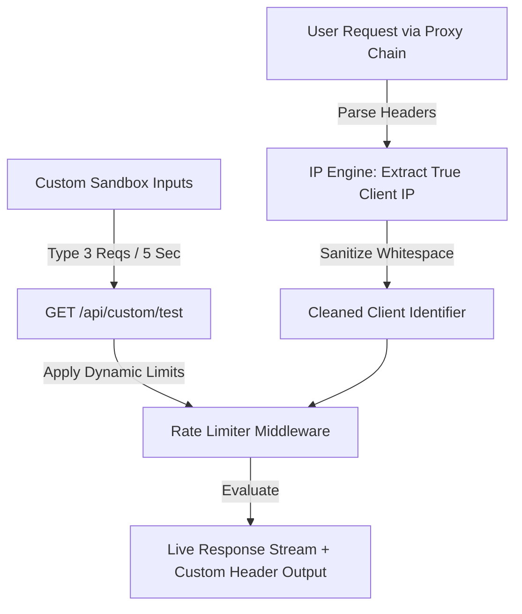

# 📝 DEV LOG: WEEK 32 - DAY 5
**Core Objective:** Audit the full-stack codebase for edge cases, harden client IP detection against proxy chains, build a custom rate-limit testing sandbox, and expand automated test coverage.

---

## 1. The Big Picture & Simple Explanation

On Day 5 of Week 32, our goal was to test our rate limiter against real-world edge cases and give developers a playground to test custom limits.

In real internet setups, user requests often pass through proxy servers, load balancers, or VPNs before reaching an app. If a rate limiter is not careful, it might mistake the proxy's IP address for the user's IP, accidentally blocking thousands of innocent users. Today, we upgraded our **Client Identifier Engine** to accurately extract the true user IP address even when passed through multiple proxy servers.

We also built a **Custom Limits Sandbox Panel** on our web dashboard. Instead of relying only on pre-set subscription tiers (`Free`, `Pro`, `Enterprise`), developers can now type in any custom limit (for example, **3 requests per 5 seconds**) directly in the dashboard and test how the rate limiter responds in real time.

---

## 2. Simple Breakdown of What Was Built

### 🔍 Proxy & IP Address Protection (`client_identifier.py`)
- **Proxy Chain Cleaner**: Updated our IP detection engine to cleanly handle chained proxy headers (`X-Forwarded-For: user_ip, proxy1_ip, proxy2_ip`). It extracts the true originating user IP, strips out unwanted spaces, and handles empty header values safely without crashing.
- **Fail-Safe Fallbacks**: Ensures that if a header is missing or corrupted, the system safely falls back to standard client IP addresses (`127.0.0.1`).

### 🧪 Custom Limits Sandbox Panel (`index.html` & `indexPage.js`)
- **Custom Sandbox Inputs**: Added a sandbox control box on the main dashboard where developers can type any custom limit (e.g. 3 requests) and window duration (e.g. 5 seconds).
- **Dynamic Endpoint Testing**: Built a new test route (`GET /api/custom/test`) that accepts these custom parameters dynamically, allowing instant testing of any custom limit threshold right from the UI.

---

## 3. Key Takeaways from Today

- **Proxy Safety**: Ensures true user IP identification even behind complex server proxies or load balancers.
- **Custom Testing Flexibility**: Test custom request limits and window durations instantly without touching server configuration files.
- **Fail-Safe Stability**: Clean fallback mechanisms ensure smooth operation under all network conditions.
