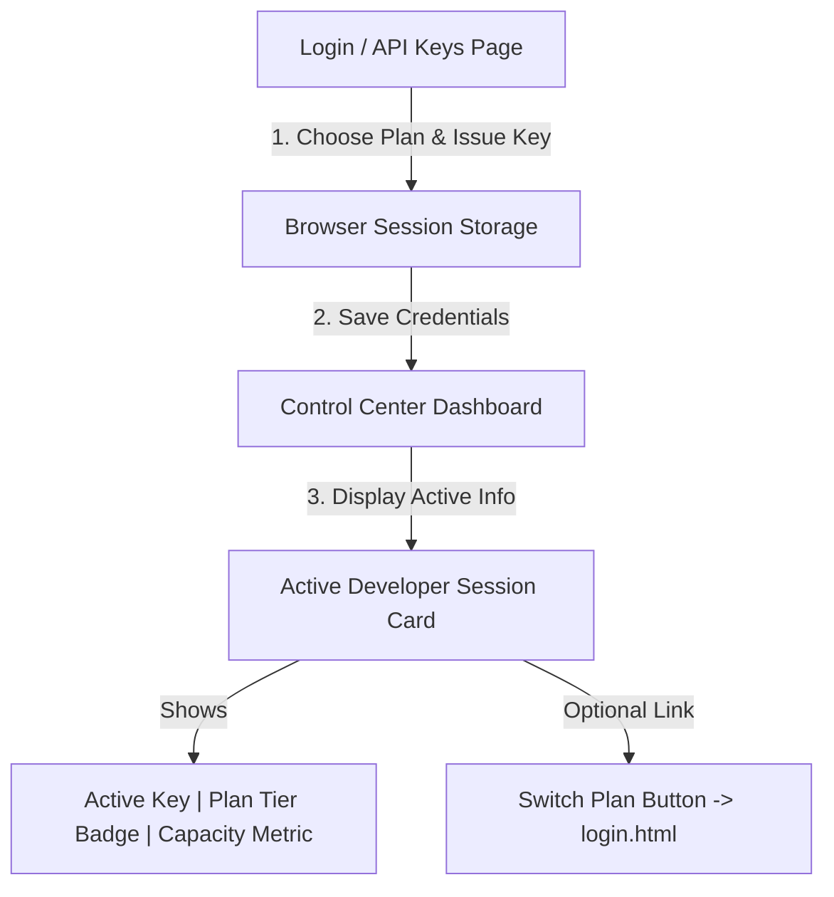

# 📝 DEV LOG: WEEK 32 - DAY 6

**Core Objective:** Clean up duplicate tier buttons on the main dashboard, connect developer login choices directly to active browser sessions, and display a live Active Developer Session card.

---

## 1. The Big Picture & Simple Explanation
On Day 6 of Week 32, our main goal was to clean up the user experience and remove confusing, duplicate controls. 
Previously, users could generate API keys on both the **Login page** and the main **Control Center dashboard**. Having key generators in two different places was confusing and redundant.

Today, we streamlined the entire app flow:
1. **Login & API Keys Page (`login.html`)**: The dedicated place where developers log in, choose their subscription plan (`Free`, `Pro`, or `Enterprise`), and issue their API key.
2. **Control Center Dashboard (`index.html`)**: The testing ground where developers test their active rate limiters. Instead of duplicate key generator buttons, it now displays an **Active Developer Session Card** showing your current API key, active plan badge (`FREE`, `PRO`, or `ENTERPRISE`), and total allowed capacity.

---

## 2. Simple Breakdown of What Was Built

### 🎴 Active Developer Session Card (`index.html` & `dashboard.css`)
- **Session Display Box**: Replaced the redundant tier buttons on the dashboard with a clean session card. It shows your active developer key, your subscription plan badge (e.g. `PRO (30 REQS/MIN)`), and your exact rate limit capacity.
- **Color-Coded Plan Badges**: Added distinct visual badges for each plan tier:
  - **Free Tier**: Slate Gray pill badge.
  - **Pro Tier**: Purple pill badge (`30 reqs/min`).
  - **Enterprise Tier**: Pink pill badge (`100 reqs/min`).
- **Quick Switch Button**: Added a `Switch Subscription Plan / Issue Key →` button so users can easily hop back to `login.html` to change plans anytime.

### 🔄 Automatic Session Sync (`indexPage.js`)
- **Live Status Lookup (`syncActiveSessionUI`)**: On page load, the dashboard automatically checks the active key in browser storage and queries the server to display your up-to-date plan tier and capacity limits.

---

## 3. Key UX Takeaways

- **Clear Purpose**: `login.html` is for choosing your plan, while `index.html` is for testing traffic bursts and inspecting live meters.
- **Visual Session Status**: Developers always know which API key and plan tier they are currently testing.
- **Clean Interface**: Removed clutter and duplicate buttons from the main control panel.
