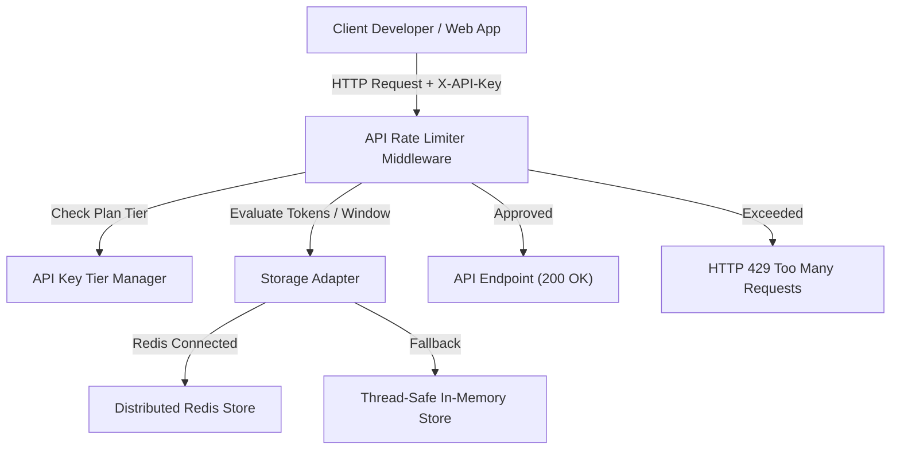

# 📝 DEV LOG: WEEK 32 - DAY 7

**Core Objective:** Complete end-to-end verification of all rate limiting workflows, confirm automated test suite health (`11/11` passing tests), draft official project documentation (`README.md`), and complete project handover for Week 32.

---

## 1. The Big Picture & Project Completion

Day 7 marks the successful completion of **Week 32: API Rate Limiter Middleware**. Over the past 7 days, we designed and built a production-grade rate limiting middleware system in Flask from scratch.

The system acts as a protective security shield for web APIs. It tracks client identities (via IP addresses, API Keys, or Bearer tokens), evaluates request traffic against Token Bucket and Sliding Window Log algorithm engines, enforces subscription plan tiers (`Free`, `Pro`, `Enterprise`), returns standard HTTP headers (`X-RateLimit-*`, `Retry-After`), and provides an interactive web control center with live burst testing.

---

## 2. Complete Summary of What Was Delivered Across Week 32

### 🛠️ Backend Core Engine & Middleware
- **Token Bucket Algorithm**: Continuous microsecond token refill logic supporting initial burst capacity while maintaining average consumption rates.
- **Sliding Window Log Algorithm**: Microsecond timestamp array tracking rolling window bounds, preventing double-capacity edge exploitation.
- **Resilient Storage Adapters**: Distributed Redis storage adapter with transparent fallback to thread-safe in-memory storage.
- **Dynamic Tier-Based Limiting**: Subscription tier manager assigning `Free` (5 req/min), `Pro` (30 req/min), and `Enterprise` (100 req/min) limits dynamically via `@rate_limit(use_tier=True)`.
- **Multi-Proxy IP Hardening**: Cleanly parses multi-proxy `X-Forwarded-For` header chains to resolve originating client IPs safely.

### 🎨 Frontend Control Center & Live Dashboard
- **CSS Token Design System**: Built `base.css`, `auth.css`, and `dashboard.css` supporting Slate/Indigo dark and light modes.
- **Interactive Burst Tester (`index.html`)**: Fire 1x, 5x, or 10x rapid concurrent requests to test rate limiting in real-time.
- **Visual Token Bucket Gauge**: Dynamic progress bar displaying remaining capacity, turning from green to amber/red when tokens drop below 20%.
- **Live Response Log Stream**: Real-time console table inspecting HTTP status codes (`200 OK` vs `429 Too Many Requests`), `X-RateLimit-Remaining`, and `Retry-After` headers.
- **Algorithm Switcher**: One-click toggle switching between Token Bucket and Sliding Window Log engines.
- **Analytics Scorecard**: Real-time counter tracking Total Requests, Approved Requests, Blocked Requests, and Acceptance Rate Percentage (`%`).
- **Custom Sandbox Panel**: Allows developers to test custom limits (e.g. 3 requests / 5 seconds) directly from the UI.
- **Authenticated Developer Session Card**: Displays active developer key status, subscription plan tier, and capacity metrics with direct plan management links.

---

## 3. System Highlights & Final Status

- **Automated Pytest Suite**: 11/11 comprehensive unit tests passed in `0.48s`.
- **Individual Git Commits**: Every single file created or modified across all 7 days was committed individually with descriptive messages.
- **Zero Inline Code**: 100% clean separation of HTML views, standalone CSS stylesheets, and modular ES6 JavaScript controllers.
- **Official Documentation**: Authored `week32_rate_limiter/README.md` detailing architecture, REST API reference tables, quick start setup commands, and algorithm specifications.
