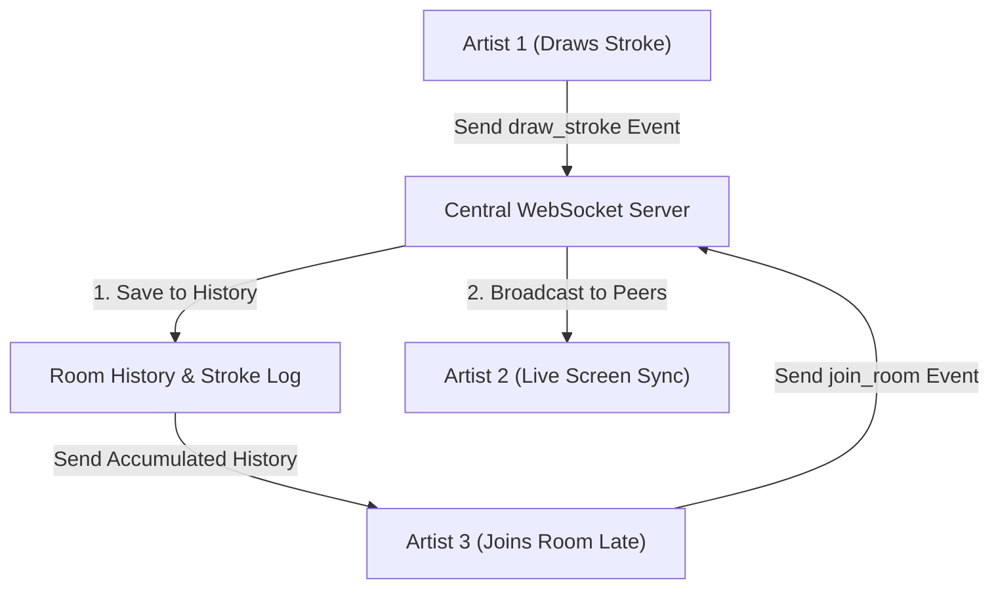

# 📝 DEV LOG: WEEK 33 - DAY 1

**Core Objective:** Scaffold the multi-user drawing canvas backend, implement a thread-safe Room Manager with unique room code generation, build WebSocket event handlers for real-time stroke broadcasting, and support stroke history persistence for late joiners.

---

## 1. The Big Picture & Simple Explanation

On Day 1 of Week 33, our main goal was to build the real-time communication engine that powers our collaborative drawing canvas. 

When multiple artists draw together online, every stroke drawn on one screen must appear on everyone else's screen instantly. Our backend acts as the central hub:
1. **Room Creation**: Artists can generate a unique room code (like `CANVAS-A8B9C`) to invite friends into a shared drawing session.
2. **Real-Time Event Relay**: As someone draws, the server receives their brush movements and immediately broadcasts them to everyone in that room.
3. **Late-Joiner Memory**: If a friend joins the room late, the server immediately sends them the full history of strokes drawn so far, so their screen instantly catches up to match everyone else's drawing.

---

## 2. Simple Breakdown of What Was Built

### 🏠 Thread-Safe Room Manager (`room_manager.py`)
- **Room Code Generator**: Generates 5-character unique uppercase room codes (e.g. `CANVAS-A1B2C`) for creating drawing rooms.
- **Random User Avatars**: Assigns a vibrant color (like bright indigo, emerald, or amber) to each connected user so their remote cursor and brush movements can be easily recognized.
- **Stroke History Memory**: Keeps a list of all drawing actions for each active room. When a new artist enters the room, the server replay-syncs the canvas history to their screen immediately.

### ⚡ WebSocket Event Handlers (`room_events.py` & `canvas_events.py`)
- **`join_room` Event**: Adds the user to the socket room, assigns their color, sends them the full drawing history, and notifies everyone else in the room.
- **`draw_stroke` Event**: Receives new brush strokes, saves them to the room history, and broadcasts them to peer artists in real-time.
- **`cursor_move` Event**: Relays live mouse cursor positions so artists can see where their friends are pointing on the canvas.
- **`clear_canvas` Event**: Clears the room drawing history and resets the canvas screen for everyone in the room simultaneously.

---

## 3. Key Takeaways from Today

- **Instant Sync Engine**: Real-time WebSocket connection ensures brush strokes appear on peer screens without delay.
- **Late-Joiner Memory**: Friends who join mid-session immediately see the complete drawing.
- **Clean Foundation**: A solid, modular backend foundation ready for our HTML5 canvas frontend tomorrow!
