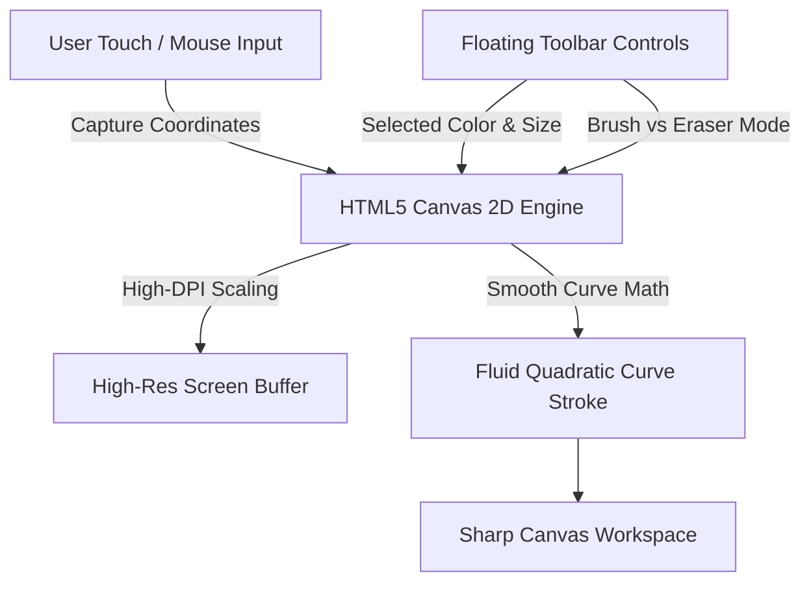

# 📝 DEV LOG: WEEK 33 - DAY 2

**Core Objective:** Build the core HTML5 Canvas 2D rendering engine with High-DPI screen resolution scaling, implement smooth curve drawing for mouse and touch inputs, and create a floating toolbar with brush, eraser, color palette, and size controls.

---

## 1. The Big Picture & Simple Explanation

On Day 2 of Week 33, our goal was to build the interactive digital canvas where artists actually draw. 

When you draw with a computer mouse or a finger on a touchscreen, raw mouse movements can look jagged or pixelated. To make the drawing experience feel as natural and smooth as real pen on paper:
1. **High-DPI Sharpness**: We scale the canvas to match high-resolution screens (like Retina displays), ensuring lines never look blurry or fuzzy.
2. **Smooth Curve Drawing**: Instead of drawing choppy straight lines between points, our engine connects your brush movements using smooth, natural curves.
3. **Floating Toolbar**: We created a sleek, floating toolbar overlay featuring quick brush and eraser toggles, a 10-color quick palette, a custom color picker, and a brush size slider with a live preview dot.



---

## 2. Simple Breakdown of What Was Built

### 🖌️ Core HTML5 Canvas Engine (`canvasEngine.js`)
- **Retina & High-DPI Sharpness**: Automatically detects screen pixel ratios (`window.devicePixelRatio`) to render crisp, high-definition lines on all monitors and mobile devices.
- **Fluid Brush Strokes**: Connects brush coordinates using smooth quadratic curves (`ctx.quadraticCurveTo`) so fast drawing gestures feel fluid and natural.
- **Mouse & Mobile Touch Support**: Handles both desktop mouse clicks and mobile finger gestures (`touchstart`, `touchmove`, `touchend`).
- **Eraser Mode**: Includes an eraser tool that clears drawing strokes seamlessly.

### 🎨 Floating Toolbar Overlay (`toolbar.js` & `canvas.css`)
- **Tool Selector**: Quick toggle buttons to switch between Brush (✏️), Eraser (🧹), and Clear Canvas (🗑️).
- **Color Palette Swatches**: 10 preset color swatches for quick color picking plus a full spectrum custom color picker.
- **Brush Size Slider & Preview**: Slider allowing stroke width adjustments from 1px to 50px, paired with a live brush size preview dot.

### 🖥️ Full Canvas Workspace View (`room.html` & `roomPage.js`)
- **Responsive Workspace**: Full-screen drawing area that automatically resizes when the browser window changes dimensions.

---

## 3. Key Takeaways from Today

- **Ultra-Sharp Graphics**: High-DPI scaling keeps artwork crisp on all devices.
- **Natural Feel**: Smooth curve interpolation makes drawing feel natural and responsive.
- **Intuitive Tools**: Easy-to-use floating toolbar gives artists instant control over colors, brush sizes, and tools.
```