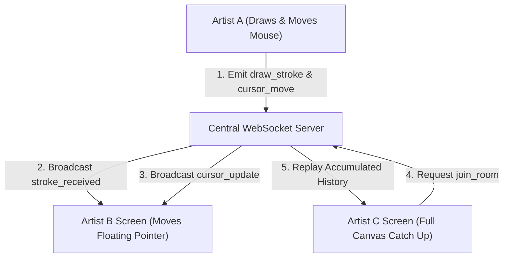

# 📝 DEV LOG: WEEK 33 - DAY 3

**Core Objective:** Connect the frontend canvas engine to the WebSocket server for real-time bi-directional stroke broadcasting, implement canvas history replay for late-joining artists, render live floating peer cursors, and display an active room member sidebar.

---

## 1. The Big Picture & Simple Explanation

On Day 3 of Week 33, our goal was to connect the drawing canvas to our real-time WebSocket server so multiple artists can draw together on the exact same digital whiteboard simultaneously.

Here is how the real-time drawing collaboration works:
1. **Live Stroke Sync**: As you draw a line or curve, your brush movements are sent across the WebSocket network and rendered instantly on all peer screens in real-time.
2. **Late-Joiner Replay**: If a friend joins your room after you've already started drawing, the server sends them all existing drawing strokes so their screen instantly catches up to match your current drawing.
3. **Live Remote Cursors**: As your friends move their mouse or finger across the canvas, floating colored cursor badges (labeled with their nickname) slide across your screen so you can see exactly where everyone is pointing and drawing.
4. **Room Member Sidebar**: A live list on the side of your screen showing all artists currently in the room along with their assigned color badges.

---

## 2. Simple Breakdown of What Was Built

### ⚡ WebSocket Connection Wrapper (`socketClient.js`)
- **Real-Time Event Relay**: Connects the browser to the backend WebSocket server (`http://127.0.0.1:5000`) and handles room join, leave, stroke, cursor, and clear canvas events.

### 🎨 Live Canvas Broadcast & Late-Joiner Replay (`roomPage.js`)
- **Instant Stroke Sync**: Listens for drawing events from peer clients and renders them smoothly on remote screens.
- **Automatic History Catch-Up**: When you enter a room, the app automatically replays all stored room strokes onto your canvas so you never miss a drawing detail.

### 🖱️ Floating Remote Peer Cursors (`cursorTracker.js` & `canvas.css`)
- **Floating Pointers**: Renders smooth floating cursor pointers labeled with peer nicknames and assigned avatar colors as friends move across the canvas.

### 👥 Room Member Sidebar (`participantList.js`)
- **Active Artists Panel**: A sleek sidebar panel displaying all artists currently connected to the room and their unique color badges.

---

## 3. Key Takeaways from Today

- **Real-Time Magic**: Brush strokes appear on peer screens instantly without delay.
- **Never Miss a Stroke**: Late joiners automatically catch up to current room artwork.
- **Visual Collaboration**: Floating peer cursors make collaborative drawing feel interactive and alive!
