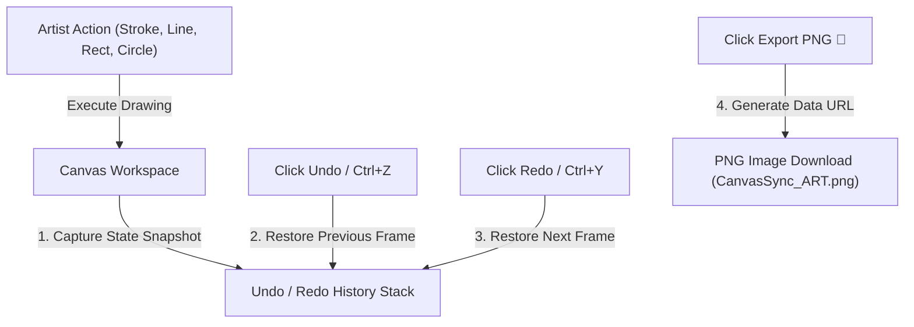

# 📝 DEV LOG: WEEK 33 - DAY 4

**Core Objective:** Expand the digital canvas toolbar with geometric shape tools (Lines, Rectangles, Circles), build an in-memory canvas state history stack for Undo and Redo operations, implement a 1-click PNG image exporter, and fix canvas shape preview and true pixel eraser bugs.

---

## 1. The Big Picture & Simple Explanation

On Day 4 of Week 33, our goal was to upgrade our digital canvas from a basic freehand sketchbook into a full-featured creative whiteboard.

Here is how today's features enhance the artist experience:
1. **Geometric Shape Tools**: In addition to freehand brush strokes, artists can now easily draw straight lines (📏), clean rectangles (🔲), and smooth circles or ellipses (⭕) with clean live drag previews.
2. **True Pixel Eraser**: Fixed eraser mode to use native pixel transparency (`destination-out`). Now when you erase parts of a drawing, it erases the pixels cleanly regardless of whether you are in dark or light theme!
3. **Undo & Redo Time Travel**: Mistakes happen! With our new History Manager stack, artists can instantly step backward (↩️) or forward (↪️) in time using toolbar buttons or classic keyboard shortcuts (`Ctrl+Z` and `Ctrl+Y`).
4. **1-Click Artwork Export**: Once a drawing is finished, artists can click **Export PNG** (💾) to immediately save and download their artwork high-resolution image (`CanvasSync_ART-123.png`) to their device.

---

## 2. Simple Breakdown of What Was Built

### 📏 Geometric Shape Tools (`canvasEngine.js` & `toolbar.js`)
- **Straight Line Tool (📏)**: Drag-and-release line tool for drawing crisp straight lines across any distance.
- **Rectangle Tool (🔲)**: Drag-and-release rectangle tool for drawing bounding boxes and framed shapes.
- **Circle & Ellipse Tool (⭕)**: Drag-and-release ellipse math tool for drawing perfect circles and curved ovals.
- **Live Drag Preview Overlay**: Captures a temporary background snapshot on mouse press so dragging a shape cleans up intermediate drag frames, leaving only 1 crisp shape when released!

### 🧹 True Pixel Eraser Fix (`canvasEngine.js`)
- **Native Pixel Eraser (`destination-out`)**: Uses true pixel transparency erasing so erased marks never turn into dark/black strokes when switching between dark and light themes.

### ↩️ Canvas History Manager & Shortcuts (`historyManager.js` & `roomPage.js`)
- **State Snapshot Stack**: Captures high-resolution canvas state snapshots after every stroke, allowing up to 30 steps of undo memory.
- **Undo & Redo Toolbar Buttons**: Simple ↩️ and ↪️ buttons for quick history navigation.
- **Keyboard Shortcuts**: Native support for `Ctrl+Z` (Undo) and `Ctrl+Y` (Redo).

### 💾 High-Resolution PNG Exporter (`helpers.js` & `toolbar.js`)
- **Instant File Downloader**: Exports the current canvas buffer directly to a downloadable `.png` image file with the active room code timestamped in the file name.

---

## 3. Key Takeaways from Today

- **More Creative Power**: Shape tools let artists combine freehand sketches with clean geometric diagrams.
- **Clean Theme Erasing**: True pixel erasing works seamlessly across dark and light modes.
- **Fearless Drawing**: Undo/Redo memory gives artists the confidence to experiment freely.
- **Save Your Art**: 1-click PNG export makes saving finished collaborative artwork fast and effortless

