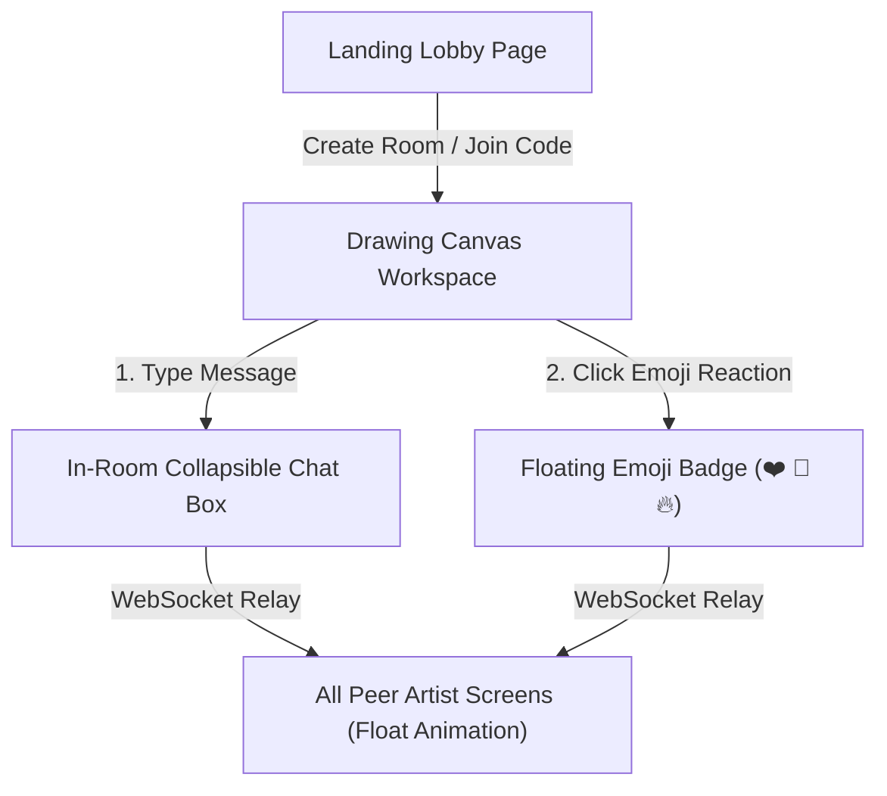

# 📝 DEV LOG: WEEK 33 - DAY 5

**Core Objective:** Build a collaborative landing lobby page for creating and joining drawing rooms, implement an in-room real-time text chat panel, and create animated floating emoji reactions that float up across the shared canvas screen.

---

## 1. The Big Picture & Simple Explanation

On Day 5 of Week 33, our goal was to make our collaborative drawing canvas social, engaging, and easy to access.

Here is how today's features bring artists together:
1. **Room Lobby Landing View**: Artists can visit the main landing page, choose a fun nickname (e.g. `Artist-Picasso`), and click **Create Room** to generate a unique room code (like `CANVAS-X8Y9Z`), or type an existing room code to join their friends' canvas.
2. **In-Room Real-Time Text Chat**: Artists can talk to each other while drawing! A collapsible chat box in the corner of the canvas workspace displays text messages in real-time.
3. **Floating Emoji Reactions**: Want to cheer on a friend's drawing? Clicking a reaction button (❤️, 🎉, 🔥, 👏, 💡) launches an animated emoji badge that floats upward across everyone's shared canvas screen in real-time!

---

## 2. Simple Breakdown of What Was Built

### 🏠 Landing Room Lobby (`index.html`, `indexPage.js` & `lobby.css`)
- **Hero & Room Cards**: Clean landing interface allowing artists to set their nickname and launch a new room or join an existing drawing session using a room code.
- **Automatic Code Generator**: Connects to the backend REST API (`POST /api/rooms`) to generate unique room codes automatically.

### 💬 In-Room Collapsible Text Chat (`chatBox.js` & `canvas.css`)
- **Collapsible Chat Box**: Sleek chat window overlay sitting on the bottom corner of the canvas workspace, complete with a toggle button to expand or minimize the chat.
- **Instant Message Broadcast**: Transmits text messages via WebSockets so all room members see messages immediately as they are typed.

### ✨ Animated Floating Emoji Reactions (`chatBox.js` & `canvas.css`)
- **Emoji Reaction Bar**: Built-in reaction bar featuring 5 popular emojis (❤️, 🎉, 🔥, 👏, 💡).
- **Floating Canvas Animation**: Clicking an emoji triggers a floating badge labeled with your nickname that floats up and fades away across the shared drawing screen for all participants.

---

## 3. Key Takeaways from Today

- **Social Drawing**: In-room chat lets artists communicate and coordinate without leaving the drawing canvas.
- **Express Yourself**: Floating emoji reactions add fun, instant feedback while friends are sketching live.
- **Frictionless Entry**: Unique room codes make inviting friends into a drawing session fast and simple!
