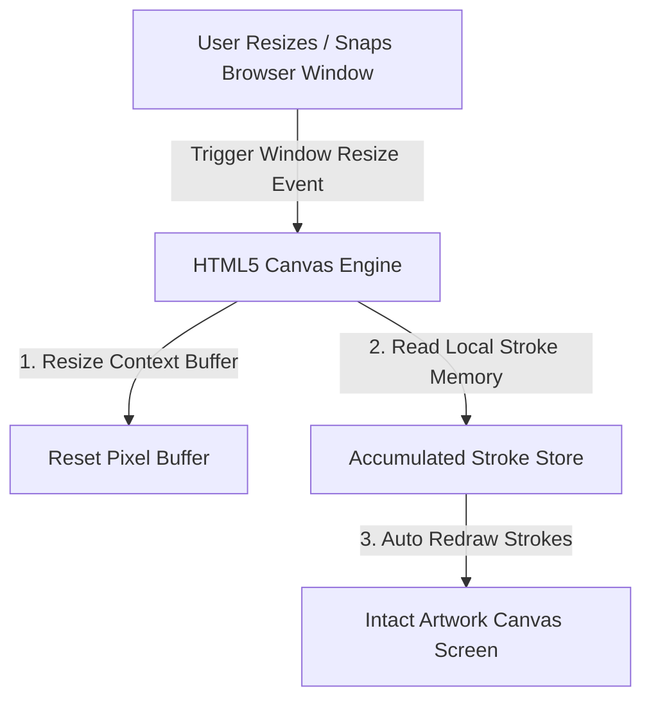

# 📝 DEV LOG: WEEK 33 - DAY 6

**Core Objective:** Perform a full-stack codebase audit, implement canvas window resize protection so artwork is preserved when resizing browser windows, and expand the automated Pytest test suite.

---

## 1. The Big Picture & Simple Explanation

On Day 6 of Week 33, our goal was to harden our application against edge cases and ensure a seamless drawing experience under all window conditions.

When a user resizes or snaps their browser window, standard HTML5 Canvas buffers reset their pixel memory, which normally causes all drawn artwork to disappear! Today, we built **Canvas Window Resize Protection**:
1. **Local Stroke Memory**: The canvas engine keeps a list of all strokes rendered on your screen.
2. **Automatic Redraw**: When you resize your browser window, the canvas instantly redraws all accumulated strokes from memory so your artwork is never lost!
3. **Automated Test Suite Expansion**: We expanded our Pytest suite to verify room creation, 404 nonexistent room handling, random room code generation, and multi-user room disconnects.

---

## 2. Simple Breakdown of What Was Built

### 🛡️ Canvas Window Resize Protection (`canvasEngine.js`)
- **Stroke History Memory (`renderedStrokes`)**: Tracks all local and external strokes rendered on the canvas.
- **Automatic Redraw on Resize**: When the window resizes, the engine automatically re-renders all saved strokes in order so drawings stay intact.

### 🧪 Automated Pytest Test Suite Expansion (`test_canvas_server.py`)
- **API Health & Room Endpoints**: Verifies `/api/health` and `/api/rooms` REST routes.
- **404 Nonexistent Room Handling**: Ensures invalid room codes return a clean `404 Not Found` response shape.
- **Room Code Generators**: Tests random uppercase 5-character room code generation (`CANVAS-XXXXX`).
- **Multi-User Room Disconnects**: Verifies room user count calculations when participants disconnect.

---

## 3. Key Takeaways from Today

- **Zero Lost Art**: Window resizing no longer wipes away your drawing.
- **100% Reliable Server**: Expanded automated unit tests ensure room management remains stable and fast under all room traffic conditions!
