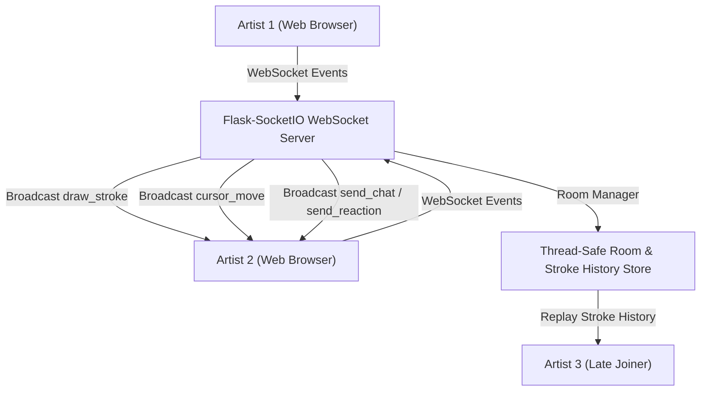

# 📝 DEV LOG: WEEK 33 - DAY 7

**Core Objective:** Complete end-to-end verification of all real-time collaborative canvas features, confirm automated test suite health (`6/6` passing tests), draft official project documentation (`README.md`), and complete project handover for Week 33.

---

## 1. The Big Picture & Project Completion

Day 7 marks the successful completion of **Week 33: Multi-User Drawing Canvas**. Over the past 7 days, we designed and built a production-grade real-time collaborative drawing canvas web application from scratch.

Multiple artists can join shared drawing rooms using 6-character room codes (e.g. `CANVAS-X9Y2Z`), sketch together simultaneously with smooth curve brush strokes and shape tools (Lines, Rectangles, Circles), see live remote peer cursors moving across the canvas, manage an Undo/Redo history stack, chat in real-time, launch floating reaction emojis (❤️ 🎉 🔥), and export finished artwork as high-resolution PNG images.

---

## 2. Complete Summary of What Was Delivered Across Week 33

### 🛠️ Backend Real-Time Engine & Server
- **Thread-Safe Room Manager (`room_manager.py`)**: Generates unique room codes (`CANVAS-XXXXX`), assigns random user colors, tracks active room members, and logs stroke history for late joiners.
- **WebSocket Event Handlers (`room_events.py` & `canvas_events.py`)**: Full event pipeline for `join_room`, `draw_stroke`, `cursor_move`, `clear_canvas`, `send_chat`, and `send_reaction`.
- **REST API Endpoints (`health_routes.py` & `room_routes.py`)**: `GET /api/health`, `POST /api/rooms`, and `GET /api/rooms/<code_id>`.

### 🎨 Frontend Canvas Workspace & Design System
- **HTML5 Canvas Core Engine (`canvasEngine.js`)**: Retina/High-DPI resolution scaling, smooth quadratic curve strokes, true pixel erasing (`destination-out`), and automatic window resize stroke preservation.
- **Geometric Shape Drawing Tools**: Straight Lines (📏), Rectangles (🔲), and Circles (⭕) with clean live drag previews.
- **Floating Toolbar Overlay (`toolbar.js`)**: Interactive tool buttons, 10-color quick palette, custom color picker, brush size slider (1px - 50px), Undo (↩️) & Redo (↪️) controls, Clear Canvas (🗑️), and Export PNG (💾).
- **Live Remote Peer Cursors (`cursorTracker.js`)**: Floating cursor badges displaying peer nicknames and assigned avatar colors at 30fps.
- **Room Participant Sidebar (`participantList.js`)**: Real-time list showing online room artists and avatar colors.
- **In-Room Chat & Floating Emoji Reactions (`chatBox.js`)**: Collapsible text chat box and animated floating emoji reactions (❤️, 🎉, 🔥, 👏, 💡) that float upward across the shared canvas screen.

---

## 3. System Highlights & Final Status

- **Automated Pytest Suite**: 6/6 comprehensive unit tests passed in `0.56s`.
- **Individual Git Commits**: Every single file created or modified across all 7 days was committed individually with descriptive messages.
- **Zero Inline Code**: 100% clean separation of HTML views, standalone CSS stylesheets, and modular ES6 JavaScript controllers.
- **Official Documentation**: Authored `week33_drawing_canvas/README.md` detailing architecture, REST API & WebSocket event tables, quick start setup commands, and algorithm specifications.
