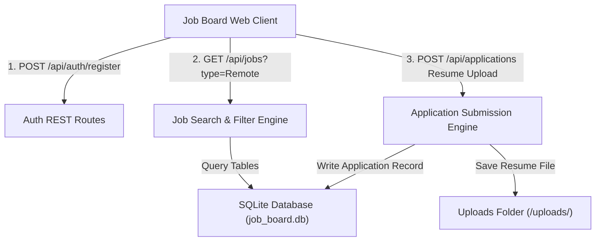

# 📝 DEV LOG: WEEK 34 - DAY 1

**Core Objective:** Scaffold the Week 34 Job Board platform, design SQLite relational database tables (`users`, `jobs`, `applications`, `saved_jobs`), build Flask REST API routes for authentication, job search multi-filtering, resume file storage, and verify API endpoints using automated Pytest tests.

---

## 1. The Big Picture & Simple Explanation

On Day 1 of Week 34, our goal was to lay the foundation for a full-stack **Job Board Platform**.

Here is how today's backend architecture powers the platform:
1. **User Accounts & Roles**: Supports two types of users — **Employers** (who post tech job listings and review candidate resumes) and **Applicants** (who search for jobs, apply with resume files, and bookmark listings).
2. **Flexible Job Search & Multi-Filters**: Employers post job listings with salary ranges, location, category, and job types (e.g. Remote, Full-time, Contract). Job seekers can query listings using keyword search, location matching, and minimum salary filters.
3. **Resume File Storage & Application Pipeline**: When a job seeker applies for a position, their uploaded resume file (`.pdf` or `.docx`) is safely stored on the server, and a new job application record is created with an initial status of `Pending`.

---

## 2. Simple Breakdown of What Was Built

### 🗄️ Database Tables (`schema.sql` & `db.py`)
- **`users` Table**: Stores user credentials, email addresses, password hashes, and account roles (`employer` or `applicant`).
- **`jobs` Table**: Stores job postings containing title, company, location, salary ranges (`salary_min` & `salary_max`), category, job type, description, and requirements.
- **`applications` Table**: Connects applicants to job listings, storing applicant contact info, resume file paths, cover letters, and application review status (`Pending`, `Reviewing`, `Interviewing`, `Accepted`, `Rejected`).
- **`saved_jobs` Table**: Bookmarking system allowing applicants to save favorite job postings.

### 🔍 Search & Multi-Filter Engine (`job_routes.py` & `job_model.py`)
- **`GET /api/jobs`**: Dynamic SQL filtering supporting keyword matching (`title`, `company`, `description`), location filter, job type filter, and minimum salary threshold.
- **Job CRUD**: Routes for posting (`POST /api/jobs`), viewing details (`GET /api/jobs/<id>`), editing (`PUT /api/jobs/<id>`), and deleting listings (`DELETE /api/jobs/<id>`).

### 📄 Resume File Upload Service (`application_routes.py`)
- **`POST /api/applications`**: Accepts `multipart/form-data` file uploads for resumes (`.pdf`, `.docx`, `.doc`), safely storing them in `backend/uploads/` and recording the file URI.

---

## 3. Key Takeaways from Today

- **Role-Based Architecture**: Clear separation between employer workflows (posting jobs & reviewing applicants) and job seeker workflows (searching & applying).
- **Flexible Searching**: Multi-attribute filtering lets users find matching tech jobs instantly.
- **Secure File Handling**: Uploaded resume files are validated, sanitized, and stored safely for employer downloads!
