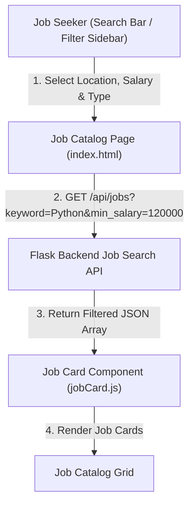

# 📝 DEV LOG: WEEK 34 - DAY 2

**Core Objective:** Build a responsive frontend Job Catalog interface (`index.html`, `catalog.css`), design multi-filter sidebar controls (Location, Job Type, Category, Minimum Salary), implement a live keyword search bar, and create modular UI components (`navbar.js`, `jobCard.js`).

---

## 1. The Big Picture & Simple Explanation

On Day 2 of Week 34, our goal was to connect our backend job search API to a clean, user-friendly frontend catalog.

Here is how today's job catalog interface empowers job seekers:
1. **Live Keyword Search**: Job seekers can type any tech skill, title, or company name into the hero search bar (e.g. `Python`, `React`, `TechCorp`) to instantly filter available job opportunities.
2. **Multi-Filter Sidebar**: Users can narrow down their search by combining location (Remote, New York, San Francisco), job commitment type (Full-time, Remote Only, Contract), category, and minimum annual salary threshold ($80k+, $120k+, $150k+).
3. **Structured Job Listing Cards**: Each job opportunity is presented in a card displaying company badges, position title, company name, location, job type pill, formatted salary range, and job description snippet.

---

## 2. Simple Breakdown of What Was Built

### 🎨 Design System & Base Stylesheet (`base.css` & `catalog.css`)
- **Theme Variables**: Slate and indigo color tokens supporting dark and light modes.
- **Navbar Styling**: Clean header layout with brand logo, navigation links, user session badges, and dark/light theme toggle.
- **Hero & Search Bar**: High-impact header section featuring a search input bar and search action button.

### 🧩 Modular Component Architecture (`navbar.js` & `jobCard.js`)
- **Header Component (`navbar.js`)**: Dynamic navigation bar rendering role-aware links (Employer Dashboard vs Applicant Tracking) based on the active user session.
- **Job Card Component (`jobCard.js`)**: Component that renders job details, company initial avatar badges, location icons, formatted salary ranges (e.g. `$130k - $165k / yr`), and colorful job type pills (`Remote`, `Full-time`, `Contract`).

### ⚙️ Search Controller & Filter Logic (`indexPage.js` & `jobApi.js`)
- **Real-Time Event Listeners**: Connects dropdown selectors (`#filter-location`, `#filter-type`, `#filter-category`, `#filter-salary`) and search inputs to trigger instant API calls without page reloads.
- **Reset Filters**: One-click reset button clearing all search filters back to default.

---

## 3. Key Takeaways from Today

- **Frictionless Search**: Instant filtering helps job seekers discover relevant tech roles in seconds.
- **Clear Compensation**: Formatted salary tags give job seekers immediate transparency into pay ranges.
- **Modular Code**: Decoupled JS components make it easy to reuse job cards across search, applicant dashboards, and employer portals!
