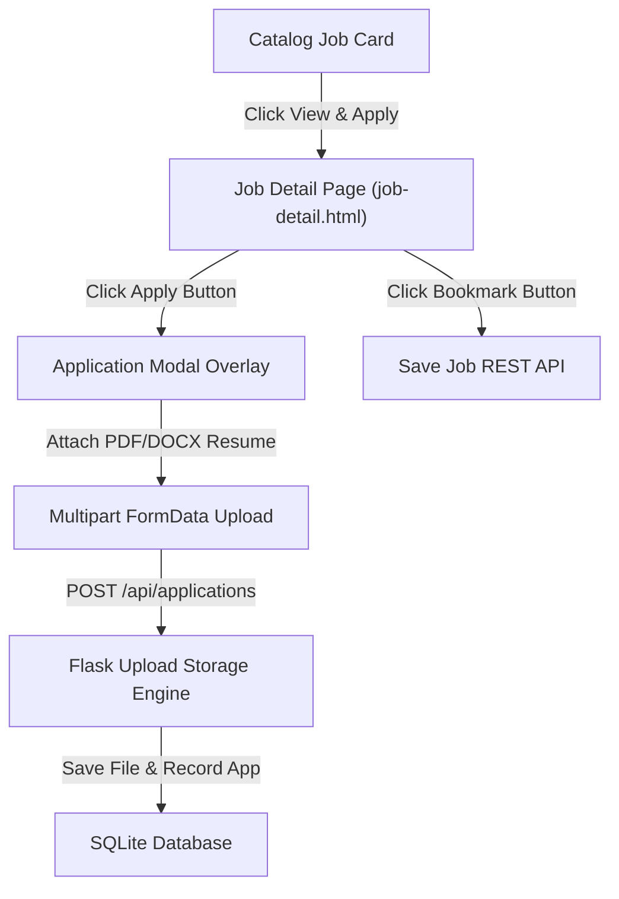

# 📝 DEV LOG: WEEK 34 - DAY 3

**Core Objective:** Build the Job Detail overview page (`job-detail.html`, `detail.css`), design an interactive Application Submission Modal with PDF/DOCX resume file upload support, and implement job bookmarking.

---

## 1. The Big Picture & Simple Explanation

On Day 3 of Week 34, our goal was to build the application pipeline where job seekers can view full job requirements and submit their resumes directly to employers.

Here is how today's application flow works:
1. **Full Job Overview**: Clicking any job card from the catalog opens the Job Detail page, displaying the full job description, salary range, location, and key skills required.
2. **Application Submission Modal**: Clicking **Apply for Position** opens an overlay modal dialog. Job seekers enter their contact details, write a cover letter note, and upload their resume document (`.pdf` or `.docx`).
3. **Resume File Upload**: The frontend packages the form fields and resume document into a `FormData` object, transmitting the file to the Flask backend where it is stored in `uploads/` and linked to the application record.
4. **Job Bookmarking**: Candidates can click **Bookmark Job** to save exciting listings for later review.

---

## 2. Simple Breakdown of What Was Built

### 📄 Job Detail Overview Page (`job-detail.html` & `detail.css`)
- **Rich Header & Badges**: Prominently displays company avatar badge, position title, company name, location tag, salary badge, and job commitment type (`Full-time`, `Remote`, `Contract`).
- **Description & Requirements**: Formatted layout displaying full job expectations and skills lists.

### 📤 Application Submission Modal & Resume Upload (`jobDetailPage.js` & `applicationApi.js`)
- **Interactive Modal Window**: Modal dialog with smooth background blur and form inputs.
- **Multipart Resume File Transfer**: Transmits candidate data and binary resume files (`.pdf`, `.docx`, `.doc`) using native HTML5 `FormData`.
- **Pre-filled Contact Info**: Automatically pre-fills candidate name and email if the job seeker is signed into a session.

### 🔖 Job Bookmarking Engine (`applicationApi.js`)
- **One-Click Bookmarking**: Connects to `POST /api/users/<id>/saved-jobs` to toggle saved status and trigger real-time toast alerts.

---

## 3. Key Takeaways from Today

- **Seamless Applications**: Job seekers can view full job expectations and submit resumes in just two clicks.
- **Safe File Storage**: Multipart uploads handle resume documents cleanly without page reloads.
- **Save For Later**: Candidates can easily bookmark positions to apply when their resume is ready!
