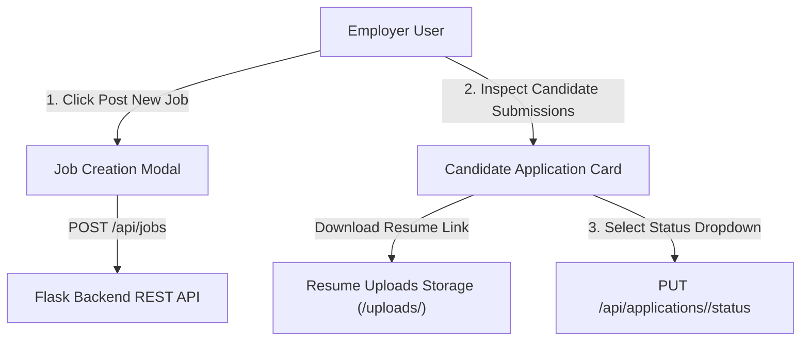

# 📝 DEV LOG: WEEK 34 - DAY 4

**Core Objective:** Build the Employer Portal workspace (`employer.html`, `dashboard.css`), design metrics cards for active jobs and candidate applications, implement the Job Creation Modal (`POST /api/jobs`), and build candidate review status management.

---

## 1. The Big Picture & Simple Explanation

On Day 4 of Week 34, our goal was to build the Employer Management Portal where companies can publish tech jobs and manage candidate applications.

Here is how today's employer workspace operates:
1. **Recruitment Overview Dashboard**: Employers see a real-time summary of their recruitment pipeline — active job listings, total candidates applied, and pending candidate reviews.
2. **Job Publishing Modal**: Employers can click **+ Post New Job** to launch a modal form where they specify position title, salary ranges, location, job type (`Remote`, `Full-time`, `Contract`), category, and job requirements.
3. **Candidate Resume Review & Status Pipeline**: For every posted job, employers can inspect candidate cover letters, click **Download Resume** to view PDF/DOCX resumes, and update candidate statuses (`Pending` ⏳, `Reviewing` 🔍, `Interviewing` 🎯, `Accepted` ✅, `Rejected` ❌).



---

## 2. Simple Breakdown of What Was Built

### 📊 Employer Dashboard Workspace (`employer.html` & `dashboard.css`)
- **Metrics Grid**: Visual stat cards displaying Active Job Listings, Total Applications Received, and Pending Reviews.
- **Job Creation Form Modal**: Form inputs for title, company name, location, job type, salary min/max sliders, and requirements list.

### 👥 Candidate Review & Resume Download (`employerPage.js`)
- **Candidate Submission Lists**: Grouped view showing all candidates who applied for each active job posting.
- **Resume File Download Links**: Direct link opening uploaded PDF/DOCX resume documents (`http://127.0.0.1:5000/uploads/...`).
- **Interactive Status Pipeline**: Live status dropdown updating application review stages (`Pending`, `Reviewing`, `Interviewing`, `Accepted`, `Rejected`) with instant toast feedback.

### 🗑️ Listing Management (`employerPage.js`)
- **Listing Deletion**: Delete listing button (`DELETE /api/jobs/<id>`) allowing employers to remove closed or filled job postings.

---

## 3. Key Takeaways from Today

- **Full Recruitment Pipeline**: Employers can publish jobs, review resumes, and manage candidates in one place.
- **Instant Status Updates**: Status dropdowns give employers seamless control over candidate progression.
- **Resume Accessibility**: Uploaded resume files are immediately accessible for employer download and evaluation!
```