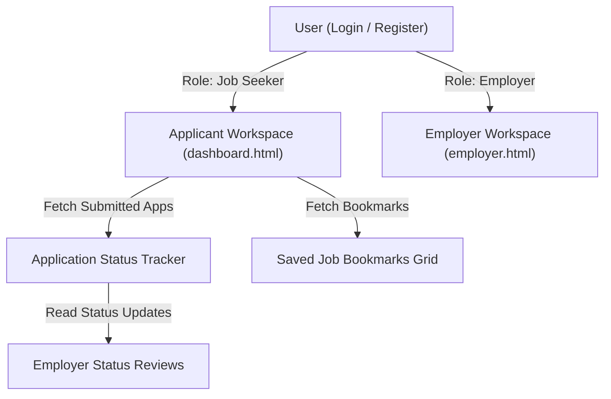

# 📝 DEV LOG: WEEK 34 - DAY 5

**Core Objective:** Build user authentication pages (`login.html`, `register.html`, `auth.css`) supporting role switching (Job Seeker vs Employer), and create the Job Seeker Applicant Dashboard (`dashboard.html`, `dashboardPage.js`) for tracking submitted applications and saved job bookmarks.

---

## 1. The Big Picture & Simple Explanation

On Day 5 of Week 34, our goal was to build the job seeker portal and user authentication system.

Here is how today's applicant features complete the user journey:
1. **Role-Aware Authentication**: New users can register as a **Job Seeker** (to search and apply for jobs) or an **Employer** (to post listings and hire talent). Signing in automatically redirects users to their appropriate workspace.
2. **Submitted Application Tracker**: Job seekers can track all job applications they have submitted in one centralized place, seeing real-time status updates as employers review their resume (`Pending` ⏳, `Reviewing` 🔍, `Interviewing` 🎯, `Accepted` ✅, `Rejected` ❌).
3. **Saved Job Bookmarks**: Candidates can manage their saved job bookmarks, allowing them to review favorite listings and apply whenever they are ready.



---

## 2. Simple Breakdown of What Was Built

### 🔐 Authentication System (`login.html`, `register.html`, `authPage.js` & `auth.css`)
- **Interactive Role Toggle**: Role selection buttons (`Job Seeker` vs `Employer`) during registration.
- **Session Management**: Saves user credentials and roles to local storage (`setStoredUser`) for role-based navigation guards.

### 📊 Job Seeker Applicant Dashboard (`dashboard.html` & `dashboardPage.js`)
- **Applicant Metrics Summary**: Metric cards tracking Applications Submitted, Active Interview Reviews, and Saved Bookmarks.
- **Submitted Applications List**: Grouped list showing job title, company name, applied date, submitted resume link, and live application status.
- **Saved Job Catalog**: Grid view displaying bookmarked tech job opportunities.

---

## 3. Key Takeaways from Today

- **Full Application Lifecycle**: Job seekers have complete visibility into their application progress.
- **Personalized Workspaces**: Employers and job seekers get tailored dashboards matching their goals.
- **Clear Status Visibility**: Candidates know exactly when their resume is being reviewed or invited for an interview!
```