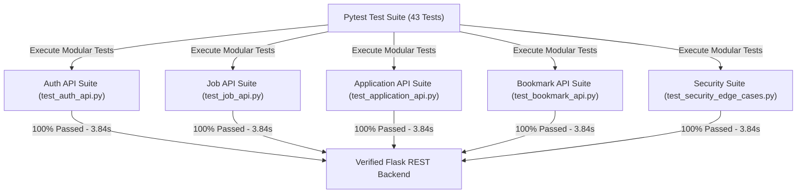

# 📝 DEV LOG: WEEK 34 - DAY 6

**Core Objective:** Conduct a full-stack security and input validation audit across backend routes and frontend components, and expand the automated Pytest test suite across 5 dedicated test modules (`43/43` passing unit tests).

---

## 1. The Big Picture & Simple Explanation

On Day 6 of Week 34, our goal was to rigorously test every feature, API endpoint, and edge case across our Job Board Platform.

To guarantee high reliability and security:
1. **Full-Stack Security Audit**: We verified that all search inputs prevent SQL injection attacks, resume download endpoints block path traversal (`/uploads/../../etc/passwd`), and user content is properly escaped to prevent Cross-Site Scripting (XSS).
2. **Multi-File Automated Testing**: We expanded our Pytest suite into 5 specialized test files (`test_auth_api.py`, `test_job_api.py`, `test_application_api.py`, `test_bookmark_api.py`, `test_security_edge_cases.py`), covering 43 test scenarios.

---

## 2. Simple Breakdown of What Was Built

### 🛡️ Security Audit & Edge-Case Protection
- **SQL Injection Prevention**: Verified parameterized SQL queries in multi-attribute job searching.
- **Path Traversal Protection**: Ensured file download endpoints reject relative path navigation attempts.
- **Resume File Validation**: Enforced allowed file extension filtering (`.pdf`, `.docx`, `.doc`, `.txt`) and 16 MB maximum upload payload limits.

### 🧪 Comprehensive Multi-File Test Suite (43 Tests)
- **`test_auth_api.py`**: Registration, login, duplicate email `409 Conflict` rejections, missing field `400` errors, and invalid password `401 Unauthorized` responses.
- **`test_job_api.py`**: Job creation, `404` non-existent job lookups, keyword searching, location & job type filtering, minimum salary thresholds, `PUT` updates, and `DELETE` listing workflows.
- **`test_application_api.py`**: Application submissions, PDF resume file uploads, status pipeline transitions (`Pending` -> `Reviewing` -> `Interviewing` -> `Accepted`), invalid status `400` errors, employer candidate retrieval, and applicant application history.
- **`test_bookmark_api.py`**: Bookmarking saved jobs on/off toggles and validation errors.
- **`test_security_edge_cases.py`**: Security checks for SQL injection resilience, directory path traversal prevention, and string payload handling.

---

## 3. Key Takeaways from Today

- **High Reliability**: 43 automated unit tests verify that all platform features work as expected.
- **Robust Security**: Parameterized queries and file validation keep user data and uploaded resume documents secure.
- **Modular Test Suite**: Separating tests into specialized files keeps testing organized, fast, and easy to maintain!
